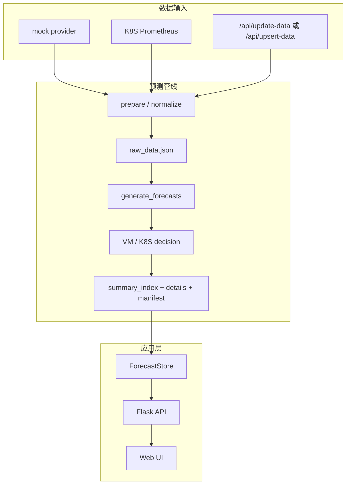
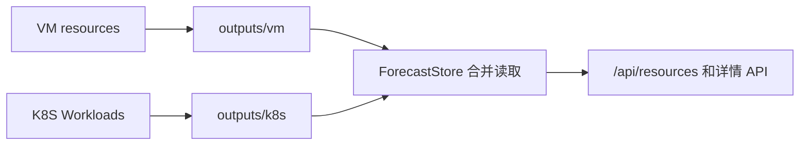
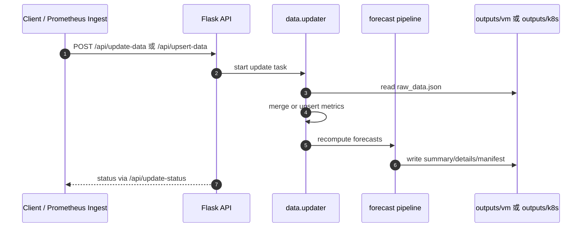
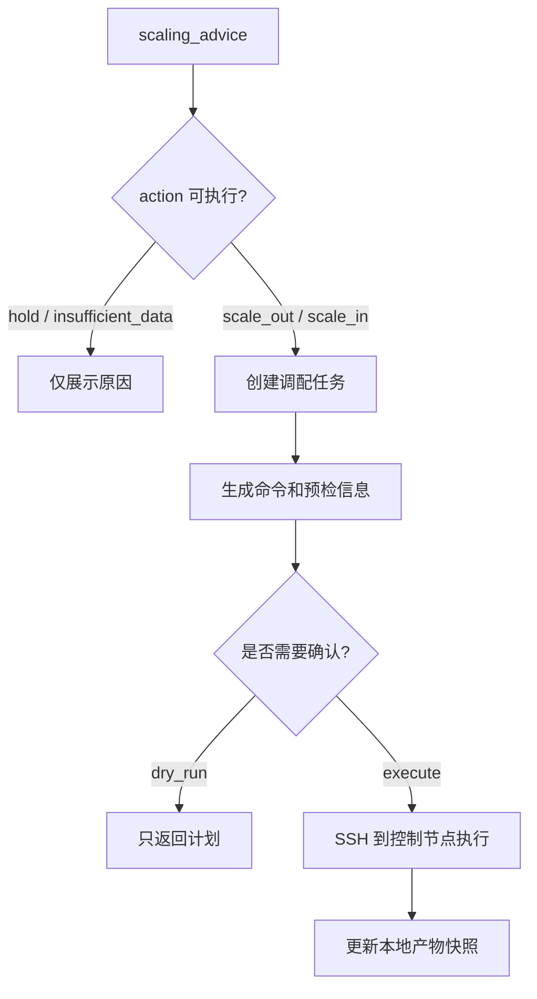

# 云资源使用预测与调配建议

本项目用于云资源历史使用率分析、时间序列预测、扩缩容建议生成和调配预检。当前支持两类资源：

- **VM 资源**：预测 `cpu / memory / disk`，生成 OpenStack 规格调整建议。
- **K8S Workload**：从 Prometheus 聚合 Pod/Container 指标到 Deployment/StatefulSet/DaemonSet 等控制器粒度，预测 `cpu / memory`，生成 requests/limits 调整建议。当前以分析建议为主。

预测产物按资源族隔离：

- VM: `outputs/vm/`
- K8S: `outputs/k8s/`

Web/API 会自动合并两个目录展示，K8S 数据接入不会覆盖 VM 产物。

## 目录

- [快速开始](#快速开始)
- [项目结构](#项目结构)
- [架构与数据流](#架构与数据流)
- [CLI 命令](#cli-命令)
- [K8S Prometheus 接入](#k8s-prometheus-接入)
- [API 摘要](#api-摘要)
- [配置](#配置)
- [验证与维护](#验证与维护)

## 快速开始

以下命令面向 CentOS/Linux shell。

```bash
python3 -m venv .venv
source .venv/bin/activate
export PYTHONUTF8=1
python -m pip install -r requirements.txt
python -m pip install -r requirements-dev.txt
```

生成演示预测产物：

```bash
python generate_forecasts.py
```

只基于已有 `raw_data.json` 重算预测：

```bash
python generate_forecasts.py predict
```

检查产物健康状态：

```bash
python check_outputs.py
```

启动 Web：

```bash
python app.py
```

默认访问：

```text
http://127.0.0.1:5000
```

## 项目结构

```text
.
├── app.py                         # Flask Web 入口
├── generate_forecasts.py          # 演示数据生成/预测重算 CLI
├── ingest_k8s_workloads.py        # K8S Workload Prometheus 接入 CLI
├── check_outputs.py               # 预测产物健康检查 CLI
├── requirements.txt               # 运行依赖
├── requirements-dev.txt           # 测试和静态检查工具
├── deploy/
│   └── clusters.example.json      # VM 调配配置示例
├── resource_predict/
│   ├── api/                       # Flask API 路由
│   ├── core/                      # 预测、VM 决策、K8S Workload 决策
│   ├── data/                      # raw_data 读写与增量合并
│   ├── pipeline/                  # 预测管线和产物写入
│   ├── providers/                 # mock / Prometheus 数据源
│   ├── services/                  # 应用服务、调配、配置、store
│   ├── resource_types.py          # 资源类型和指标集
│   └── settings.py                # 默认配置
├── static/                        # 前端静态资源
├── templates/                     # Flask 模板
├── tests/                         # 自动化测试
└── outputs/                       # 运行产物，已被 .gitignore 忽略
```

## 架构与数据流

### 总体架构



### 产物隔离



每个 scope 内包含：

```text
raw_data.json
summary_index.json
manifest.json
details/*.json
```

### 增量更新



### 调配流程



## CLI 命令

### 预测生成

```bash
export PYTHONUTF8=1
python generate_forecasts.py
```

只重算预测，不覆盖 raw：

```bash
export PYTHONUTF8=1
python generate_forecasts.py predict
```

### K8S Workload 接入

```bash
export K8S_PROMETHEUS_CLUSTERS='{"cluster-k8s-a":"http://prometheus.example:9090"}'
export PYTHONUTF8=1
python ingest_k8s_workloads.py
```

只诊断，不写产物：

```bash
python ingest_k8s_workloads.py --diagnose
python ingest_k8s_workloads.py --diagnose --json
```

只拉取指定集群：

```bash
python ingest_k8s_workloads.py --cluster cluster-k8s-a
```

### 产物检查

```bash
python check_outputs.py
python check_outputs.py --json
python check_outputs.py --allow-missing-type
```

## K8S Prometheus 接入

### 需要的 Prometheus 指标

| 指标 | 用途 |
| --- | --- |
| `container_cpu_usage_seconds_total` | CPU 使用量 |
| `container_memory_working_set_bytes` | 内存使用量 |
| `kube_pod_owner` | Pod 到 ReplicaSet/控制器的 owner 关系 |
| `kube_replicaset_owner` | ReplicaSet 到 Deployment 的 owner 关系 |
| `kube_pod_container_resource_requests*` | CPU/Memory request |
| `kube_pod_container_resource_limits*` | CPU/Memory limit |

provider 会把 Pod/Container 序列聚合为 `k8s_workload`，生成形如：

```text
k8s:<cluster>:<namespace>:<workload-kind>:<workload-name>
```

### 配置方式

临时验证推荐环境变量：

```bash
export K8S_PROMETHEUS_CLUSTERS='{"cluster-k8s-a":"http://127.0.0.1:9090"}'
python ingest_k8s_workloads.py --diagnose
```

长期运行推荐写入：

```text
deploy/k8s_prometheus_clusters.json
```

示例：

```json
[
  {
    "cluster": "cluster-k8s-a",
    "prometheus_url": "http://prometheus.example:9090",
    "namespace_regex": "default|prod"
  }
]
```

该文件可能包含内网地址或凭据，默认不提交。

## API 摘要

| API | 说明 |
| --- | --- |
| `GET /` | Web 首页 |
| `GET /api/resources` | 资源列表 |
| `GET /api/resources/<id>` | 资源详情 |
| `GET /api/resources/details?ids=a,b` | 批量详情 |
| `GET /api/resources/advice-summary` | 建议统计 |
| `GET /api/update-status` | 更新任务状态 |
| `POST /api/update-trigger` | 触发 pull 型增量更新 |
| `POST /api/update-data` | 只更新已有资源 |
| `POST /api/upsert-data` | 更新或新增资源 |
| `GET /api/cluster-configs` | 读取集群配置 |
| `PUT /api/cluster-configs` | 保存集群配置 |
| `POST /api/cluster-configs/k8s-diagnose` | 诊断 K8S Prometheus |
| `POST /api/cluster-configs/k8s-fetch` | 拉取 K8S Prometheus 数据 |
| `POST /api/resources/<id>/scale` | 创建调配任务 |
| `GET /api/scaling-tasks/<id>` | 查询调配任务 |
| `POST /api/scaling-tasks/<id>/confirm` | 确认 OpenStack resize |

常用列表参数：

| 参数 | 说明 |
| --- | --- |
| `resource_type=openstack_vm` | 只看 VM |
| `resource_type=k8s_workload` | 只看 K8S Workload |
| `q=keyword` | 搜索资源 ID、IP、namespace、workload、node 等 |
| `action=scale_out` | 筛选 VM 扩容 |
| `action=scale_out_candidate` | 筛选 K8S 扩容候选 |
| `page/page_size` | 分页 |
| `sort_by=urgency_score` | 按紧急度排序 |

## 配置

主要默认配置在：

```text
resource_predict/settings.py
```

本地敏感配置：

```text
deploy/clusters.json
deploy/k8s_prometheus_clusters.json
.env
```

这些文件已在 `.gitignore` 中忽略。

## 验证与维护

### 回归检查

```bash
export PYTHONUTF8=1
python -m compileall -q app.py check_outputs.py generate_forecasts.py ingest_k8s_workloads.py resource_predict tests
python -m pyflakes app.py check_outputs.py generate_forecasts.py ingest_k8s_workloads.py resource_predict tests
vulture app.py check_outputs.py generate_forecasts.py ingest_k8s_workloads.py resource_predict tests --min-confidence 80
python -m pytest -q
```

### 维护约定

- 根目录只放直接运行的 CLI 或项目级配置。
- 业务逻辑放入 `resource_predict/` 包内，CLI 只做参数解析和输出。
- 新增 K8S 逻辑优先使用 `workload` 命名；`pod` 只作为 Prometheus 标签或历史产物兼容词出现。
- 预测产物统一称为 `outputs` 或 `forecast artifacts`，不要再使用 `images` 命名。
- 不提交 `outputs/`、日志、缓存、`__pycache__`、本地凭据。

### 常见问题

| 问题 | 处理 |
| --- | --- |
| 页面无数据 | 先运行 `python generate_forecasts.py`，再运行 `python check_outputs.py` |
| VM 有数据，K8S 为空 | 检查 Prometheus 配置，运行 `python ingest_k8s_workloads.py --diagnose` |
| 提示缺少 K8S Prometheus 配置 | 设置 `K8S_PROMETHEUS_CLUSTERS` 或写入 `deploy/k8s_prometheus_clusters.json` |
| 产物结构不一致 | 运行 `python check_outputs.py --json` 查看具体错误 |
| 测试工具缺失 | 运行 `python -m pip install -r requirements-dev.txt` |
