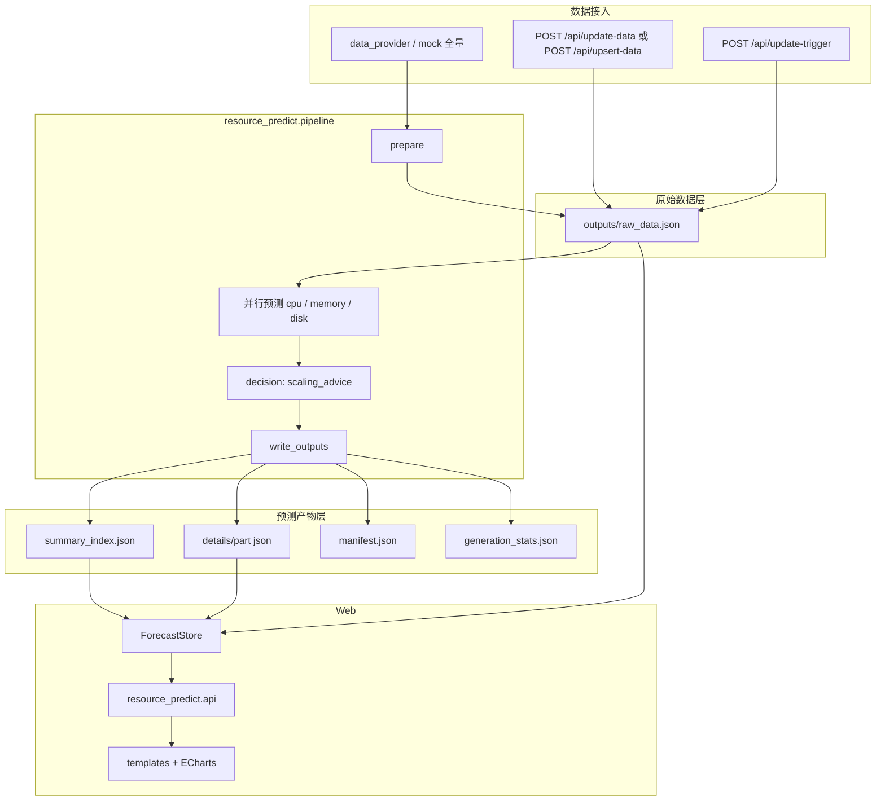
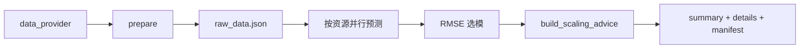
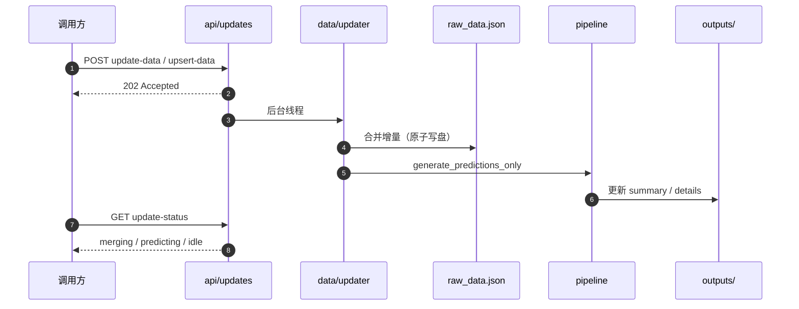
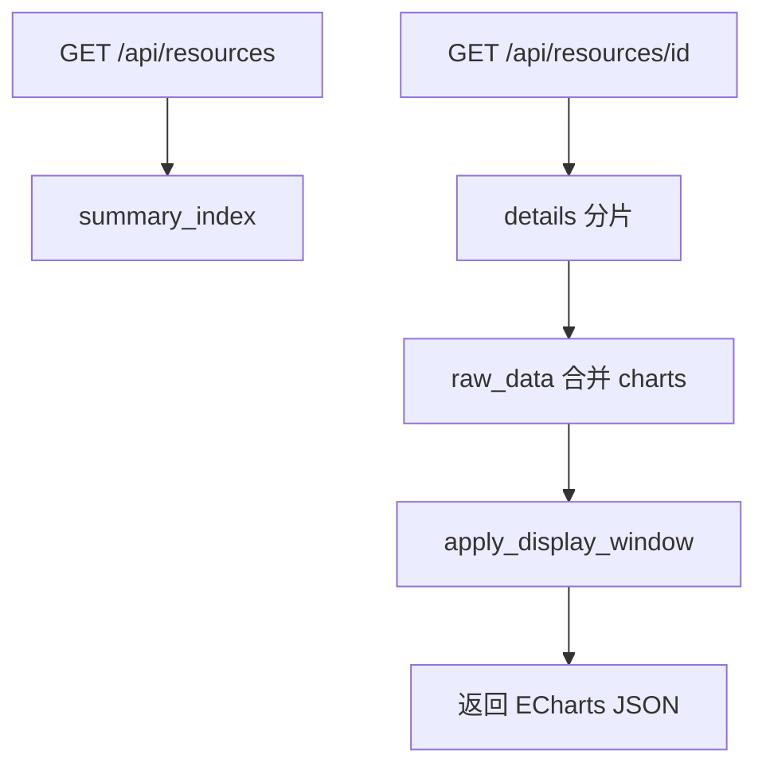
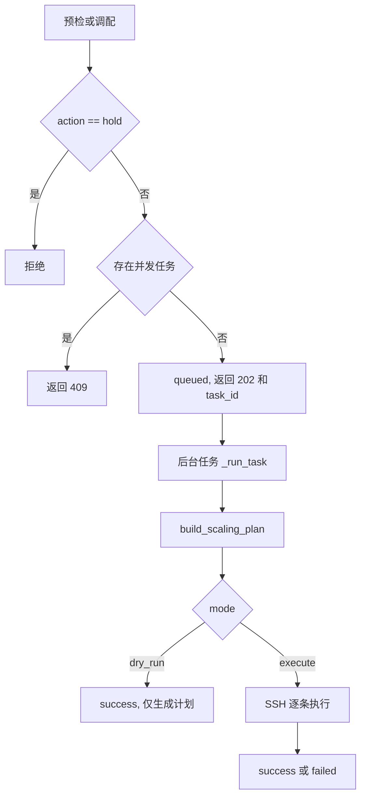
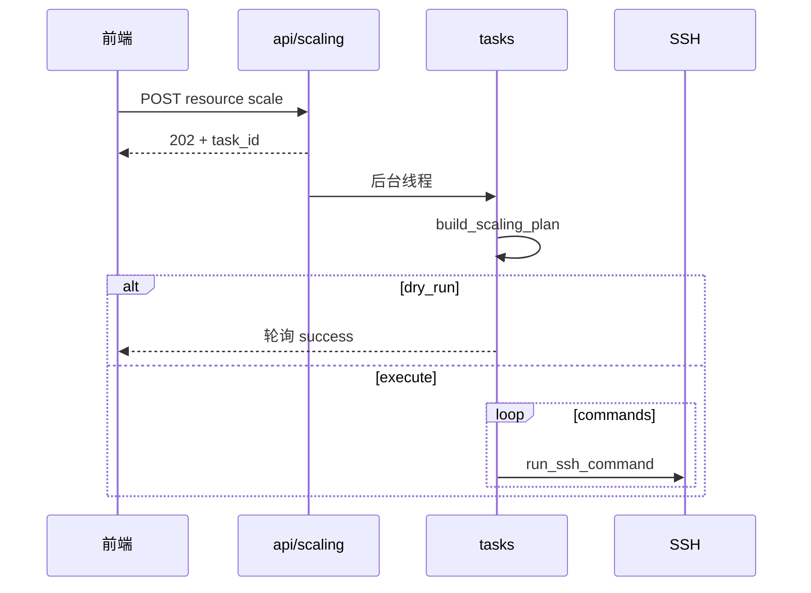
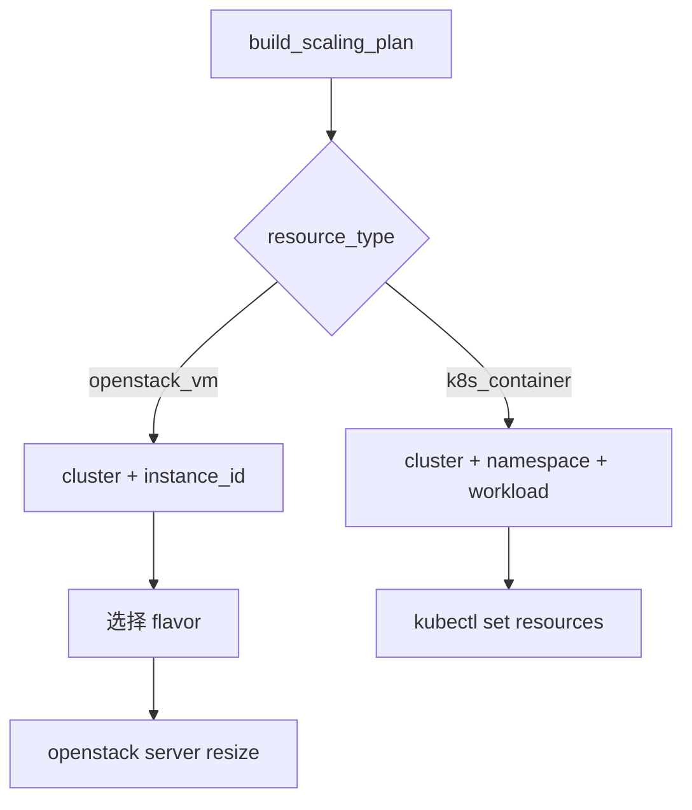

# 云资源使用预测与扩缩容建议

本项目用于云资源（虚拟机）的 CPU、内存、硬盘时序预测。系统会对每个指标独立训练和评估预测模型，按 RMSE 选择最佳模型，并基于未来负载窗口给出扩容、缩容或保持建议。

项目支持离线生成预测结果，也支持通过接口推送增量监控数据。增量更新时会合并到 `raw_data.json`，并尽量只对发生变化的资源和指标重新预测。

## 目录

| 章节 | 说明 |
| --- | --- |
| [1. 功能概览](#1-功能概览) | 能力一览 |
| [2. 快速开始](#2-快速开始) | 安装、运行、生成预测 |
| [3. 项目结构](#3-项目结构) | 目录与导入约定 |
| [4. 数据与预测](#4-数据与预测) | 架构、全量/增量、产物、扩缩容建议 |
| [5. API 参考](#5-api-参考) | HTTP 接口与增量数据格式 |
| [6. 资源调配](#6-资源调配) | 预检、执行、OpenStack/K8S |
| [7. 配置与运维](#7-配置与运维) | 配置项、日志、数据接入 |
| [8. 常见问题](#8-常见问题) | 排错与维护建议 |

---

## 1. 功能概览

- **多指标预测**：每个资源包含 `cpu / memory / disk` 三条时序。
- **自动选模**：支持 ARIMA、SARIMA、Prophet，按测试集 RMSE 选择最佳模型。
- **数据分层**：`raw_data.json` 存观测数据，`details/` 存预测曲线。
- **增量更新**：`POST /api/update-data` 立即返回 `202`，后台合并并重预测。
- **指标级重预测**：仅更新 CPU 时，保留 memory/disk 旧预测并重建扩缩容建议。
- **扩缩容建议**：输出 `action / confidence / reason / target_vm_spec / stats`。
- **前端展示**：资源列表、筛选排序、详情图表、紧迫度与置信度说明。
- **调配执行**：OpenStack / K8S 预检与执行（见 [6. 资源调配](#6-资源调配)）。
- **稳定写入**：关键 JSON 临时文件 + 原子替换，降低损坏风险。

---

## 2. 快速开始

建议使用 **Python 3.10+**。

```bash
pip install -r requirements.txt
python generate_images.py    # 全量生成预测产物
python app.py                # 启动 Web
```

浏览器访问 `http://127.0.0.1:5000`。首次运行前 `outputs/` 为空，需先执行 `generate_images.py`。

### 2.1 预测命令

| 命令 | 说明 |
| --- | --- |
| `python generate_images.py` | 全量：生成 raw + 预测产物 |
| `python generate_images.py predict` | 仅基于已有 `raw_data.json` 重预测 |

代码调用：

```python
from resource_predict.pipeline import generate_all_images, generate_predictions_only

generate_all_images(data_provider=provider)
generate_predictions_only()
```

根目录 `generate_images.py` 为 CLI 兼容入口，内部转发至 `resource_predict.pipeline`。

## 3. 项目结构

```text
resource_predict/                 # 仓库根目录
├── app.py                        # Web 入口
├── generate_images.py            # 预测 CLI
├── deploy/                       # 集群配置（clusters.json，勿提交 Git）
├── resource_predict/             # 主 Python 包
│   ├── settings.py
│   ├── core/                     # decision、forecasting
│   ├── data/                     # io、updater
│   ├── providers/                # mock 数据源
│   ├── pipeline/                 # 预测批处理
│   ├── api/                      # HTTP 路由
│   └── services/                 # store、scaling、urgency
├── templates/
├── static/
├── outputs/                      # 运行时产物（gitignore）
├── docs/
└── requirements.txt
```

业务代码统一使用 `resource_predict.*` 导入：

```python
from resource_predict.settings import settings
from resource_predict.pipeline import generate_predictions_only
```

---

## 4. 数据与预测

系统把**原始观测**与**预测产物**分开：训练与预测只依赖 `raw_data.json`；列表与图表由 `summary_index.json`、`details/` 与 raw 在 API 层合并后返回前端。

### 4.1 总体架构



### 4.2 产物职责

| 文件 | 写入方 | 读取方 | 内容 |
| --- | --- | --- | --- |
| `raw_data.json` | 全量 / updater | pipeline、ForecastStore | 观测序列 + vm_spec |
| `summary_index.json` | pipeline | 列表 API | 摘要、detail_ref、scaling_advice |
| `details/part-*.json` | pipeline | 详情 API | 预测曲线、RMSE、best_method |
| `manifest.json` | pipeline | 兼容回退 | 含完整 charts 的旧结构 |
| `generation_stats.json` | pipeline | 运维 | 最近一次批处理统计 |
| `scaling_tasks.json` | 调配任务 | 调配 API | 预检/执行任务与执行结果 |
| `resource_predict.log` | 运行时 | 运维 | 含调配 SSH、flavor 日志 |

`details` 仅存 `charts_forecast`；完整 `charts`（含 `y_train`）由 `ForecastStore` 读取时与 raw 合并。

### 4.3 全量生成



要点：每资源三条序列，使用率 **[0, 1]** 小数。

### 4.4 增量更新



Pull 模式：`POST /api/update-trigger` 经 `IncrementalProvider` 拉取后，进入相同合并与重预测流程。

**增量预测策略**（补充规则）：

- 记录本次更新的 `resource_id` 及变更指标（如仅 `cpu`）。
- 有旧产物时只重拟合变更指标，其余保留；再对受影响资源重算 `scaling_advice`。
- 可选 `sliding_window` 裁旧点；`display_window_points` 仅影响图表展示。

### 4.5 前端读取详情



更新进行中若资源处于 `writing_raw` / `predicting`，详情接口返回 **202 + prediction_pending**。

### 4.6 扩缩容建议与紧迫度

- 扩缩容建议：`resource_predict/core/decision.py`（`scaling_advice`、`target_vm_spec`）。
- 列表紧迫度：`resource_predict/services/urgency.py`。

列表上的「扩容 / 缩容 / 保持」来自预测建议；**实际改配**见 [6. 资源调配](#6-资源调配)。

### 4.7 并行与性能

资源级、指标级两层并行；`generate_images.py` 自动选择计划。配置见 `settings.py` 的 `GenerationConfig`（`max_workers`、`parallel_metrics` 等）。

---

## 5. API 参考

### 5.1 接口一览

| 路径 | 说明 |
| --- | --- |
| `GET /` | 首页 |
| `GET /api/resources` | 资源列表（搜索、筛选、分页、排序） |
| `GET /api/resources/details?ids=a,b` | 批量详情 |
| `GET /api/resources/<id>` | 单资源详情 |
| `GET /api/resources/advice-summary` | 扩缩容建议统计 |
| `GET /api/update-status` | 后台更新状态 |
| `POST /api/update-trigger` | Pull 增量更新 |
| `POST /api/update-data` | Push 增量（仅更新已有资源） |
| `POST /api/upsert-data` | Push upsert（可插入新资源） |
| `POST /api/resources/<id>/scale` | 调配预检/执行 → [6.3](#63-调配-api) |
| `GET /api/scaling-tasks/<task_id>` | 调配任务状态 |
| `GET /api/resources/<id>/scaling-history` | 调配历史 |

`POST /api/update-data` 合法 JSON 后立即 **202**，预测在后台执行；可轮询 `/api/update-status`。

### 5.2 增量数据格式

请求体为非空 JSON 数组：

```json
[
  {
    "resource_id": "vm-001",
    "metrics": {
      "cpu": { "timestamps": [1730000000000], "values": [0.45] },
      "memory": { "timestamps": [], "values": [] },
      "disk": { "timestamps": [], "values": [] }
    }
  }
]
```

| 规则 | 说明 |
| --- | --- |
| 时间戳 | 秒/毫秒 Unix 或 pandas 可解析字符串；落盘统一为毫秒 |
| 数值 | 0～1 使用率小数 |
| 不更新某指标 | `timestamps` 与 `values` 均为 `[]` |
| 有数据时 | 两数组长度必须一致 |
| `update-data` | 仅更新 `raw_data.json` 中已存在的资源 |
| `upsert-data` | 已存在则增量更新；新资源需 cpu/memory/disk 完整序列，建议带 `vm_spec` |

---

## 6. 资源调配

根据 `scaling_advice` 在集群**控制节点**生成白名单命令，支持预检（`dry_run`）或 SSH 执行（`execute`）。实现：`resource_predict/services/scaling/`；任务文件：`outputs/scaling_tasks.json`。

**安全原则**：不接受前端任意 shell，仅执行后台模板拼出的命令。

### 6.1 与预测的关系


### 6.2 调配流程



**预检 vs 执行**

| 模式 | 请求 | 行为 |
| --- | --- | --- |
| `dry_run` | `{"mode": "dry_run"}` | 生成命令，不执行改配 |
| `execute` | `{"mode": "execute", "confirm": true}` | 依次执行 `plan.commands` |



前端 `static/js/scaling.js` 执行前二次确认；OpenStack 无 flavor 时可传 `confirm_create_flavor`（预检不真正创建）。

### 6.3 调配 API

请求示例：

```json
{ "mode": "dry_run" }

{
  "mode": "execute",
  "confirm": true,
  "confirm_create_flavor": false
}
```

**任务状态**

| status | 含义 |
| --- | --- |
| `queued` | 已入队 |
| `running` | 计划中或 SSH 执行中 |
| `success` | 预检完成或命令全部成功 |
| `failed` | 计划失败或某条命令非 0 退出 |

同一资源同时仅允许一个 `queued` / `running` 任务（否则 **409**）。

### 6.4 OpenStack 与 K8S



**OpenStack flavor 策略**：

- 不需要手工维护 `flavor_map`。
- 预检/调配时，后台会 SSH 到控制节点执行 `openstack flavor list -f json` 读取 flavor。
- 扩容：选择 CPU、内存、磁盘都不低于目标规格的最小 flavor。
- 缩容：选择 CPU、内存不高于目标规格，且磁盘不低于当前磁盘的最大 flavor。
- 如果没有完全匹配但存在符合策略的 flavor，会在任务结果和 `outputs/resource_predict.log` 记录实际选择的 flavor 及规格偏差。
- 如果没有任何符合策略的 flavor，前端点击“调配”时会弹窗二次确认是否允许后台创建新 flavor。
- 只有用户确认后，后台才会先执行 `openstack flavor create`，再执行 `openstack server resize`。
- 当 `auto_confirm_resize=false` 时，后台执行 resize 后任务进入 `waiting_confirm`，前端显示“确认生效”按钮；点击确认成功后才会更新本地规格快照和调配建议。
- 当 `auto_confirm_resize=true` 时，后台会等待实例进入 `VERIFY_RESIZE` 后自动执行 `openstack server resize --confirm`。
- 点击“预检”不会真正创建 flavor，只会生成并展示计划执行的 `openstack flavor create` 命令。

**限制**：

- 单次只调配当前点击的单个资源。
- `hold` 建议不会创建调配任务。
- 同一资源已有 `queued` / `running` / `waiting_confirm` / `confirming` 任务时拒绝重复提交。
- K8S 磁盘缩容不执行。
- OpenStack 磁盘扩容和 K8S 存储调整当前只给出 warnings，不直接处理。

### 6.5 集群与 vm_spec

```bash
cp deploy/clusters.example.json deploy/clusters.json
```

要使用资源调配，预测数据源必须提供足够的 `vm_spec`，否则后台只能生成扩缩容建议，无法定位控制节点或具体资源。

`data_provider` 返回值必须是非空 list，每个元素格式如下：

```python
[
    {
        "resource_id": "vm-001",
        "vm_spec": {
            "resource_type": "openstack_vm",
            "cluster": "cluster-openstack-a",
            "ip": "10.0.10.11",
            "instance_id": "server-uuid",
            "cpu_cores": 4,
            "memory_gb": 16,
            "disk_gb": 100
        },
        "metrics": {
            "cpu": {
                "timestamps": [1730000000000, 1730003600000],
                "values": [0.42, 0.51]
            },
            "memory": {
                "timestamps": [1730000000000, 1730003600000],
                "values": [0.58, 0.61]
            },
            "disk": {
                "timestamps": [1730000000000, 1730003600000],
                "values": [0.32, 0.33]
            }
        }
    }
]
```

字段规则：

| 字段 | 是否必填 | 说明 |
| --- | --- | --- |
| `resource_id` | 是 | 资源唯一 ID，前端列表、详情和调配任务都用它定位资源 |
| `metrics.cpu/memory/disk` | 是 | 三个指标都必须提供完整历史序列 |
| `timestamps` | 是 | 可为秒/毫秒 Unix 时间戳、pandas 可解析字符串或 `DatetimeIndex` 中的时间值 |
| `values` | 是 | 使用率小数，建议范围 `[0, 1]` |
| `vm_spec.cluster` | 调配必填 | 必须与 `deploy/clusters.json` 中的集群 key 一致 |
| `vm_spec.cpu_cores` | 调配必填 | 当前 CPU 核数，用于计算目标规格和匹配 flavor |
| `vm_spec.memory_gb` | 调配必填 | 当前内存 GB |
| `vm_spec.disk_gb` | 调配必填 | 当前磁盘 GB；缩容时不会选择低于当前磁盘的 OpenStack flavor |
| `vm_spec.resource_type` | 建议填写 | `openstack_vm` 或 `k8s_container`；不填时后台会按字段尝试推断 |
| `vm_spec.ip` | 建议填写 | 前端展示和搜索使用；调配不依赖 IP |

`vm_spec.cluster` 须与 `clusters.json` 的 key 一致。预检/调配时按资源类型还需提供以下字段：

**OpenStack**

```json
{
  "resource_type": "openstack_vm",
  "cluster": "cluster-openstack-a",
  "instance_id": "server-uuid",
  "cpu_cores": 4,
  "memory_gb": 16,
  "disk_gb": 100
}
```

OpenStack 必填定位字段：

| 字段 | 说明 |
| --- | --- |
| `instance_id` 或 `server_id` | OpenStack server ID，用于执行 `openstack server resize` |
| `cluster` | 对应 `deploy/clusters.json` 中 `cloud_type=openstack` 的配置 |

**K8S**

```json
{
  "resource_type": "k8s_container",
  "cluster": "cluster-k8s-a",
  "namespace": "default",
  "deployment": "app-name",
  "container": "main",
  "cpu_cores": 1,
  "memory_gb": 2,
  "disk_gb": 20
}
```

K8S 必填定位字段：

| 字段 | 说明 |
| --- | --- |
| `namespace` | Kubernetes 命名空间，不填时后台默认 `default` |
| `deployment` 或 `statefulset` | 二选一，用于定位工作负载 |
| `container` | 可选；不填时 `kubectl set resources` 不指定容器名 |
| `cluster` | 对应 `deploy/clusters.json` 中 `cloud_type=k8s` 的配置 |

`resource_type` 可据 `instance_id/server_id` 或 `namespace + deployment/statefulset` 推断，但生产数据建议显式填写。

---

## 7. 配置与运维

### 7.1 应用配置

- 主配置：`resource_predict/settings.py`（`GenerationConfig`、`UpdateConfig` 等）。
- 集群凭证：`deploy/clusters.json`（勿提交 Git）。
- `settings.app.out_dir` 与 `settings.generation.out_dir` 须指向同一 `outputs/` 目录。

`deploy/clusters.json` 由 `deploy/clusters.example.json` 复制后修改，按集群填写控制节点 SSH、云平台类型和命令参数。后台不会接受前端传入的原始 shell，只会根据资源类型和目标规格生成白名单命令。

OpenStack 集群常用配置：

| 配置项 | 说明 |
| --- | --- |
| `cloud_type` | 固定为 `openstack` |
| `control_host` / `ssh_user` / `ssh_port` / `ssh_key` | 控制节点 SSH 信息 |
| `openstack_rc` | 控制节点上的 OpenStack 环境变量文件，如 `/root/admin-openrc` |
| `auto_confirm_resize` | 是否在 resize 后自动等待 `VERIFY_RESIZE` 并执行 `openstack server resize --confirm` |
| `resize_confirm_poll_interval_seconds` | 自动确认前查询实例状态的间隔；默认 15 秒，最小 5 秒 |
| `resize_confirm_wait_seconds` | 自动确认前等待 `VERIFY_RESIZE` 的最长时间；默认 240 秒 |
| `command_timeout_seconds` | 调配命令执行超时时间 |
| `flavor_discovery` | flavor 发现方式，当前使用 `remote` 从控制节点读取 |
| `flavor_cache_seconds` | flavor 列表缓存秒数，默认建议 300 |
| `flavor_discovery_timeout_seconds` | 远程读取 flavor 的超时时间 |
| `auto_flavor_name_prefix` | 自动创建 flavor 时的名称前缀，默认建议 `rp` |
| `allowed_flavors` | 可选白名单；空数组表示允许从集群读取到的全部 flavor 中选择 |

K8S 集群常用配置：

| 配置项 | 说明 |
| --- | --- |
| `cloud_type` | 固定为 `k8s` |
| `control_host` / `ssh_user` / `ssh_port` / `ssh_key` | 控制节点 SSH 信息 |
| `kubeconfig` | 控制节点上的 kubeconfig 路径 |
| `command_timeout_seconds` | `kubectl` 命令执行超时时间 |

### 7.2 日志

默认路径：`outputs/resource_predict.log`。Windows 下若文件被占用，需先停止 Flask/Python 进程。

### 7.3 真实数据接入

全量 provider 格式见 `resource_predict/pipeline/prepare.py`；指标可为 `pd.Series`（`DatetimeIndex`）。

Pull 增量 provider 签名：

```python
def provider(prepared_resources, points_to_add):
    return incremental_items  # 与 update-data 数组项同结构
```

在 `UpdateConfig` 中配置：

```python
incremental_provider_path = "your_module:provider"
# 留空则用 resource_predict.providers.mock:mock_incremental_provider
```

也可仅用 `POST /api/update-data` / `upsert-data` 推送，无需 provider。

---

## 8. 常见问题

| 现象 | 处理 |
| --- | --- |
| 页面无数据 | 先 `python generate_images.py`，确认 `outputs/summary_index.json` 存在 |
| `predict` 失败 | 需先有全量生成或合法 `raw_data.json` |
| 更新接口 409 | 已有更新任务，查 `GET /api/update-status` |
| `update-data` 长时间阻塞 | 应立刻 202；确认服务已重启并加载最新代码 |
| 详情 prediction_pending | 后台预测中，完成后刷新 |
| 日志删不掉 | 停止 Flask/Python 后再删 |
| 调配 409 | 同资源已有进行中的调配任务 |

**维护建议**

- 勿提交 `__pycache__`、日志、截图等；`outputs/` 由 `.gitignore` 忽略。
- 改预测/决策逻辑后：`python generate_images.py predict` 验证产物结构。
- 改前端后检查桌面/移动端布局与图表高度。
- 调配流程见 [6. 资源调配](#6-资源调配)。
