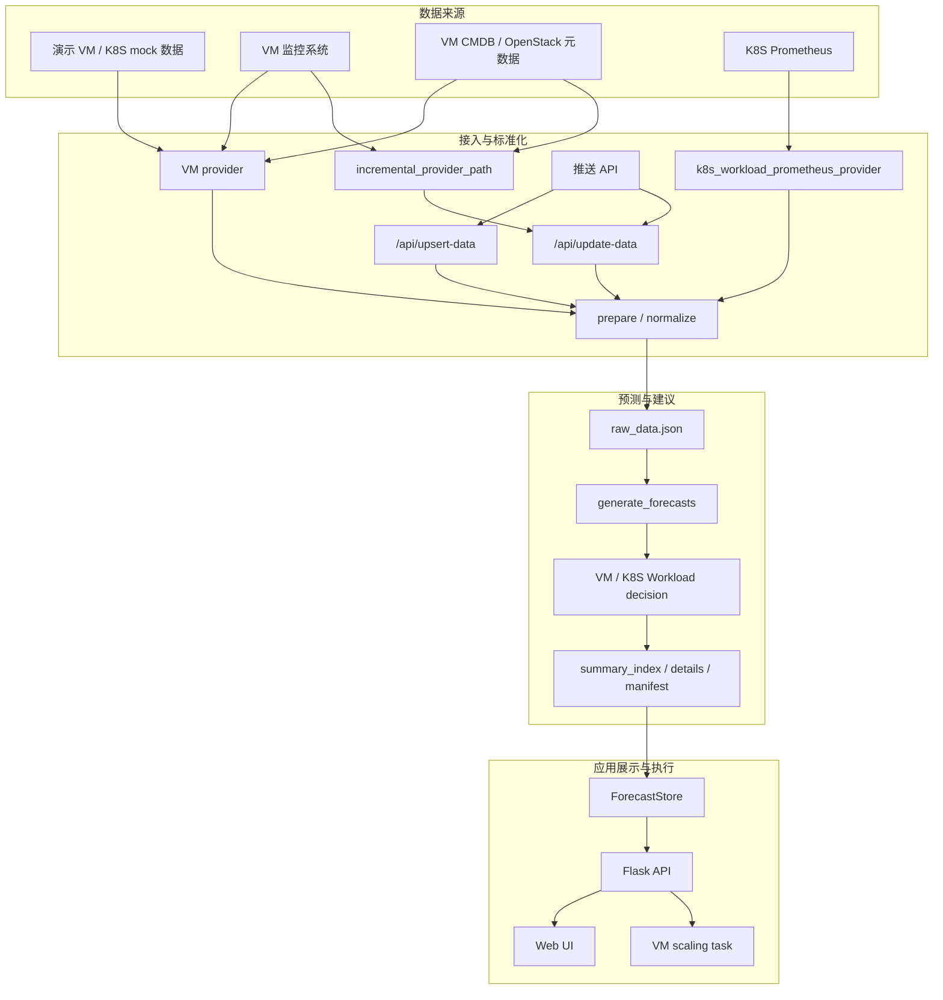
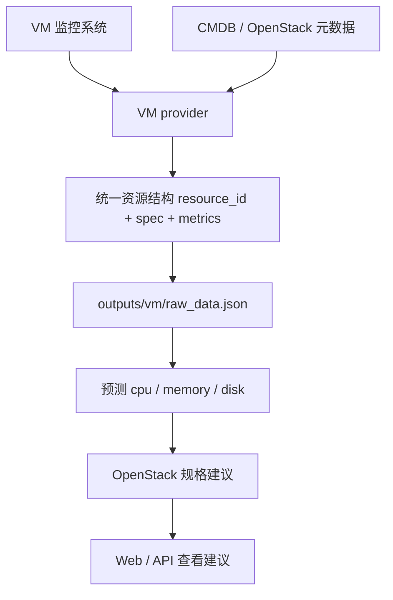
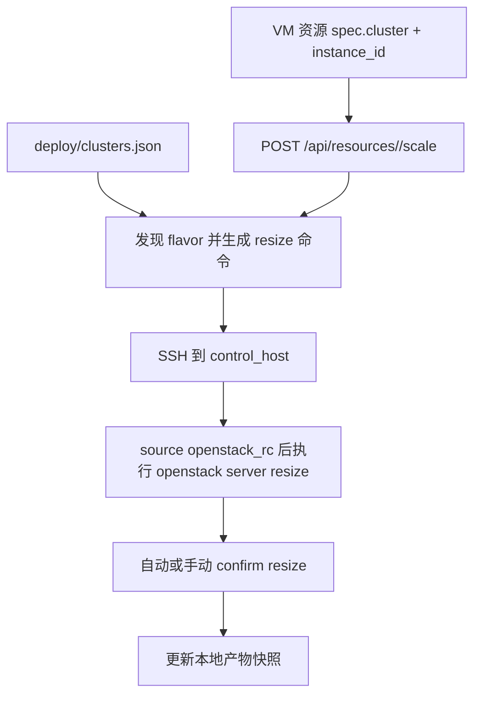
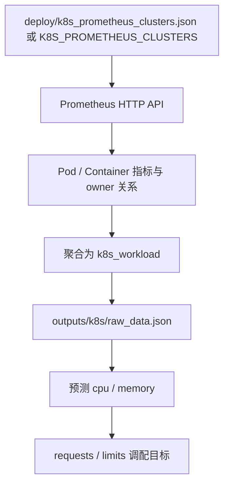
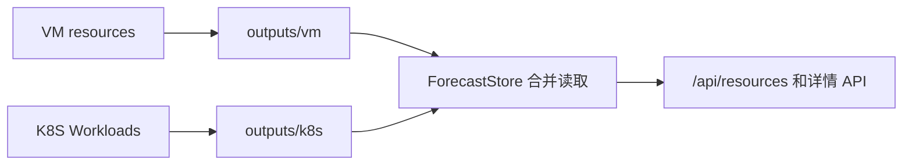
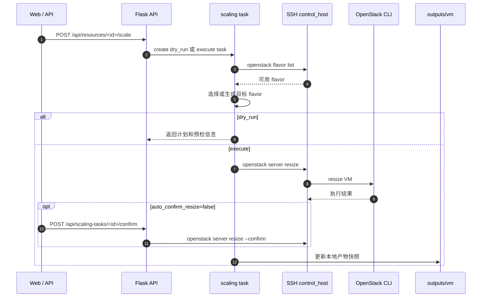

# 云资源使用预测与调配建议

本项目用于云资源历史使用率分析、时间序列预测、扩缩容建议生成和调配预检。当前支持两类资源：

- **VM 资源**：预测 `cpu / memory / disk`，生成 OpenStack 规格调整建议，并可通过 SSH 到 OpenStack 控制节点执行 resize。
- **K8S Workload**：从 Prometheus 聚合 Pod/Container 指标到 Deployment/StatefulSet/DaemonSet 等控制器粒度，预测 `cpu / memory`，生成 requests/limits 与目标副本数建议，并可通过 SSH 到 K8S 控制节点执行 `kubectl` 调配。

预测产物按资源族隔离：

- VM: `outputs/vm/`
- K8S: `outputs/k8s/`

Web/API 会自动合并两个目录展示，K8S 数据接入不会覆盖 VM 产物。

## 目录

- [1. 快速开始](#1-快速开始)
- [2. 项目结构](#2-项目结构)
- [3. 架构与数据流](#3-架构与数据流)
  - [3.1 总体架构](#31-总体架构)
  - [3.2 真实 VM 接入流程](#32-真实-vm-接入流程)
  - [3.3 K8S Workload 接入流程](#33-k8s-workload-接入流程)
  - [3.4 产物隔离](#34-产物隔离)
  - [3.5 VM 调配执行流程](#35-vm-调配执行流程)
- [4. CLI 命令](#4-cli-命令)
- [5. 真实 VM 数据接入](#5-真实-vm-数据接入)
- [6. K8S Prometheus 接入](#6-k8s-prometheus-接入)
- [7. API 摘要](#7-api-摘要)
- [8. 配置](#8-配置)
- [9. 验证与维护](#9-验证与维护)

## 1. 快速开始

以下命令面向 CentOS/Linux shell。

```bash
python3 -m venv .venv
source .venv/bin/activate
python -m pip install -r requirements.txt
python -m pip install -r requirements-dev.txt
```

生成演示预测产物：

```bash
python generate_forecasts.py
```

只基于已有 `raw_data.json` 重算预测：

```bash
python generate_forecasts.py predict
```

检查产物健康状态：

```bash
python check_outputs.py
```

启动 Web：

```bash
python app.py
```

默认访问：

```text
http://127.0.0.1:5000
```

## 2. 项目结构

```text
.
├── app.py                         # Flask Web 入口
├── generate_forecasts.py          # 演示数据生成/预测重算 CLI
├── ingest_k8s_workloads.py        # K8S Workload Prometheus 接入 CLI
├── check_outputs.py               # 预测产物健康检查 CLI
├── requirements.txt               # 运行依赖
├── requirements-dev.txt           # 测试和静态检查工具
├── deploy/
│   └── clusters.example.json      # VM 调配配置示例
├── resource_predict/
│   ├── api/                       # Flask API 路由
│   ├── core/                      # 预测、VM 决策、K8S Workload 决策
│   ├── data/                      # raw_data 读写与增量合并
│   ├── pipeline/                  # 预测管线和产物写入
│   ├── providers/                 # mock / Prometheus 数据源
│   ├── services/                  # 应用服务、调配、配置、store
│   ├── resource_types.py          # 资源类型和指标集
│   └── settings.py                # 默认配置
├── static/                        # 前端静态资源
├── templates/                     # Flask 模板
├── tests/                         # 自动化测试
└── outputs/                       # 运行产物，已被 .gitignore 忽略
```

## 3. 架构与数据流

### 3.1 总体架构



### 3.2 真实 VM 接入流程

真实 VM 接入以 provider 为主路径：provider 从监控系统读取指标、从 CMDB 或 OpenStack 元数据补齐规格和实例 ID，返回统一资源结构后写入 `outputs/vm/raw_data.json` 并触发预测。推送 API 是补充入口，适合外部平台已经整理好同一份 JSON 的场景。调配配置是另一条链路，用 `resource_id`、`spec.cluster`、`spec.instance_id` 把预测建议和 OpenStack resize 关联起来。





### 3.3 K8S Workload 接入流程



### 3.4 产物隔离



每个 scope 内包含：

```text
raw_data.json
summary_index.json
manifest.json
details/*.json
```

### 3.5 VM 调配执行流程



## 4. CLI 命令

### 4.1 预测生成

```bash
python generate_forecasts.py
```

只重算预测，不覆盖 raw：

```bash
python generate_forecasts.py predict
```

### 4.2 K8S Workload 接入

```bash
export K8S_PROMETHEUS_CLUSTERS='{"cluster-k8s-a":"http://prometheus.example:9090"}'
python ingest_k8s_workloads.py
```

只诊断，不写产物：

```bash
python ingest_k8s_workloads.py --diagnose
python ingest_k8s_workloads.py --diagnose --json
```

只拉取指定集群：

```bash
python ingest_k8s_workloads.py --cluster cluster-k8s-a
```

### 4.3 产物检查

```bash
python check_outputs.py
python check_outputs.py --json
python check_outputs.py --allow-missing-type
```

## 5. 真实 VM 数据接入

### 5.1 接入前准备

真实 VM provider 要返回与 `data_provider` / 增量 provider 合约一致的资源结构。每个 VM 至少需要提供：

| 字段 | 说明 |
| --- | --- |
| `resource_id` | VM 在本系统中的稳定 ID |
| `resource_type` | 建议写 `openstack_vm` |
| `spec.cluster` | 对应 `deploy/clusters.json` 中的集群名 |
| `spec.instance_id` 或 `spec.server_id` | OpenStack server ID，执行 resize 时必需 |
| `spec.cpu_cores` / `memory_gb` / `disk_gb` | 当前规格 |
| `metrics.cpu` / `memory` / `disk` | 使用率序列，值为 `[0, 1]` 小数 |

### 5.2 Provider 接入

全量接入用于初始化或重建 `outputs/vm/raw_data.json`，provider 函数返回 VM 资源列表，结构与 `resource_predict.providers.mock.mock_provider` 中的 VM 数据一致：

```python
def vm_provider(resources: int, n: int, freq: str) -> list[dict]:
    return [
        {
            "resource_id": "vm-prod-001",
            "resource_type": "openstack_vm",
            "spec": {
                "cluster": "cluster-openstack-a",
                "instance_id": "7b8c1d2e-0000-1111-2222-333344445555",
                "ip": "10.0.10.21",
                "cpu_cores": 4,
                "memory_gb": 8,
                "disk_gb": 100
            },
            "metrics": {
                "cpu": {"timestamps": [...], "values": [...]},
                "memory": {"timestamps": [...], "values": [...]},
                "disk": {"timestamps": [...], "values": [...]}
            }
        }
    ]
```

增量 pull 接入用于已有 VM 的持续更新，配置 `resource_predict/settings.py` 中的 `settings.update.incremental_provider_path`，格式为 `module:function`。该函数接收当前已准备好的资源列表和追加点数，返回同样的 `resource_id + metrics` 增量数据：

```python
def vm_incremental_provider(prepared_resources: list[dict], points_to_add: int) -> list[dict]:
    return [
        {
            "resource_id": "vm-prod-001",
            "metrics": {
                "cpu": {"timestamps": [...], "values": [...]},
                "memory": {"timestamps": [...], "values": [...]},
                "disk": {"timestamps": [...], "values": [...]}
            }
        }
    ]
```

手动触发 pull 更新：

```bash
curl -X POST http://127.0.0.1:5000/api/update-trigger
```

### 5.3 推送新增或更新 VM

如果外部系统已经完成 provider 侧采集和标准化，也可以直接推送同一份资源结构。`/api/upsert-data` 可新增资源，也可给已有资源追加新点。

```bash
curl -X POST http://127.0.0.1:5000/api/upsert-data \
  -H 'Content-Type: application/json' \
  -d '[
    {
      "resource_id": "vm-prod-001",
      "resource_type": "openstack_vm",
      "spec": {
        "cluster": "cluster-openstack-a",
        "instance_id": "7b8c1d2e-0000-1111-2222-333344445555",
        "ip": "10.0.10.21",
        "cpu_cores": 4,
        "memory_gb": 8,
        "disk_gb": 100
      },
      "metrics": {
        "cpu": {
          "timestamps": [1778500000000, 1778500300000],
          "values": [0.62, 0.66]
        },
        "memory": {
          "timestamps": [1778500000000, 1778500300000],
          "values": [0.71, 0.73]
        },
        "disk": {
          "timestamps": [1778500000000, 1778500300000],
          "values": [0.45, 0.45]
        }
      }
    }
  ]'
```

`/api/update-data` 只更新已有资源，适合资源已经在 `raw_data.json` 中、后续只追加指标点的场景。

```bash
curl -X POST http://127.0.0.1:5000/api/update-data \
  -H 'Content-Type: application/json' \
  -d '[
    {
      "resource_id": "vm-prod-001",
      "metrics": {
        "cpu": {"timestamps": [1778500600000], "values": [0.69]},
        "memory": {"timestamps": [1778500600000], "values": [0.74]},
        "disk": {"timestamps": [1778500600000], "values": [0.46]}
      }
    }
  ]'
```

提交后可查询任务状态：

```bash
curl http://127.0.0.1:5000/api/update-status
```

### 5.4 配置调配控制节点

复制示例配置并按真实环境修改：

```bash
cp deploy/clusters.example.json deploy/clusters.json
```

VM 与 K8S Workload 调配都读取 `deploy/clusters.json`，其中集群名需要与资源的 `spec.cluster` 一致。OpenStack 集群用于 VM resize，K8S 集群用于执行 `kubectl set resources` 和 `kubectl scale`。

OpenStack 关键字段如下：

| 字段 | 说明 |
| --- | --- |
| `cloud_type` | OpenStack 集群写 `openstack` |
| `control_host` | 可执行 `openstack` CLI 的控制节点地址 |
| `ssh_user` / `ssh_port` / `ssh_key` | SSH 登录信息 |
| `openstack_rc` | 控制节点上的 OpenStack RC 文件路径 |
| `auto_confirm_resize` | 是否自动执行 `openstack server resize --confirm` |
| `allowed_flavors` | 可选，限制自动选择的 flavor 名称 |

K8S 关键字段如下：

| 字段 | 说明 |
| --- | --- |
| `cloud_type` | K8S 集群写 `k8s` |
| `control_host` | 可执行 `kubectl` 的控制节点地址 |
| `ssh_user` / `ssh_port` / `ssh_key` | SSH 登录信息 |
| `kubeconfig` | 控制节点上的 kubeconfig 路径，例如 `/root/.kube/config` |
| `command_timeout_seconds` | 调配命令超时时间 |

页面的“集群配置”里可以新增 VM 集群或 K8S 集群；保存后会写入同一个 `deploy/clusters.json`。

发起调配前建议先 dry run，由页面操作或直接调用 API：

```bash
curl -X POST http://127.0.0.1:5000/api/resources/vm-prod-001/scale \
  -H 'Content-Type: application/json' \
  -d '{"mode":"dry_run"}'
```

K8S Workload 的建议会在 `scaling_advice.target_spec` 中给出目标 requests/limits 和 `replicas`，例如 `cpu_request_cores`、`memory_limit_gb`、`replicas`。预检示例：

```bash
curl -X POST http://127.0.0.1:5000/api/resources/k8s:cluster-k8s-a:prod:deployment:api/scale \
  -H 'Content-Type: application/json' \
  -d '{"mode":"dry_run"}'
```

确认计划无误后再执行：

```bash
curl -X POST http://127.0.0.1:5000/api/resources/vm-prod-001/scale \
  -H 'Content-Type: application/json' \
  -d '{"mode":"execute","confirm":true,"operator":"ops"}'
```

如果 `auto_confirm_resize=false`，resize 成功后任务会进入 `waiting_confirm`，需要再确认：

```bash
curl -X POST http://127.0.0.1:5000/api/scaling-tasks/<task_id>/confirm \
  -H 'Content-Type: application/json' \
  -d '{"confirm":true,"operator":"ops"}'
```

## 6. K8S Prometheus 接入

### 6.1 需要的 Prometheus 指标

| 指标 | 用途 |
| --- | --- |
| `container_cpu_usage_seconds_total` | CPU 使用量 |
| `container_memory_working_set_bytes` | 内存使用量 |
| `kube_pod_owner` | Pod 到 ReplicaSet/控制器的 owner 关系 |
| `kube_replicaset_owner` | ReplicaSet 到 Deployment 的 owner 关系 |
| `kube_pod_container_resource_requests*` | CPU/Memory request |
| `kube_pod_container_resource_limits*` | CPU/Memory limit |

provider 会把 Pod/Container 序列聚合为 `k8s_workload`，生成形如：

```text
k8s:<cluster>:<namespace>:<workload-kind>:<workload-name>
```

### 6.2 配置方式

临时验证推荐环境变量：

```bash
export K8S_PROMETHEUS_CLUSTERS='{"cluster-k8s-a":"http://127.0.0.1:9090"}'
python ingest_k8s_workloads.py --diagnose
```

长期运行推荐写入：

```text
deploy/k8s_prometheus_clusters.json
```

示例：

```json
[
  {
    "cluster": "cluster-k8s-a",
    "prometheus_url": "http://prometheus.example:9090",
    "namespace_regex": "default|prod"
  }
]
```

该文件可能包含内网地址或凭据，默认不提交。

## 7. API 摘要

| API | 说明 |
| --- | --- |
| `GET /` | Web 首页 |
| `GET /api/resources` | 资源列表 |
| `GET /api/resources/<id>` | 资源详情 |
| `GET /api/resources/details?ids=a,b` | 批量详情 |
| `GET /api/resources/advice-summary` | 建议统计 |
| `GET /api/update-status` | 更新任务状态 |
| `POST /api/update-trigger` | 触发 pull 型增量更新 |
| `POST /api/update-data` | 只更新已有资源 |
| `POST /api/upsert-data` | 更新或新增资源 |
| `GET /api/cluster-configs` | 读取集群配置 |
| `PUT /api/cluster-configs` | 保存集群配置 |
| `GET /api/forecast-config` | 读取预测模型开关 |
| `PUT /api/forecast-config` | 保存预测模型开关 |
| `POST /api/cluster-configs/k8s-diagnose` | 诊断 K8S Prometheus |
| `POST /api/cluster-configs/k8s-fetch` | 拉取 K8S Prometheus 数据 |
| `POST /api/resources/<id>/scale` | 创建调配任务 |
| `GET /api/scaling-tasks/<id>` | 查询调配任务 |
| `POST /api/scaling-tasks/<id>/confirm` | 确认 OpenStack resize，K8S 调配无需该确认步骤 |

常用列表参数：

| 参数 | 说明 |
| --- | --- |
| `resource_type=openstack_vm` | 只看 VM |
| `resource_type=k8s_workload` | 只看 K8S Workload |
| `q=keyword` | 搜索资源 ID、IP、namespace、workload、node 等 |
| `action=scale_out` | 筛选 VM 扩容 |
| `action=scale_out_candidate` | 筛选 K8S 扩容建议 |
| `page/page_size` | 分页 |
| `sort_by=urgency_score` | 按紧急度排序 |

## 8. 配置

主要默认配置在：

```text
resource_predict/settings.py
```

本地敏感配置：

```text
deploy/clusters.json
deploy/k8s_prometheus_clusters.json
deploy/forecast_config.json
.env
```

这些文件已在 `.gitignore` 中忽略。

预测模型默认启用 `seasonal_naive` 和 `prophet`，默认关闭 `rolling_mean` 与 `ensemble`。可以在 Web 页面的“集群配置 -> 预测模型”中启用或关闭 ARIMA、SARIMA、Prophet、Seasonal naive、Rolling mean 和 Ensemble；保存后会写入 `deploy/forecast_config.json`，后续重新预测时生效。

预测窗口由 `resource_predict/settings.py` 中的 `settings.generation` 控制。系统按资源族分别解析窗口：

| 配置 | 作用 | 默认行为 |
| --- | --- | --- |
| `default_test_size` / `default_future_steps` | 未设置资源族专用窗口时的兜底点数 | `72` 个测试点、`24` 个未来预测点 |
| `vm_test_size` / `vm_future_steps` | VM 专用点数覆盖 | `None`，沿用 `default_*` 兜底；默认 VM mock 为小时级，所以相当于 72 小时测试、24 小时预测 |
| `vm_test_duration` / `vm_future_duration` | VM 专用时长，优先于 VM 点数 | `None` |
| `workload_test_size` / `workload_future_steps` | K8S Workload 专用点数覆盖 | `None`，未设置时可继续走 `default_*` 兜底 |
| `workload_test_duration` / `workload_future_duration` | K8S Workload 专用时长，优先于 Workload 点数 | 默认 `24h` / `24h` |

时长配置会根据真实时间序列采样间隔自动换算为点数。例如 K8S Prometheus 默认 `step_seconds=300`，即 5 分钟一个点，`workload_test_duration="24h"` 会换算为 `288` 个测试点，`workload_future_duration="24h"` 会换算为 `288` 个未来预测点。预测产物会在 `summary_index.meta.forecast_window` 和 `generation_stats.forecast_window` 中记录实际生效的点数、时长来源和采样间隔。

## 9. 验证与维护

### 9.1 回归检查

```bash
python -m compileall -q app.py check_outputs.py generate_forecasts.py ingest_k8s_workloads.py resource_predict tests
python -m pyflakes app.py check_outputs.py generate_forecasts.py ingest_k8s_workloads.py resource_predict tests
vulture app.py check_outputs.py generate_forecasts.py ingest_k8s_workloads.py resource_predict tests --min-confidence 80
python -m pytest -q
```

### 9.2 维护约定

- 根目录只放直接运行的 CLI 或项目级配置。
- 业务逻辑放入 `resource_predict/` 包内，CLI 只做参数解析和输出。
- 新增 K8S 逻辑优先使用 `workload` 命名；`pod` 只作为 Prometheus 标签或历史产物兼容词出现。
- 预测产物统一称为 `outputs` 或 `forecast artifacts`，不要再使用 `images` 命名。
- 不提交 `outputs/`、日志、缓存、`__pycache__`、本地凭据。

### 9.3 常见问题

| 问题 | 处理 |
| --- | --- |
| 页面无数据 | 先运行 `python generate_forecasts.py`，再运行 `python check_outputs.py` |
| VM 有数据，K8S 为空 | 检查 Prometheus 配置，运行 `python ingest_k8s_workloads.py --diagnose` |
| 提示缺少 K8S Prometheus 配置 | 设置 `K8S_PROMETHEUS_CLUSTERS` 或写入 `deploy/k8s_prometheus_clusters.json` |
| VM 调配提示缺少配置 | 检查 `deploy/clusters.json` 中是否存在与 `spec.cluster` 同名的 OpenStack 集群 |
| K8S 调配提示缺少配置 | 检查 `deploy/clusters.json` 中是否存在与 `spec.cluster` 同名且 `cloud_type=k8s` 的集群 |
| OpenStack flavor 发现失败 | 确认控制节点能 SSH 登录，且 `openstack_rc` 加载后可执行 `openstack flavor list -f json` |
| 产物结构不一致 | 运行 `python check_outputs.py --json` 查看具体错误 |
| 测试工具缺失 | 运行 `python -m pip install -r requirements-dev.txt` |
