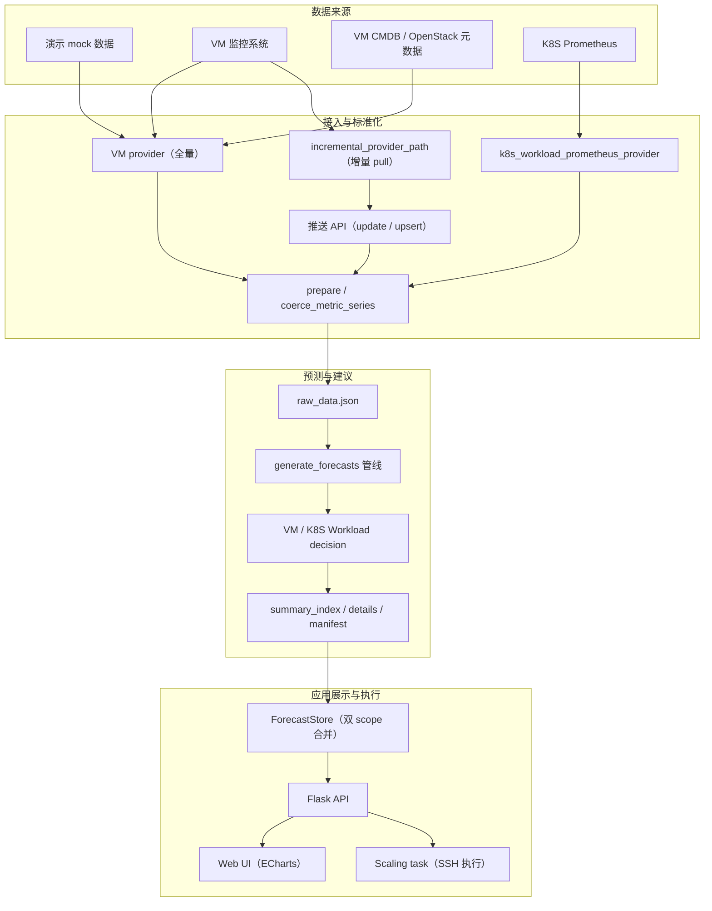
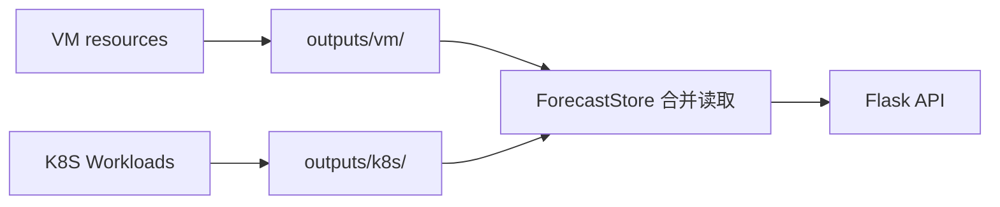

# 云资源使用预测与调配建议系统

基于时间序列预测的云资源智能分析与调配平台。系统自动采集 VM 和 K8S Workload 的 CPU / 内存 / 磁盘使用率，运行多模型预测，生成扩缩容建议（含目标规格和副本数），并可通过 SSH 在控制节点上执行实际调配操作。

**支持资源类型：**

- **VM（OpenStack）**：预测 `cpu / memory / disk`，生成 `openstack server resize` 命令
- **K8S Workload**：从 Prometheus 聚合到控制器粒度，预测 `cpu / memory` request/limit，生成 `kubectl set resources` 和 `kubectl scale` 命令

**核心能力：**

- 多模型预测（ARIMA / SARIMA / Prophet / Seasonal Naive / Rolling Mean / Ensemble）
- 自动最优模型选择（基于 RMSE + 滚动回测）
- 异常检测与鲁棒路由
- 策略分级（conservative / balanced / aggressive）与 Namespace-aware 差异化阈值
- 增量数据接入（pull 定时 / push HTTP）
- 预测误差报告、紧急度评分、调配执行与结果快照

---

## 目录

- [1. 环境要求与安装](#1-环境要求与安装)
- [2. 快速开始](#2-快速开始)
- [3. 架构概览](#3-架构概览)
- [4. 配置与部署](#4-配置与部署)
- [5. API 概览](#5-api-概览)
- [6. 测试](#6-测试)
- [详细文档](#详细文档)

---

## 1. 环境要求与安装

### 1.1 环境要求

| 项目 | 要求 |
| --- | --- |
| Python | >= 3.8 |
| 操作系统 | CentOS / RHEL / Ubuntu（推荐）；Windows 可运行 |
| 内存 | >= 4 GB（Prophet 模型较吃内存） |
| 可选依赖 | OpenStack CLI（VM 调配）、kubectl + kubeconfig（K8S 调配） |

### 1.2 安装

```bash
python3 -m venv .venv
source .venv/bin/activate

# 运行依赖
python -m pip install -r requirements.txt

# 开发与测试依赖
python -m pip install -r requirements-dev.txt
```

**运行依赖（`requirements.txt`）：**

| 包 | 用途 |
| --- | --- |
| Flask | Web 框架与 API |
| numpy | 数值计算 |
| pandas | 时间序列处理 |
| statsmodels | ARIMA / SARIMA 模型 |
| prophet | Facebook Prophet 模型 |

**开发依赖（`requirements-dev.txt`）：**

| 包 | 用途 |
| --- | --- |
| pytest | 单元与集成测试 |
| pyflakes | 静态检查 |
| vulture | 死代码检测 |

---

## 2. 快速开始

以下命令面向 CentOS / Linux shell。

```bash
source .venv/bin/activate
```

### 2.1 生成演示预测产物

```bash
python generate_forecasts.py
```

首次运行会生成 mock VM 数据并运行全量预测，产物输出到 `outputs/vm/` 和 `outputs/k8s/`。

### 2.2 仅重算预测（不覆盖原始数据）

```bash
python generate_forecasts.py predict
```

该模式会在预测前后校验 `raw_data.json` 的 SHA-256 摘要，确保原始数据未被篡改。

### 2.3 检查产物健康状态

```bash
python check_outputs.py
```

支持 `--json` 输出机器可读格式，`--allow-missing-type` 容忍仅有 VM 或仅有 K8S 产物。

### 2.4 启动 Web 服务

```bash
python app.py
```

访问 `http://127.0.0.1:5000`

### 2.5 K8S 数据接入

```bash
export K8S_PROMETHEUS_CLUSTERS='{"cluster-k8s-a":"http://prometheus.example:9090"}'
python ingest_k8s_workloads.py
```

仅诊断连通性：

```bash
python ingest_k8s_workloads.py --diagnose --json
```

仅拉取指定集群：

```bash
python ingest_k8s_workloads.py --cluster cluster-k8s-a
```

---

## 3. 架构概览



数据通过 Provider 接入后写入 `raw_data.json`，预测管线运行多模型并生成扩缩容建议，产物通过 ForecastStore 合并后供 Web UI 和调配执行使用。



VM 和 K8S 产物完全物理隔离，API 层透明合并。

完整目录结构、管线流程、数据更新机制和核心模块说明见 [docs/architecture.md](docs/architecture.md)。

---

## 4. 配置与部署

| 文件 | 用途 |
| --- | --- |
| `deploy/clusters.json` | VM / K8S 调配集群配置（含 SSH 凭据） |
| `deploy/k8s_prometheus_clusters.json` | K8S Prometheus 集群地址与认证 |
| `deploy/forecast_config.json` | 预测模型开关 |
| `.env` | 环境变量覆盖 |

从示例复制集群配置：`cp deploy/clusters.example.json deploy/clusters.json`

完整配置参数、JSON 示例和输出产物 schema 见 [docs/configuration.md](docs/configuration.md)。

---

## 5. API 概览

| 方法 | 路径 | 说明 |
| --- | --- | --- |
| GET | `/` | Web 首页（SPA） |
| GET | `/api/resources` | 资源列表（分页、筛选、搜索） |
| GET | `/api/resources/<id>` | 资源详情（含 charts） |
| GET | `/api/resources/details?ids=a,b` | 批量详情 |
| GET | `/api/resources/advice-summary` | 建议统计 |
| GET | `/api/update-status` | 更新任务状态 |
| POST | `/api/update-trigger` | 触发 pull 增量更新 |
| POST | `/api/update-data` | 推送增量数据（仅更新已有） |
| POST | `/api/upsert-data` | 推送数据（更新或新增） |
| POST | `/api/resources/<id>/scale` | 创建调配任务 |
| GET | `/api/scaling-tasks/<id>` | 查询调配任务 |
| POST | `/api/scaling-tasks/<id>/confirm` | 确认 resize |
| GET/PUT | `/api/cluster-configs` | 集群配置读写 |
| GET/PUT | `/api/forecast-config` | 预测模型开关读写 |
| POST | `/api/cluster-configs/k8s-fetch` | 拉取 K8S 数据（异步） |

详细参数、请求体格式和 curl 示例见 [docs/api-reference.md](docs/api-reference.md)。

---

## 6. 测试

```bash
# 1. 编译检查
python -m compileall -q app.py check_outputs.py generate_forecasts.py ingest_k8s_workloads.py resource_predict tests

# 2. 静态分析
python -m pyflakes app.py check_outputs.py generate_forecasts.py ingest_k8s_workloads.py resource_predict tests

# 3. 死代码检测
vulture app.py check_outputs.py generate_forecasts.py ingest_k8s_workloads.py resource_predict tests --min-confidence 80

# 4. 测试
python -m pytest -q
```

测试策略、开发指南和 FAQ 见 [docs/development.md](docs/development.md)。

---

## 详细文档

| 文档 | 内容 |
| --- | --- |
| [docs/architecture.md](docs/architecture.md) | 目录结构、总体架构、管线流程、数据更新机制、核心模块说明 |
| [docs/configuration.md](docs/configuration.md) | 部署配置文件详解、全局参数默认值、输出产物结构 |
| [docs/api-reference.md](docs/api-reference.md) | API 端点详细参数、请求体格式、curl 使用示例 |
| [docs/development.md](docs/development.md) | 测试策略、代码约定、Provider 接口、安全规范、常见问题 |
