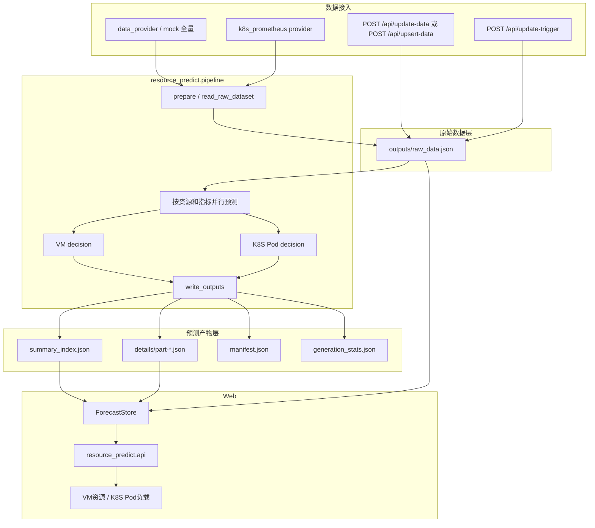
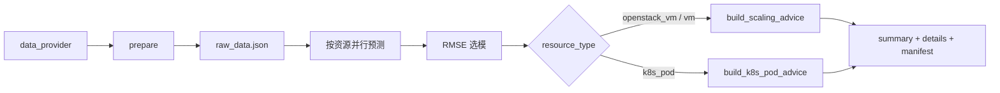
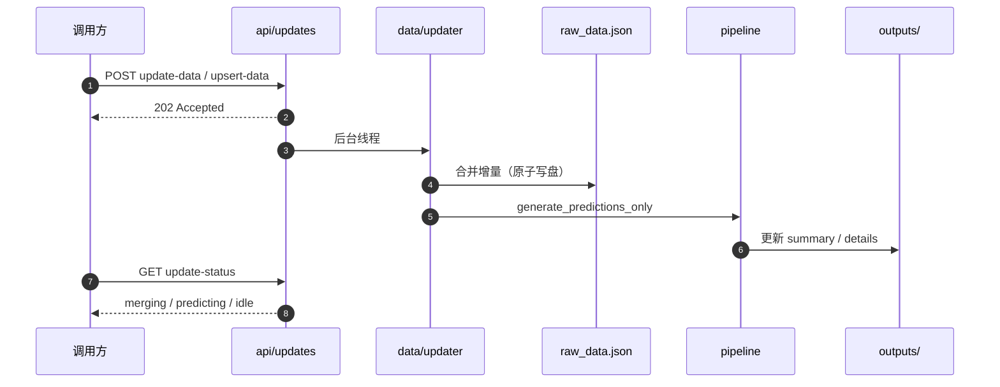
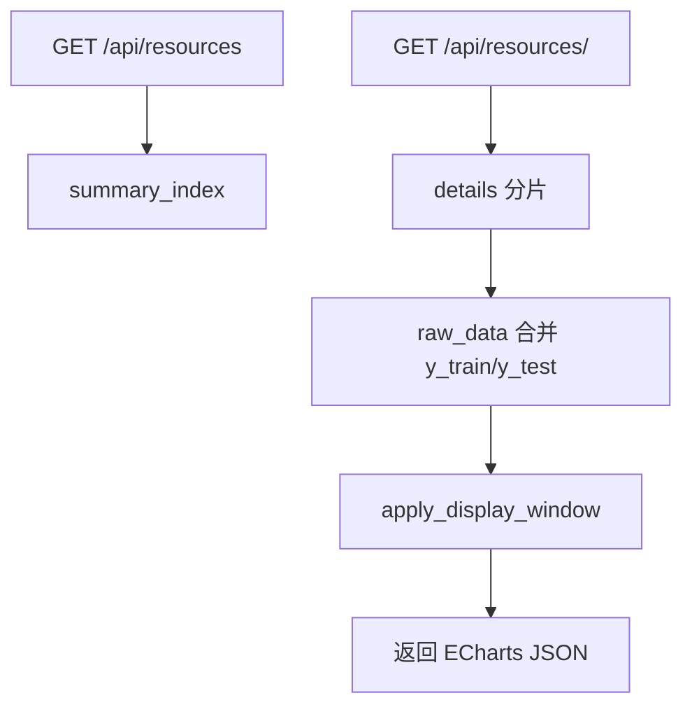
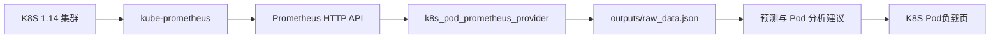
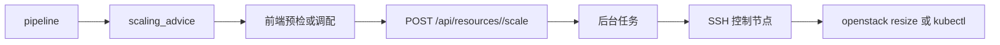
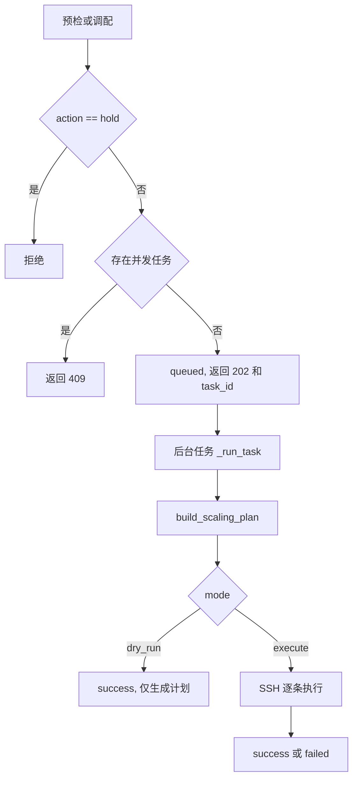

# 云资源使用预测与扩缩容建议

本项目用于云资源使用率分析、时间序列预测和扩缩容建议生成。当前支持两类主视图：

- **VM 资源**：以虚拟机为对象，预测 CPU、内存、硬盘，并给出目标规格建议。
- **K8S Pod 负载**：以 Pod 容器为对象，接入 kube-prometheus 的 CPU、内存监控数据，给出分析建议，不自动执行 Pod 调配。

系统采用“原始监控数据”和“预测产物”分层设计：`raw_data.json` 保存观测序列，`summary_index.json` 与 `details/` 保存预测结果，前端通过 API 合并展示。

---

## 目录

| 章节 | 说明 |
| --- | --- |
| [1. 功能概览](#1-功能概览) | VM、K8S Pod、预测、前端、调配能力 |
| [2. 快速开始](#2-快速开始) | 本地运行、预测生成、Web 启动 |
| [3. 项目结构](#3-项目结构) | 目录说明与主要模块 |
| [4. 数据流与产物](#4-数据流与产物) | 数据流图、产物职责、全量/增量流程 |
| [5. 资源类型与数据模型](#5-资源类型与数据模型) | VM 与 K8S Pod 的输入格式和建议结构 |
| [6. K8S Pod 真实环境接入](#6-k8s-pod-真实环境接入) | kube-prometheus 接入步骤 |
| [7. API 参考](#7-api-参考) | 列表、详情、更新、调配 API |
| [8. 资源调配](#8-资源调配) | OpenStack/K8S 调配预检与执行 |
| [9. 配置与运维](#9-配置与运维) | 配置项、日志、运行建议 |
| [10. 常见问题](#10-常见问题) | 排错与维护建议 |

---

## 1. 功能概览

- **双主视图**：前端提供“VM资源”和“K8S Pod负载”两个主视图。
- **多指标预测**：VM 支持 `cpu / memory / disk`；K8S Pod v1 支持 `cpu / memory`。
- **自动选模**：支持 ARIMA、SARIMA、Prophet，按测试集 RMSE 选择最佳模型。
- **数据分层**：`raw_data.json` 存观测数据，`details/` 存预测曲线。
- **增量更新**：`POST /api/update-data` 或 `POST /api/upsert-data` 接收监控增量，后台合并并重预测。
- **指标级重预测**：仅更新某个指标时，可保留其他指标旧预测并重建建议。
- **VM 扩缩容建议**：输出 `action / confidence / reason / target_spec / stats`。
- **K8S Pod 分析建议**：输出 `scale_out_candidate / scale_in_candidate / hold / insufficient_data`，仅分析，不自动执行调配。
- **调配执行**：已有 OpenStack VM resize 和 K8S workload requests/limits 调配入口；Pod 视图 v1 不接入执行。
- **稳定写入**：关键 JSON 使用临时文件 + 原子替换，降低写坏风险。

---

## 2. 快速开始

建议使用项目虚拟环境：

```powershell
$env:PYTHONUTF8="1"
.\.venv\Scripts\python.exe -m pip install -r requirements.txt
```

`PYTHONUTF8=1` 建议保留。Windows 中文路径下，Prophet/CmdStanPy 可能因默认 GBK 解码报错。

### 2.1 生成 VM 演示数据

```powershell
$env:PYTHONUTF8="1"
.\.venv\Scripts\python.exe generate_images.py
```

仅基于已有 `outputs/raw_data.json` 重算预测：

```powershell
$env:PYTHONUTF8="1"
.\.venv\Scripts\python.exe generate_images.py predict
```

### 2.2 生成 K8S Pod 数据

需要先配置 Prometheus 地址，详见 [6. K8S Pod 真实环境接入](#6-k8s-pod-真实环境接入)。该命令默认使用 upsert 模式，会合并到现有 `raw_data.json`，不会覆盖已有 VM。

```powershell
$env:K8S_PROMETHEUS_URL="http://你的-prometheus:9090"
$env:PYTHONUTF8="1"
.\.venv\Scripts\python.exe generate_k8s_pods.py
```

### 2.3 启动 Web

```powershell
$env:PYTHONUTF8="1"
.\.venv\Scripts\python.exe app.py
```

访问：

```text
http://127.0.0.1:5000
```

顶部可切换：

- `VM资源`
- `K8S Pod负载`

---

## 3. 项目结构

```text
resource_predict/
├── app.py                         # Flask Web 入口
├── generate_images.py             # VM/通用预测 CLI
├── generate_k8s_pods.py           # K8S Pod Prometheus 接入 CLI
├── deploy/
│   └── clusters.example.json      # 调配控制节点配置示例
├── resource_predict/
│   ├── settings.py                # 全局配置
│   ├── resource_types.py          # resource_type 与指标集合
│   ├── core/
│   │   ├── forecasting.py         # ARIMA/SARIMA/Prophet
│   │   ├── decision.py            # VM 扩缩容建议
│   │   └── k8s_pod_decision.py    # K8S Pod 分析建议
│   ├── data/
│   │   ├── io.py                  # raw_data 读写与图表合并
│   │   └── updater.py             # 增量合并与后台重预测
│   ├── providers/
│   │   ├── mock.py                # 演示数据
│   │   └── k8s_prometheus.py      # kube-prometheus provider
│   ├── pipeline/
│   │   ├── run.py                 # 全量/仅预测主流程
│   │   ├── prepare.py             # provider 数据标准化
│   │   ├── partial.py             # 指标级增量合并
│   │   └── write_outputs.py       # summary/details/manifest 写出
│   ├── api/                       # Flask API 路由
│   └── services/
│       ├── store/                 # 读取 summary/details/raw
│       ├── scaling/               # 调配任务
│       └── urgency.py             # 列表紧迫度排序
├── templates/
├── static/
└── outputs/                       # 运行时产物，已被 .gitignore 忽略
```

业务代码统一使用 `resource_predict.*` 导入。

---

## 4. 数据流与产物

### 4.1 总体架构



### 4.2 产物职责

| 文件 | 写入方 | 读取方 | 内容 |
| --- | --- | --- | --- |
| `outputs/raw_data.json` | 全量生成 / updater / K8S provider | pipeline、ForecastStore | 原始观测序列、资源元数据、数据质量 |
| `outputs/summary_index.json` | pipeline | 列表 API | 资源摘要、建议、紧迫度排序依据、详情引用 |
| `outputs/details/part-*.json` | pipeline | 详情 API | 预测曲线、RMSE、best_method |
| `outputs/manifest.json` | pipeline | 兼容回退 | 合并后的旧结构 |
| `outputs/generation_stats.json` | pipeline | 运维 | 最近一次生成统计 |
| `outputs/scaling_tasks.json` | 调配任务 | 调配 API | 预检/执行任务记录 |
| `outputs/resource_predict.log` | 运行时 | 运维 | 预测、更新、调配日志 |

`details` 只保存预测曲线；完整图表数据由 `ForecastStore` 读取 `raw_data.json` 后与预测结果合并。

### 4.3 全量生成



### 4.4 增量更新



规则：

- `update-data` 只更新已有资源。
- `upsert-data` 可插入新资源。
- 更新时记录本次变化的 `resource_id` 和指标名。
- 若有旧预测产物，会尽量只重算变化指标，再重建建议。
- `display_window_points` 只影响前端展示，不裁剪训练数据。

### 4.5 前端读取详情



更新进行中若资源处于 `writing_raw` / `predicting`，详情接口返回 `202 + prediction_pending`。

---

## 5. 资源类型与数据模型

### 5.1 支持的资源类型

| resource_type | 主视图 | 指标 | 建议类型 | 是否执行调配 |
| --- | --- | --- | --- | --- |
| `openstack_vm` / 默认 VM | VM资源 | `cpu / memory / disk` | `scale_out / scale_in / hold` | 支持 OpenStack resize |
| `k8s_container` | VM资源兼容调配入口 | `cpu / memory / disk` 兼容结构 | `scale_out / scale_in / hold` | 支持 workload requests/limits |
| `k8s_pod` | K8S Pod负载 | `cpu / memory` | `scale_out_candidate / scale_in_candidate / hold / insufficient_data` | v1 不执行 |

### 5.2 VM 数据格式

`data_provider` 返回 list，每项格式：

```python
{
    "resource_id": "vm-001",
    "resource_type": "openstack_vm",
    "spec": {
        "cluster": "cluster-openstack-a",
        "ip": "10.0.10.11",
        "instance_id": "server-uuid",
        "cpu_cores": 4,
        "memory_gb": 16,
        "disk_gb": 100
    },
    "metrics": {
        "cpu": {"timestamps": [1730000000000], "values": [0.42]},
        "memory": {"timestamps": [1730000000000], "values": [0.58]},
        "disk": {"timestamps": [1730000000000], "values": [0.32]}
    }
}
```

字段规则：

| 字段 | 必填 | 说明 |
| --- | --- | --- |
| `resource_id` | 是 | 资源唯一 ID |
| `resource_type` | 建议 | 默认按 VM 处理 |
| `metrics.cpu/memory/disk` | 是 | VM 三个指标都需要完整序列 |
| `timestamps` | 是 | 秒/毫秒 Unix 时间戳、ISO 字符串或 pandas 可解析值 |
| `values` | 是 | 使用率小数，通常为 `[0, 1]`，部分真实口径可超过 1 |
| `spec.cluster` | 调配必填 | 对应 `deploy/clusters.json` 的集群 key |
| `spec.instance_id/server_id` | OpenStack 调配必填 | OpenStack server ID |
| `spec.cpu_cores/memory_gb/disk_gb` | 调配建议必填 | 当前规格 |

### 5.3 K8S Pod 数据格式

K8S Pod provider 会生成：

```python
{
    "resource_id": "k8s:cluster-k8s-a:default:demo-pod:main",
    "resource_type": "k8s_pod",
    "spec": {
        "cluster": "cluster-k8s-a",
        "namespace": "default",
        "pod": "demo-pod",
        "container": "main",
        "node": "node-01",
        "cpu_request_cores": 1.0,
        "cpu_limit_cores": 2.0,
        "memory_request_gb": 1.0,
        "memory_limit_gb": 2.0,
        "cpu_metric_mode": "ratio",
        "memory_metric_mode": "ratio"
    },
    "metrics": {
        "cpu": {"timestamps": [1730000000000], "values": [0.64]},
        "memory": {"timestamps": [1730000000000], "values": [0.52]}
    },
    "data_quality": {
        "cpu": {"level": "good", "points": 2016, "missing_ratio": 0.01},
        "memory": {"level": "good", "points": 2016, "missing_ratio": 0.01}
    }
}
```

口径：

| 指标 | 优先口径 | 兜底 |
| --- | --- | --- |
| CPU | `cpu_usage_cores / cpu_request_cores` | 无 request 时用 limit；都没有则展示原始 cores |
| 内存 | `working_set_gb / memory_limit_gb` | 无 limit 时用 request；都没有则展示原始 GB |

Pod 数据质量会影响建议置信度。缺点严重或缺少 request/limit 时，系统会偏向 `insufficient_data` 或 `hold`。

---

## 6. K8S Pod 真实环境接入

你的内网环境是 **K8S 1.14 + kube-prometheus**。推荐通过 Prometheus HTTP API 拉取数据。

### 6.1 接入数据流



### 6.2 确认 Prometheus 地址

在 K8S 控制节点或能访问集群内网的机器上执行：

```bash
kubectl -n monitoring get svc
kubectl -n monitoring get pod
```

常见 Prometheus Service：

| 名称 | 说明 |
| --- | --- |
| `prometheus-k8s` | kube-prometheus 常见名称 |
| `prometheus-operated` | Prometheus Operator 创建的 headless Service |
| `kube-prometheus-stack-prometheus` | Helm chart 常见名称 |

如果 Service 是 `prometheus-k8s`，端口是 `9090`，集群内地址通常为：

```text
http://prometheus-k8s.monitoring.svc:9090
```

如果本项目运行在集群外，可先用端口转发验证：

```bash
kubectl -n monitoring port-forward svc/prometheus-k8s 9090:9090
```

此时本项目机器访问：

```text
http://127.0.0.1:9090
```

生产环境可改为内网 LB、NodePort、Nginx 反代或堡垒机代理。要求只有一个：本项目机器能访问 `http://地址:端口/api/v1/query`。

### 6.3 验证 Prometheus 指标

先在 Prometheus UI 中执行以下查询，确认有数据。

CPU 使用量：

```text
rate(container_cpu_usage_seconds_total{container!="",pod!=""}[5m])
```

内存使用量：

```text
container_memory_working_set_bytes{container!="",pod!="",container!=""}
```

K8S 1.14 常见 request/limit 指标：

```text
kube_pod_container_resource_requests_cpu_cores
kube_pod_container_resource_limits_cpu_cores
kube_pod_container_resource_requests_memory_bytes
kube_pod_container_resource_limits_memory_bytes
```

部分 kube-state-metrics 版本使用新格式，本项目也兼容：

```text
kube_pod_container_resource_requests{resource="cpu"}
kube_pod_container_resource_limits{resource="cpu"}
kube_pod_container_resource_requests{resource="memory"}
kube_pod_container_resource_limits{resource="memory"}
```

确认返回标签至少包含：

| 标签 | 用途 |
| --- | --- |
| `namespace` | 命名空间 |
| `pod` | Pod 名称 |
| `container` | 容器名称 |
| `node` | 可选，前端展示所在节点 |

### 6.4 配置 Prometheus 访问

方式 A：环境变量，适合首次验证。

```powershell
$env:K8S_PROMETHEUS_URL="http://127.0.0.1:9090"
$env:PYTHONUTF8="1"
.\.venv\Scripts\python.exe generate_k8s_pods.py
```

内网地址示例：

```powershell
$env:K8S_PROMETHEUS_URL="http://prometheus-k8s.monitoring.svc:9090"
$env:PYTHONUTF8="1"
.\.venv\Scripts\python.exe generate_k8s_pods.py
```

如需鉴权：

```powershell
$env:K8S_PROMETHEUS_BEARER_TOKEN="xxxxx"
# 或 Basic Auth，值为 base64 后的 user:password
$env:K8S_PROMETHEUS_BASIC_AUTH="dXNlcjpwYXNz"
```

方式 B：固定写入 `resource_predict/settings.py`。

```python
@dataclass(frozen=True)
class K8SPrometheusConfig:
    prometheus_url: str = "http://prometheus-k8s.monitoring.svc:9090"
    cluster: str = "cluster-k8s-a"
    history_days: int = 7
    step_seconds: int = 300
    namespace_regex: str = ""
    request_timeout_seconds: int = 30
```

| 配置 | 说明 |
| --- | --- |
| `prometheus_url` / `K8S_PROMETHEUS_URL` | Prometheus HTTP API 地址 |
| `cluster` | 集群标识，写入 `resource_id` |
| `history_days` | 默认拉取最近 7 天 |
| `step_seconds` | 默认 300 秒，即 5 分钟 |
| `namespace_regex` | 可选，只接入部分命名空间，如 `default|prod` |
| `request_timeout_seconds` | HTTP 查询超时 |

### 6.5 首次生成与查看

推荐用默认 upsert 模式接入。它会先拉取 Prometheus Pod 数据，再合并到现有 `outputs/raw_data.json`：

- 已有 VM 资源会保留。
- 已有 Pod 会按 `resource_id` 更新 `spec/data_quality`，并合并 `cpu/memory` 时间序列。
- 不存在的 Pod 会新增。
- 写入前会自动备份当前 raw 到 `outputs/backups/`。
- 如果 `raw_data.json` 不存在，则会初始化一个仅包含 K8S Pod 的 raw。

执行：

```powershell
$env:K8S_PROMETHEUS_URL="http://你的-prometheus:9090"
$env:PYTHONUTF8="1"
.\.venv\Scripts\python.exe generate_k8s_pods.py
```

可选模式：

```powershell
# 默认：合并 Pod，不覆盖 VM
.\.venv\Scripts\python.exe generate_k8s_pods.py --mode upsert

# 仅替换已有 K8S Pod 集合，VM 保留
.\.venv\Scripts\python.exe generate_k8s_pods.py --mode replace-k8s

# 初始化 raw；raw 已存在时会先备份
.\.venv\Scripts\python.exe generate_k8s_pods.py --mode init
```

不要用 `generate_all_images(data_provider=k8s_pod_prometheus_provider)` 直接接入生产 Pod，因为它属于全量生成，会重写 raw。真实环境推荐使用 `generate_k8s_pods.py` 默认 upsert，或使用 `/api/upsert-data`。

启动 Web：

```powershell
$env:PYTHONUTF8="1"
.\.venv\Scripts\python.exe app.py
```

打开：

```text
http://127.0.0.1:5000
```

切到 **K8S Pod负载**。如果列表为空，先看 [10. 常见问题](#10-常见问题)。

### 6.6 小范围验证建议

首次接入不要直接拉全量集群，建议先限制命名空间：

```python
namespace_regex: str = "default"
```

验证顺序：

1. Prometheus UI 中确认 CPU、内存、request、limit 查询均有数据。
2. 运行 `generate_k8s_pods.py`。
3. 打开 `outputs/raw_data.json`，确认存在 `resource_type: "k8s_pod"`。
4. 启动 Web，切到“K8S Pod负载”。
5. 任选一个 Pod，与 Prometheus UI 曲线对比量级。

### 6.7 无法直连 Prometheus 时

如果本项目机器不能访问 Prometheus，可以由内网定时任务查询 Prometheus，再按 `k8s_pod` 数据结构推送：

```text
POST /api/upsert-data
```

这种方式适合网络隔离严格、只能单向推送数据的环境。

---

## 7. API 参考

### 7.1 资源与详情

| 路径 | 说明 |
| --- | --- |
| `GET /` | 首页 |
| `GET /api/resources` | 资源列表 |
| `GET /api/resources/details?ids=a,b` | 批量详情 |
| `GET /api/resources/<id>` | 单资源详情 |
| `GET /api/resources/advice-summary` | 建议统计 |

常用参数：

| 参数 | 说明 |
| --- | --- |
| `resource_type=openstack_vm` | 只看 VM |
| `resource_type=k8s_pod` | 只看 K8S Pod |
| `q=xxx` | 搜索资源 ID、IP、集群、namespace、pod、container、node |
| `action=scale_out` | 筛选 VM 扩容 |
| `action=scale_out_candidate` | 筛选 Pod 扩容候选 |
| `page/page_size` | 分页 |
| `top_n` | TopN |
| `sort_by=urgency_score` | 按紧迫度排序 |

示例：

```text
GET /api/resources?resource_type=k8s_pod&page=1&page_size=20
GET /api/resources?resource_type=openstack_vm&action=scale_out
```

### 7.2 数据更新

| 路径 | 说明 |
| --- | --- |
| `GET /api/update-status` | 后台更新状态 |
| `POST /api/update-trigger` | Pull 增量更新 |
| `POST /api/update-data` | Push 增量，仅更新已有资源 |
| `POST /api/upsert-data` | Push upsert，可插入新资源 |

VM 增量示例：

```json
[
  {
    "resource_id": "vm-001",
    "metrics": {
      "cpu": { "timestamps": [1730000000000], "values": [0.45] },
      "memory": { "timestamps": [], "values": [] },
      "disk": { "timestamps": [], "values": [] }
    }
  }
]
```

K8S Pod upsert 示例：

```json
[
  {
    "resource_id": "k8s:cluster-k8s-a:default:demo-pod:main",
    "resource_type": "k8s_pod",
    "spec": {
      "cluster": "cluster-k8s-a",
      "namespace": "default",
      "pod": "demo-pod",
      "container": "main",
      "cpu_request_cores": 1,
      "memory_limit_gb": 2
    },
    "metrics": {
      "cpu": { "timestamps": [1730000000000], "values": [0.55] },
      "memory": { "timestamps": [1730000000000], "values": [0.48] }
    }
  }
]
```

规则：

- 时间戳支持秒、毫秒或可解析字符串。
- `values` 使用小数，不是百分号。
- VM 新资源需要 `cpu/memory/disk`。
- K8S Pod 新资源只需要 `cpu/memory`。
- Pod 必须带顶层 `resource_type: "k8s_pod"`，否则会按 VM 默认规则校验。
- Upsert 会合并到现有 `raw_data.json`，不会整体覆盖；写入前会自动备份。
- 合法请求立即返回 `202`，后台重预测；轮询 `/api/update-status`。

### 7.3 调配 API

| 路径 | 说明 |
| --- | --- |
| `POST /api/resources/<id>/scale` | 调配预检/执行 |
| `GET /api/scaling-tasks/<task_id>` | 调配任务状态 |
| `GET /api/resources/<id>/scaling-history` | 调配历史 |

Pod 视图 v1 不展示调配按钮，不会调用调配 API。

---

## 8. 资源调配

调配根据 `scaling_advice` 在集群控制节点生成白名单命令，支持预检 `dry_run` 和执行 `execute`。实现位于 `resource_predict/services/scaling/`。

### 8.1 调配数据流



### 8.2 调配流程



请求：

```json
{ "mode": "dry_run" }
```

```json
{
  "mode": "execute",
  "confirm": true,
  "confirm_create_flavor": false
}
```

任务状态：

| status | 含义 |
| --- | --- |
| `queued` | 已入队 |
| `running` | 计划中或 SSH 执行中 |
| `waiting_confirm` | OpenStack resize 后等待确认 |
| `confirming` | 正在确认 OpenStack resize |
| `success` | 成功 |
| `failed` | 失败 |

### 8.3 OpenStack VM

`resource_type=openstack_vm` 时，后台读取 OpenStack flavor 并选择合适规格：

- 扩容：选择 CPU、内存、磁盘都不低于目标规格的最小 flavor。
- 缩容：选择 CPU、内存不高于目标规格，且磁盘不低于当前磁盘的最大 flavor。
- 无合适 flavor 时，可在用户确认后自动创建 flavor。
- 磁盘缩容不自动执行。
- 磁盘扩容只 resize flavor，不自动处理文件系统扩容。

OpenStack 必填：

```json
{
  "resource_type": "openstack_vm",
  "cluster": "cluster-openstack-a",
  "instance_id": "server-uuid",
  "cpu_cores": 4,
  "memory_gb": 16,
  "disk_gb": 100
}
```

### 8.4 K8S Workload

`resource_type=k8s_container` 时，后台生成：

```bash
kubectl -n <namespace> set resources deployment/<name> -c <container> \
  --requests=cpu=<cpu>,memory=<memory> \
  --limits=cpu=<cpu>,memory=<memory>
```

K8S workload 必填：

```json
{
  "resource_type": "k8s_container",
  "cluster": "cluster-k8s-a",
  "namespace": "default",
  "deployment": "app-name",
  "container": "main",
  "cpu_cores": 1,
  "memory_gb": 2,
  "disk_gb": 20
}
```

说明：

- `deployment` 或 `statefulset` 二选一。
- `container` 可选；不填则 `kubectl set resources` 不指定容器。
- K8S 存储不自动调整。
- `k8s_pod` 当前只是分析对象，不进入调配执行。

### 8.5 集群配置

复制配置：

```bash
cp deploy/clusters.example.json deploy/clusters.json
```

OpenStack 示例：

```json
{
  "cluster-openstack-a": {
    "cloud_type": "openstack",
    "control_host": "192.168.1.10",
    "ssh_user": "root",
    "ssh_port": 22,
    "ssh_key": "C:/path/to/id_rsa",
    "openstack_rc": "/root/admin-openrc",
    "auto_confirm_resize": false
  }
}
```

K8S 示例：

```json
{
  "cluster-k8s-a": {
    "cloud_type": "k8s",
    "control_host": "192.168.1.20",
    "ssh_user": "root",
    "ssh_port": 22,
    "ssh_key": "C:/path/to/id_rsa",
    "kubeconfig": "/root/.kube/config",
    "command_timeout_seconds": 300
  }
}
```

---

## 9. 配置与运维

### 9.1 主要配置

| 配置类 | 文件 | 说明 |
| --- | --- | --- |
| `AppConfig` | `resource_predict/settings.py` | Web、输出目录、日志 |
| `GenerationConfig` | `resource_predict/settings.py` | 资源数量、测试窗口、并行、分页 |
| `ForecastConfig` | `resource_predict/settings.py` | ARIMA/SARIMA/Prophet 开关和参数 |
| `DecisionConfig` | `resource_predict/settings.py` | VM 扩缩容阈值和紧迫度参数 |
| `UpdateConfig` | `resource_predict/settings.py` | 增量更新、定时更新 |
| `K8SPrometheusConfig` | `resource_predict/settings.py` | K8S Pod Prometheus 接入 |
| `clusters.json` | `deploy/clusters.json` | 调配控制节点和 kubeconfig/openrc |

### 9.2 日志

默认日志：

```text
outputs/resource_predict.log
```

Windows 下如果日志文件删不掉，先停止 Flask/Python 进程。

### 9.3 后台更新

`UpdateConfig.enabled=False` 时，不自动定时更新，只支持手动触发：

```text
POST /api/update-trigger
POST /api/update-data
POST /api/upsert-data
```

要开启自动 Pull 更新，需要配置：

```python
enabled = True
interval_minutes = 60
incremental_provider_path = "your_module:provider"
```

provider 签名：

```python
def provider(prepared_resources, points_to_add):
    return incremental_items
```

### 9.4 验证命令

Python 编译检查：

```powershell
$env:PYTHONUTF8="1"
.\.venv\Scripts\python.exe -m compileall resource_predict app.py generate_images.py generate_k8s_pods.py
```

前端 JS 语法检查：

```powershell
node --check static\js\app-state.js
node --check static\js\resource-list.js
node --check static\js\charts.js
node --check static\js\index.js
```

VM 回归预测：

```powershell
$env:PYTHONUTF8="1"
.\.venv\Scripts\python.exe generate_images.py predict
```

---

## 10. 常见问题

| 现象 | 处理 |
| --- | --- |
| 页面无数据 | 先生成预测产物，确认 `outputs/summary_index.json` 存在 |
| VM 页有数据，Pod 页为空 | 尚未运行 `generate_k8s_pods.py`，或 Prometheus 查询无结果 |
| `请配置 K8S_PROMETHEUS_URL` | 设置环境变量或写入 `settings.k8s_prometheus.prometheus_url` |
| Prometheus 连接超时 | 本项目机器不能访问 Prometheus；先用浏览器/curl/Invoke-WebRequest 验证 URL |
| CPU/内存有曲线但建议“数据不足” | 缺少 request/limit 指标，检查 kube-state-metrics |
| 指标有数据但没有 Pod/Container | Prometheus 标签不符合 provider 当前查询逻辑，需要按实际标签调整 |
| `predict` 失败：缺少 raw | 先全量生成或使用 upsert/provider 创建 `raw_data.json` |
| CmdStanPy 在中文路径下报解码错误 | 运行前设置 `$env:PYTHONUTF8="1"` |
| 更新接口返回 409 | 已有更新任务，查看 `GET /api/update-status` |
| 详情返回 `prediction_pending` | 后台正在预测，完成后刷新 |
| 调配返回 409 | 同一资源已有进行中的调配任务 |
| 日志删不掉 | 停止 Flask/Python 后再删 |

维护建议：

- 不要提交 `outputs/`、日志、缓存、`__pycache__`。
- 修改预测或决策逻辑后，运行 `generate_images.py predict` 回归。
- 修改 K8S provider 后，先用单 namespace 小范围验证。
- 修改前端后，检查 VM 与 K8S Pod 两个主视图。

