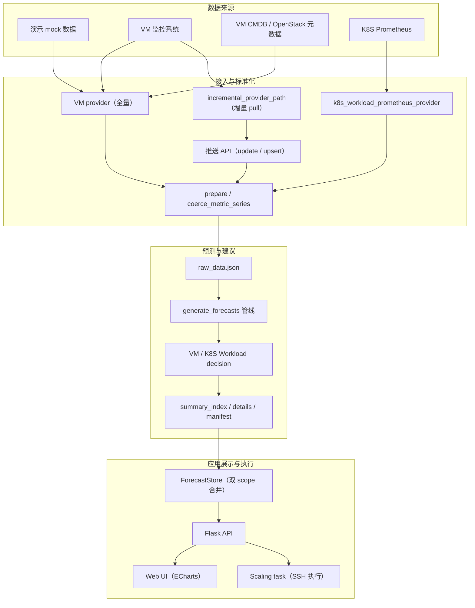
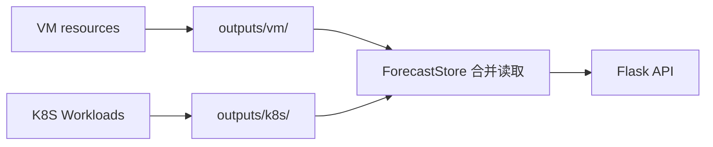
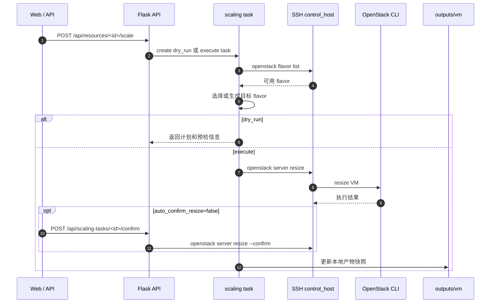

# 云资源使用预测与调配建议系统

基于时间序列预测的云资源智能分析与调配平台。系统自动采集 VM 和 K8S Workload 的 CPU / 内存 / 磁盘使用率，运行多模型预测，生成扩缩容建议（含目标规格和副本数），并可通过 SSH 在控制节点上执行实际调配操作。

**支持资源类型：**

- **VM（OpenStack）**：预测 `cpu / memory / disk` 三项指标，生成 `openstack server resize` 命令
- **K8S Workload**：从 Prometheus 聚合 Pod/Container 到 Deployment/StatefulSet/DaemonSet 控制器粒度，预测 `cpu / memory`，生成 `kubectl set resources` 和 `kubectl scale` 命令

**核心能力：**

- 多模型预测（ARIMA / SARIMA / Prophet / Seasonal Naive / Rolling Mean / Ensemble）
- 自动最优模型选择（基于 RMSE + 滚动回测）
- 异常检测与鲁棒路由（MAD-based z-score）
- 策略分级（conservative / balanced / aggressive）
- Namespace-aware 差异化阈值
- 增量数据接入（pull 定时 / push HTTP）
- 紧急度评分与优先级排序
- 调配执行与结果快照

---

## 目录

- [1. 环境要求与安装](#1-环境要求与安装)
- [2. 快速开始](#2-快速开始)
- [3. 目录结构](#3-目录结构)
- [4. 架构与数据流](#4-架构与数据流)
- [5. 核心功能模块](#5-核心功能模块)
- [6. 部署配置](#6-部署配置)
- [7. 输出目录结构](#7-输出目录结构)
- [8. API 接口文档](#8-api-接口文档)
- [9. 使用方法和示例](#9-使用方法和示例)
- [10. 测试策略](#10-测试策略)
- [11. 开发指南](#11-开发指南)
- [附录 A：常见问题](#附录-a常见问题)

---

## 1. 环境要求与安装

### 1.1 环境要求

| 项目 | 要求 |
| --- | --- |
| Python | >= 3.8 |
| 操作系统 | CentOS / RHEL / Ubuntu（推荐）；Windows 可运行 |
| 内存 | >= 4 GB（Prophet 模型较吃内存） |
| 可选依赖 | OpenStack CLI（VM 调配）、kubectl + kubeconfig（K8S 调配） |

### 1.2 安装

```bash
python3 -m venv .venv
source .venv/bin/activate

# 运行依赖
python -m pip install -r requirements.txt

# 开发与测试依赖
python -m pip install -r requirements-dev.txt
```

**运行依赖（`requirements.txt`）：**

| 包 | 用途 |
| --- | --- |
| Flask | Web 框架与 API |
| numpy | 数值计算 |
| pandas | 时间序列处理 |
| statsmodels | ARIMA / SARIMA 模型 |
| prophet | Facebook Prophet 模型 |

**开发依赖（`requirements-dev.txt`）：**

| 包 | 用途 |
| --- | --- |
| pytest | 单元与集成测试 |
| pyflakes | 静态检查 |
| vulture | 死代码检测 |

---

## 2. 快速开始

以下命令面向 CentOS / Linux shell。

```bash
source .venv/bin/activate
```

### 2.1 生成演示预测产物

```bash
python generate_forecasts.py
```

首次运行会生成 mock VM 数据并运行全量预测，产物输出到 `outputs/vm/` 和 `outputs/k8s/`。

### 2.2 仅重算预测（不覆盖原始数据）

```bash
python generate_forecasts.py predict
```

该模式会在预测前后校验 `raw_data.json` 的 SHA-256 摘要，确保原始数据未被篡改。

### 2.3 检查产物健康状态

```bash
python check_outputs.py
```

支持 `--json` 输出机器可读格式，`--allow-missing-type` 容忍仅有 VM 或仅有 K8S 产物。

### 2.4 启动 Web 服务

```bash
python app.py
```

访问 `http://127.0.0.1:5000`

### 2.5 K8S 数据接入

```bash
export K8S_PROMETHEUS_CLUSTERS='{"cluster-k8s-a":"http://prometheus.example:9090"}'
python ingest_k8s_workloads.py
```

仅诊断连通性：

```bash
python ingest_k8s_workloads.py --diagnose --json
```

仅拉取指定集群：

```bash
python ingest_k8s_workloads.py --cluster cluster-k8s-a
```

---

## 3. 目录结构

```text
.
├── app.py                           # Flask Web 入口
├── generate_forecasts.py            # 预测生成 CLI（全量 / 仅预测）
├── ingest_k8s_workloads.py          # K8S Workload Prometheus 接入 CLI
├── check_outputs.py                 # 预测产物健康检查 CLI
├── requirements.txt                 # 运行依赖
├── requirements-dev.txt             # 开发测试依赖
├── AGENTS.md                        # 项目协作约定
├── CLAUDE.md                        # AI 辅助开发指南
│
├── deploy/                          # 运行时敏感配置（.gitignore 忽略）
│   ├── clusters.example.json        # 集群配置示例
│   ├── clusters.json                # VM / K8S 调配集群配置
│   ├── k8s_prometheus_clusters.json # K8S Prometheus 集群配置
│   └── forecast_config.json         # 预测模型开关配置
│
├── resource_predict/                # 核心业务包
│   ├── __init__.py
│   ├── settings.py                  # 全局配置（frozen dataclass 单例）
│   ├── resource_types.py            # 资源类型归一化与指标集定义
│   ├── utils.py                     # 公共工具（数值解析、统计、策略分级）
│   ├── logging_setup.py             # 应用日志初始化
│   │
│   ├── api/                         # Flask API 路由层
│   │   ├── resources.py             #   资源列表 / 详情 / 批量查询
│   │   ├── updates.py               #   数据更新（pull / push / upsert）
│   │   ├── scaling.py               #   调配任务创建 / 查询 / 确认
│   │   ├── cluster_configs.py       #   集群配置读写与 K8S 诊断/拉取
│   │   ├── forecast_config.py       #   预测模型开关读写
│   │   └── pages.py                 #   HTML 页面路由
│   │
│   ├── core/                        # 核心业务逻辑
│   │   ├── forecasting.py           #   ARIMA / SARIMA / Prophet / Naive / Rolling 实现
│   │   ├── decision.py              #   VM 决策引擎（扩缩容判断 + 目标规格计算）
│   │   └── k8s_workload_decision.py #   K8S Workload 决策引擎
│   │
│   ├── data/                        # 数据层
│   │   ├── io.py                    #   raw_data.json 读写 + 时间戳解析
│   │   └── updater.py               #   增量合并 + 滑动窗口 + 原始数据备份 + 后台调度
│   │
│   ├── pipeline/                    # 预测管线
│   │   ├── run.py                   #   管线入口（generate_forecasts）
│   │   ├── prepare.py               #   数据准备与 mock 数据生成
│   │   ├── worker.py                #   单资源 worker
│   │   ├── fit.py                   #   单指标拟合（回测 + 未来预测 + 集成）
│   │   ├── forecasting.py           #   方法调度与集成融合
│   │   ├── model_selection.py       #   最优方法选择（异常路由）
│   │   ├── plan.py                  #   并行策略规划
│   │   ├── windowing.py             #   预测窗口解析
│   │   ├── metrics.py               #   回测指标计算
│   │   ├── anomaly.py               #   异常检测（MAD z-score）
│   │   ├── resource_profile.py      #   资源画像构建
│   │   ├── partial.py               #   增量预测合并
│   │   ├── write_outputs.py         #   产物写入（summary / details / manifest）
│   │   ├── series_utils.py          #   序列转换工具
│   │   ├── output_paths.py          #   scope 输出路径管理
│   │   ├── constants.py             #   常量定义
│   │   └── _types.py                #   WorkerContext 类型定义
│   │
│   ├── providers/                   # 数据源
│   │   ├── mock.py                  #   Mock 数据生成器
│   │   └── k8s_prometheus.py        #   K8S Prometheus 数据拉取与聚合
│   │
│   └── services/                    # 应用服务层
│       ├── store/                   #   产物读取与缓存
│       │   ├── forecast_store.py    #     ForecastStore（双 scope 合并读取）
│       │   ├── resource_detail.py   #     详情展示窗口裁切
│       │   └── query.py             #     搜索与筛选辅助
│       ├── scaling/                 #   调配执行
│       │   ├── executor.py          #     调配计划构建（VM / K8S 命令生成）
│       │   ├── tasks.py             #     任务生命周期管理
│       │   ├── command_runner.py    #     SSH 命令执行
│       │   ├── openstack_flavors.py #     OpenStack flavor 发现与选择
│       │   ├── cluster_config.py    #     集群配置加载
│       │   └── snapshot.py          #     调配成功后更新本地产物快照
│       ├── urgency.py               #   紧急度评分（资源排序优先级）
│       ├── output_health.py         #   产物健康检查逻辑
│       ├── forecast_config.py       #   预测配置管理
│       ├── cluster_configs.py       #   集群配置服务
│       ├── k8s_ingest.py            #   K8S 后台定时拉取
│       └── update_tasks.py          #   更新任务同步/异步执行
│
├── templates/                       # Flask HTML 模板
│   └── index.html                   #   单页应用主页面
│
├── static/                          # 前端静态资源
│   ├── css/index.css                #   样式
│   ├── js/                          #   JavaScript 模块
│   │   ├── index.js                 #     入口与初始化
│   │   ├── app-state.js             #     全局状态管理
│   │   ├── api.js                   #     API 调用封装
│   │   ├── resource-list.js         #     资源列表渲染
│   │   ├── charts.js                #     ECharts 图表
│   │   └── scaling.js               #     调配交互
│   └── vendor/echarts/              #   ECharts 库
│
├── tests/                           # 自动化测试
│   ├── test_forecasting.py          #   预测方法测试
│   ├── test_forecast_windowing.py   #   窗口解析测试
│   ├── test_decision.py             #   VM 决策测试
│   ├── test_k8s_workload_decision.py #  K8S 决策测试
│   ├── test_io.py                   #   数据 IO 测试
│   ├── test_scaling_executor.py     #   调配计划测试
│   ├── test_scaling_api.py          #   调配 API 测试
│   ├── test_scaling_tasks.py        #   任务生命周期测试
│   ├── test_scaling_security.py     #   安全相关测试
│   ├── test_output_health.py        #   健康检查测试
│   ├── test_output_isolation.py     #   产物隔离测试
│   ├── test_cluster_configs.py      #   集群配置测试
│   ├── test_forecast_config.py      #   预测配置测试
│   ├── test_k8s_workload_provider.py #  K8S provider 测试
│   └── test_utils.py                #   工具函数测试
│
└── outputs/                         # 运行产物（.gitignore 忽略）
    ├── vm/                          #   VM scope 产物
    ├── k8s/                         #   K8S scope 产物
    └── scaling_tasks.json           #   调配任务记录
```

---

## 4. 架构与数据流

### 4.1 总体架构



### 4.2 预测管线流程

```text
Provider（mock / real / Prometheus）
  -> build_prepared_data()          [pipeline/prepare.py]
  -> write_raw_dataset()            [data/io.py -> outputs/<scope>/raw_data.json]
  -> resolve_parallel_plan()        [pipeline/plan.py - ThreadPoolExecutor 调度]
  -> worker() per resource          [pipeline/worker.py]
      -> fit_one_metric()           [pipeline/fit.py - 全部活跃模型]
      -> model_selection            [pipeline/model_selection.py - 最优选择]
      -> build_scaling_advice()     [core/decision.py]
      -> build_k8s_workload_advice()[core/k8s_workload_decision.py]
  -> write_prediction_outputs()     [pipeline/write_outputs.py]
```

### 4.3 产物隔离



VM 数据写入 `outputs/vm/`，K8S 数据写入 `outputs/k8s/`。两个目录完全物理隔离，互不覆盖。`ForecastStore` 在 API 层透明合并两个 scope 的数据。

### 4.4 数据更新机制

系统支持多种数据更新模式：

- **Pull 模式（增量）**：后台调度线程定时调用 `IncrementalProvider` 拉取增量数据
- **Push 模式（增量）**：通过 HTTP `POST /api/update-data` 或 `/api/upsert-data` 推送增量数据
- **K8S Prometheus Pull**：后台定时从 Prometheus 拉取 K8S Workload 指标并合并到 K8S scope
- **K8S CLI / API 触发**：手动通过 CLI 或 `POST /api/cluster-configs/k8s-fetch` 触发一次性拉取

所有模式共享同一个排他锁 `_update_exclusive`，保证"读 raw -> 合并 -> 写 raw -> 重预测"序列的原子性。合并前自动备份 `raw_data.json` 到 `backups/` 子目录。

```text
Pull:       _scheduler_loop -> run_update -> IncrementalProvider -> _do_update
Push:       POST /api/update-data -> run_scoped_update_with_data -> _do_update
K8S Pull:   _k8s_scheduler_loop -> run_k8s_prometheus_upsert -> run_upsert_with_data
K8S Fetch:  POST /api/cluster-configs/k8s-fetch -> run_k8s_prometheus_upsert（异步）
```

### 4.5 VM 调配执行流程



---

## 5. 核心功能模块

### 5.1 预测引擎（`core/forecasting.py`）

| 方法 | 说明 |
| --- | --- |
| ARIMA | 自动阶数选择（AIC 最小），线性趋势，收敛重试 |
| SARIMA | 季节差分，自动推断日周期 s，SARIMAX 框架 |
| Prophet | 日/周季节性，可配置 changepoint 灵活度 |
| Seasonal Naive | 回放最近一个季节窗口，鲁棒候选 |
| Rolling Mean | 近期滚动均值作为稳定基线 |
| Ensemble | RMSE 倒数加权融合（可选启用） |

**模型选择**：正常情况按 `selection_rmse`（0.65 * 回测 RMSE + 0.35 * 滚动回测 RMSE）最小选择；存在异常时优先鲁棒候选（ensemble / seasonal_naive / rolling_mean）。滚动回测折数由 `rolling_backtest_folds`（默认 3）控制。

### 5.2 VM 决策引擎（`core/decision.py`）

- **扩容判断**：P95 / 峰值超过阈值 + 峰谷差 + 上升趋势斜率 + 窗口均值变化
- **缩容判断**：均值 + P95 低于阈值，含 `max_reduction_ratio` 保护（防止 32 核 -> 1 核）
- **Rightsize 检测**：均值 < 0.35 且 P95 < 0.55 的资源标记为过度配置候选（可优化规格但非极端空闲）
- **磁盘专用阈值**：磁盘扩容阈值比通用阈值低 0.05（磁盘使用具有单调性且不可弹性回收）
- **目标规格**：按维度独立计算，超出 100% 时线性推算容量，CPU 核数对齐偶数，硬盘缩容最小 50GB
- **策略分级**：conservative / balanced / aggressive，阈值和确认轮次差异化
- **风险画像**：每个资源生成 `risk_profile`，包含 `saturation_risk`（饱和风险分）、`idle_opportunity`（空闲机会分）、`risk_score`（综合风险分）、当前生效阈值和冷却时间
- **置信度评分**：多指标加权（P95 强度 42 + 峰值强度 20 + 均值强度 14 + 持续性 16 + 趋势 8）
- **执行门控**：`action_gate` 输出 `ready` / `observe`，含所需确认轮次（conservative 缩容 +1 轮，aggressive 缩容 -1 轮）

### 5.3 K8S Workload 决策引擎（`core/k8s_workload_decision.py`）

- **扩容判断**：P95 >= 0.8 或峰值 >= 0.9
- **缩容判断**：均值 < 0.2 且 P95 < 0.35
- **数据质量**：`_quality_level()` 评估每个指标的数据质量，poor 质量自动跳过执行建议
- **Baseline 缺失处理**：缺少 request/limit 时降级为 trend-only 分析
- **目标利用率分级**：`_target_utilization()` 按策略层级返回差异化利用率目标（0.55~0.78）
- **requests/limits 建议**：按容器粒度，per-replica target 与副本数独立计算避免双重缩放
- **副本数建议**：Deployment / StatefulSet / ReplicaSet 支持；DaemonSet 跳过副本缩放并给出警告
- **Namespace 策略**：自动从 spec 中识别 namespace 并匹配 conservative / aggressive 分组
- **Workload 类型归一化**：`_workload_kind()` 标准化控制器类型字符串

### 5.4 增量数据合并（`data/updater.py`）

- 支持混合时间戳格式（秒/毫秒/ISO 字符串）
- 去重保留最新值（`duplicated(keep="last")`）
- 可选滑动窗口：合并后裁切到原始长度
- 并发安全：`_update_exclusive`（排他锁）+ `_lock`（状态锁）
- 变更检测：仅在 spec 或指标值真正变化时触发重预测
- 原始数据备份：合并前自动调用 `backup_raw_dataset()` 将 `raw_data.json` 复制到 `backups/` 子目录（带时间戳命名）
- 可插拔数据源：通过 `incremental_provider_path`（`module:function` 格式）指定自定义增量 provider，未配置时使用默认 mock provider

### 5.5 调配执行（`services/scaling/`）

- **OpenStack VM**：自动发现可用 flavor -> 选择/生成目标 flavor -> `openstack server resize` -> 可选自动/手动 confirm
- **K8S Workload**：`kubectl set resources` 按容器粒度 -> `kubectl scale` 调整副本数
- **安全**：所有用户可控值使用 `shlex.quote()` 转义
- **快照**：调配成功后自动更新 `summary_index.json` / `details/*.json` / `raw_data.json` / `manifest.json` 中的 spec

### 5.6 紧急度评分（`services/urgency.py`）

`compute_urgency_score()` 为每个资源计算一个综合紧急度分数，用于资源列表的默认排序。评分维度包括：

- **动作类型**：`scale_out` 基础分 35，`scale_in` 基础分 18，`hold` 为 0
- **置信度加成**：high +6、medium +3、low +1
- **指标压力**：逐指标计算 P95/峰值/均值/趋势/峰谷差的超标程度，取最高值
- **风险评分加成**：从 `risk_profile.risk_score` 读取，最高 +20
- **多指标叠加**：多指标同时告警时额外加分
- **混合信号**：`has_mixed_signals` 为 true 时 +4
- **目标规格变化幅度**：当前规格与建议规格的差异比例，最高 +18
- **副本数变化**：K8S 副本数变化也纳入评分

---

## 6. 部署配置

### 6.1 配置文件概览

| 文件 | 用途 | 是否提交 Git |
| --- | --- | --- |
| `resource_predict/settings.py` | 全局默认配置（frozen dataclass 单例） | 是 |
| `deploy/clusters.json` | VM / K8S 调配集群配置（含 SSH 凭据） | 否 |
| `deploy/k8s_prometheus_clusters.json` | K8S Prometheus 集群地址与认证 | 否 |
| `deploy/forecast_config.json` | 预测模型开关 | 否 |
| `.env` | 环境变量覆盖 | 否 |

### 6.2 集群配置（`deploy/clusters.json`）

从示例文件复制：

```bash
cp deploy/clusters.example.json deploy/clusters.json
```

**OpenStack 集群配置：**

```json
{
  "cluster-openstack-a": {
    "cloud_type": "openstack",
    "control_host": "192.168.1.10",
    "ssh_user": "root",
    "ssh_port": 22,
    "ssh_key": "/path/to/id_rsa",
    "openstack_rc": "/root/admin-openrc",
    "auto_confirm_resize": false,
    "resize_confirm_poll_interval_seconds": 15,
    "resize_confirm_wait_seconds": 240,
    "command_timeout_seconds": 300,
    "flavor_discovery": "remote",
    "flavor_cache_seconds": 300,
    "auto_flavor_name_prefix": "rp",
    "allowed_flavors": []
  }
}
```

| 字段 | 说明 |
| --- | --- |
| `cloud_type` | 必须为 `openstack` |
| `control_host` | 可执行 `openstack` CLI 的控制节点地址 |
| `ssh_user` / `ssh_port` / `ssh_key` | SSH 登录信息 |
| `openstack_rc` | 控制节点上的 OpenStack RC 文件路径 |
| `auto_confirm_resize` | 是否自动执行 `resize --confirm` |
| `allowed_flavors` | 可选，限制自动选择的 flavor 名称列表 |

**K8S 集群配置：**

```json
{
  "cluster-k8s-a": {
    "cloud_type": "k8s",
    "control_host": "192.168.1.20",
    "ssh_user": "root",
    "ssh_port": 22,
    "ssh_key": "/path/to/id_rsa",
    "kubeconfig": "/root/.kube/config",
    "command_timeout_seconds": 300
  }
}
```

| 字段 | 说明 |
| --- | --- |
| `cloud_type` | 必须为 `k8s` |
| `control_host` | 可执行 `kubectl` 的控制节点地址 |
| `kubeconfig` | 控制节点上的 kubeconfig 路径 |

### 6.3 K8S Prometheus 配置（`deploy/k8s_prometheus_clusters.json`）

```json
[
  {
    "cluster": "cluster-k8s-a",
    "prometheus_url": "http://prometheus.example:9090",
    "namespace_regex": "default|prod",
    "bearer_token": "",
    "basic_auth": ""
  }
]
```

也可通过环境变量临时配置：

```bash
export K8S_PROMETHEUS_CLUSTERS='{"cluster-k8s-a":"http://127.0.0.1:9090"}'
```

### 6.4 预测模型配置（`deploy/forecast_config.json`）

```json
{
  "enabled_methods": ["seasonal_naive", "prophet"],
  "enable_ensemble": false
}
```

可在 Web 页面的"预测模型"中启用或关闭模型，保存后写入此文件。

### 6.5 全局默认配置（`resource_predict/settings.py`）

所有配置均为 frozen dataclass，运行时只读。主要配置组：

| 配置类 | 关键参数 | 默认值 |
| --- | --- | --- |
| `AppConfig` | `host` / `port` / `out_dir` / `log_file` / `debug` | `0.0.0.0` / `5000` / `outputs` / `resource_predict.log` / `False` |
| `GenerationConfig` | `default_test_size` / `default_future_steps` / `freq` | `72` / `24` / `h` |
| `ForecastConfig` | `enabled_methods` / `enable_ensemble` / `rolling_backtest_folds` / `anomaly_route_zscore_threshold` | `("seasonal_naive", "prophet")` / `False` / `3` / `3.5` |
| `DecisionConfig` | `scale_out_threshold` / `scale_in_threshold` / `scale_in_max_reduction_ratio` / `scale_out_confirmations` / `scale_in_confirmations` | `0.8` / `0.2` / `0.5` / `2` / `3` |
| `UpdateConfig` | `enabled` / `interval_minutes` / `sliding_window` / `display_window_points` | `False` / `60` / `False` / `0` |
| `K8SPrometheusConfig` | `history_days` / `step_seconds` / `rate_window` / `scheduled_update_enabled` / `scheduled_update_interval_minutes` | `7` / `300` / `5m` / `False` / `360` |

**预测窗口配置说明：**

| 配置 | 作用 |
| --- | --- |
| `default_test_size` / `default_future_steps` | 未设置资源族专用窗口时的兜底点数 |
| `vm_test_duration` / `vm_future_duration` | VM 专用时长，优先于点数 |
| `workload_test_duration` / `workload_future_duration` | K8S Workload 专用时长，默认 `24h` |

时长配置根据真实采样间隔自动换算点数。例如 `step_seconds=300` + `workload_test_duration="24h"` = 288 个测试点。

**策略分级配置：**

| 参数 | 说明 |
| --- | --- |
| `default_policy_tier` | 默认策略层级（`balanced`） |
| `conservative_namespaces` | 保守策略命名空间：`prod`, `production`, `payments`, `core`, `platform` |
| `aggressive_namespaces` | 激进策略命名空间：`dev`, `test`, `staging`, `batch` |
| `scale_out_cooldown_minutes` | 扩容冷却时间（默认 60 分钟） |
| `scale_in_cooldown_minutes` | 缩容冷却时间（默认 360 分钟） |

---

## 7. 输出目录结构

预测产物按资源族物理隔离：

```text
outputs/
├── vm/
│   ├── raw_data.json          # 原始观测数据
│   ├── summary_index.json     # 资源列表摘要（含扩缩容建议）
│   ├── manifest.json          # 完整预测结果（含 charts）
│   ├── generation_stats.json  # 本次生成统计
│   ├── backups/               # raw_data.json 历史备份
│   │   └── raw_data.20260530-120000.json
│   └── details/               # 详情分片
│       ├── part-00000.json
│       └── ...
├── k8s/
│   ├── raw_data.json
│   ├── summary_index.json
│   ├── manifest.json
│   ├── generation_stats.json
│   ├── backups/               # raw_data.json 历史备份
│   └── details/
│       └── ...
└── scaling_tasks.json         # 调配任务记录
```

### 各文件说明

#### `raw_data.json`

原始观测数据，是预测的唯一输入。

```json
{
  "meta": {
    "schema_version": 1,
    "saved_at_epoch_ms": 1717000000000,
    "freq": "h"
  },
  "resources": [
    {
      "resource_id": "vm-prod-001",
      "resource_type": "openstack_vm",
      "spec": {"cluster": "...", "instance_id": "...", "cpu_cores": 4, "memory_gb": 8, "disk_gb": 100},
      "metrics": {
        "cpu":    {"timestamps": [1717000000000, ...], "values": [0.45, ...]},
        "memory": {"timestamps": [...], "values": [...]},
        "disk":   {"timestamps": [...], "values": [...]}
      }
    }
  ]
}
```

#### `summary_index.json`

资源列表摘要，包含扩缩容建议、紧急度、预测方法选择和 anomaly_score。前端列表页直接读取此文件。

#### `manifest.json`

完整预测结果，包含合并后的 charts（y_train + y_test + 预测值 + 未来预测）。API 详情接口优先读取此文件。

#### `details/part-*.json`

预测详情分片，每个分片包含若干资源的完整预测数据。通过 `summary_index.json` 中的 `detail_ref` 引用。

#### `generation_stats.json`

本次预测的统计信息：资源数、预测模型、窗口参数、耗时、输出大小等。

#### `backups/`

增量合并前自动创建的 `raw_data.json` 时间戳备份，格式为 `raw_data.YYYYMMDD-HHMMSS.json`。

---

## 8. API 接口文档

### 8.1 页面路由

| 方法 | 路径 | 说明 |
| --- | --- | --- |
| GET | `/` | Web 首页（SPA） |

### 8.2 资源查询

| 方法 | 路径 | 说明 |
| --- | --- | --- |
| GET | `/api/resources` | 资源列表（支持分页、筛选、搜索） |
| GET | `/api/resources/<id>` | 资源详情（含 charts） |
| GET | `/api/resources/details?ids=a,b` | 批量详情（最多 100 个） |
| GET | `/api/resources/advice-summary` | 建议统计（action/confidence 计数） |
| GET | `/api/resources/<id>/scaling-history` | 资源调配历史 |

**列表参数：**

| 参数 | 类型 | 说明 |
| --- | --- | --- |
| `q` | string | 搜索 resource_id / IP / namespace / workload / node |
| `action` | string | 筛选动作：`scale_out` / `scale_in` / `hold` / `mixed` / `scale_out_candidate` / `scale_in_candidate` / `insufficient_data` |
| `resource_type` | string | 筛选类型：`openstack_vm` / `k8s_workload` |
| `sort_by` | string | 排序：`urgency_score`（默认）/ `resource_id` / `anomaly_score` |
| `page` | int | 页码（从 1 开始） |
| `page_size` | int | 每页数量（默认 20，最大 200） |
| `top_n` | int | 返回前 N 条（优先于分页） |

**详情接口特殊状态：**

当资源正在等待预测完成时，详情接口返回 HTTP 202 并包含 `prediction_pending: true` 标记。批量详情接口同样处理。

### 8.3 数据更新

| 方法 | 路径 | 说明 |
| --- | --- | --- |
| GET | `/api/update-status` | 查询更新任务状态 |
| POST | `/api/update-trigger` | 触发 pull 型增量更新（同步） |
| POST | `/api/update-data` | 推送增量数据，仅更新已有资源（异步） |
| POST | `/api/upsert-data` | 推送数据，更新或新增资源（异步） |

**更新触发（同步）：**

`POST /api/update-trigger` 调用 `IncrementalProvider` 拉取增量数据并重新预测。如果已有更新任务在执行，返回 HTTP 409。

**推送数据格式：**

```json
[
  {
    "resource_id": "vm-prod-001",
    "resource_type": "openstack_vm",
    "spec": {"cluster": "cluster-openstack-a", "cpu_cores": 4, "memory_gb": 8, "disk_gb": 100},
    "metrics": {
      "cpu":    {"timestamps": [1778500000000, ...], "values": [0.62, ...]},
      "memory": {"timestamps": [...], "values": [...]},
      "disk":   {"timestamps": [...], "values": [...]}
    }
  }
]
```

- `timestamps`：毫秒级 Unix 时间戳（也支持秒级和 ISO 字符串）
- `values`：使用率小数 `[0, 1]`
- `/api/update-data` 和 `/api/upsert-data` 均为异步接口（HTTP 202），合并与预测在后台线程执行
- `/api/upsert-data` 新增资源时，该资源必须提供所有指标的完整非空序列
- 并发冲突时返回 HTTP 409，查询 `/api/update-status` 确认当前状态

### 8.4 调配

| 方法 | 路径 | 说明 |
| --- | --- | --- |
| POST | `/api/resources/<id>/scale` | 创建调配任务 |
| GET | `/api/scaling-tasks/<id>` | 查询调配任务 |
| POST | `/api/scaling-tasks/<id>/confirm` | 确认 OpenStack resize |

**创建调配任务：**

```json
{"mode": "dry_run"}
```

```json
{"mode": "execute", "confirm": true, "operator": "ops"}
```

| 参数 | 说明 |
| --- | --- |
| `mode` | `dry_run`（仅生成计划）或 `execute`（实际执行） |
| `confirm` | `execute` 模式必须为 `true` |
| `operator` | 操作人标识 |
| `target_spec` | 可选，覆盖预测建议的目标规格 |
| `confirm_create_flavor` | 可选，允许自动创建 OpenStack flavor |
| `target_source` | 可选，标记目标规格来源 |

**任务状态流转：**

```text
queued -> running -> plan_built -> executing_command -> command_finished
  -> updating_snapshot -> completed (success)
  -> waiting_confirm (OpenStack 手动 confirm)
  -> failed
```

### 8.5 配置管理

| 方法 | 路径 | 说明 |
| --- | --- | --- |
| GET | `/api/cluster-configs` | 读取集群配置 |
| PUT | `/api/cluster-configs` | 保存集群配置 |
| GET | `/api/forecast-config` | 读取预测模型开关 |
| PUT | `/api/forecast-config` | 保存预测模型开关 |
| POST | `/api/cluster-configs/k8s-diagnose` | 诊断 K8S Prometheus 连通性 |
| POST | `/api/cluster-configs/k8s-fetch` | 拉取 K8S Prometheus 数据（异步） |

**集群配置读写：**

`PUT /api/cluster-configs` 请求体：

```json
{
  "vm_scaling_clusters": { ... },
  "k8s_prometheus_clusters": [ ... ]
}
```

**K8S Prometheus 拉取：**

`POST /api/cluster-configs/k8s-fetch` 可选传入集群名称列表以仅拉取指定集群：

```json
{"clusters": ["cluster-k8s-a"]}
```

该接口为异步（HTTP 202），拉取和预测在后台线程执行。

---

## 9. 使用方法和示例

### 9.1 VM 数据接入

#### Provider 接入（全量）

Provider 函数返回统一资源结构：

```python
def vm_provider(resources: int, n: int, freq: str) -> list[dict]:
    return [
        {
            "resource_id": "vm-prod-001",
            "resource_type": "openstack_vm",
            "spec": {
                "cluster": "cluster-openstack-a",
                "instance_id": "7b8c1d2e-0000-1111-2222-333344445555",
                "cpu_cores": 4, "memory_gb": 8, "disk_gb": 100
            },
            "metrics": {
                "cpu":    {"timestamps": [...], "values": [...]},
                "memory": {"timestamps": [...], "values": [...]},
                "disk":   {"timestamps": [...], "values": [...]}
            }
        }
    ]
```

#### 增量 pull 接入

配置 `settings.update.incremental_provider_path`，格式为 `module:function`：

```python
def vm_incremental_provider(prepared_resources: list[dict], points_to_add: int) -> list[dict]:
    return [
        {
            "resource_id": "vm-prod-001",
            "metrics": {
                "cpu":    {"timestamps": [1778500600000], "values": [0.69]},
                "memory": {"timestamps": [1778500600000], "values": [0.74]},
                "disk":   {"timestamps": [1778500600000], "values": [0.46]}
            }
        }
    ]
```

手动触发 pull 更新：

```bash
curl -X POST http://127.0.0.1:5000/api/update-trigger
```

#### 推送新增或更新

```bash
# 新增资源（upsert）
curl -X POST http://127.0.0.1:5000/api/upsert-data \
  -H 'Content-Type: application/json' \
  -d '[
    {
      "resource_id": "vm-prod-001",
      "resource_type": "openstack_vm",
      "spec": {
        "cluster": "cluster-openstack-a",
        "instance_id": "7b8c1d2e-0000-1111-2222-333344445555",
        "cpu_cores": 4, "memory_gb": 8, "disk_gb": 100
      },
      "metrics": {
        "cpu":    {"timestamps": [1778500000000, 1778500300000], "values": [0.62, 0.66]},
        "memory": {"timestamps": [1778500000000, 1778500300000], "values": [0.71, 0.73]},
        "disk":   {"timestamps": [1778500000000, 1778500300000], "values": [0.45, 0.45]}
      }
    }
  ]'

# 追加增量数据（update，仅更新已有资源）
curl -X POST http://127.0.0.1:5000/api/update-data \
  -H 'Content-Type: application/json' \
  -d '[
    {
      "resource_id": "vm-prod-001",
      "metrics": {
        "cpu":    {"timestamps": [1778500600000], "values": [0.69]},
        "memory": {"timestamps": [1778500600000], "values": [0.74]},
        "disk":   {"timestamps": [1778500600000], "values": [0.46]}
      }
    }
  ]'

# 查询更新状态
curl http://127.0.0.1:5000/api/update-status
```

### 9.2 K8S Prometheus 接入

#### 需要的 Prometheus 指标

| 指标 | 用途 |
| --- | --- |
| `container_cpu_usage_seconds_total` | CPU 使用量 |
| `container_memory_working_set_bytes` | 内存使用量 |
| `kube_pod_owner` | Pod -> ReplicaSet/控制器 owner 关系 |
| `kube_replicaset_owner` | ReplicaSet -> Deployment owner 关系 |
| `kube_pod_container_resource_requests*` | CPU/Memory request |
| `kube_pod_container_resource_limits*` | CPU/Memory limit |

Provider 会把 Pod/Container 序列聚合为 `k8s_workload`，resource_id 格式为：

```text
k8s:<cluster>:<namespace>:<workload-kind>:<workload-name>
```

#### CLI 使用

```bash
# 临时验证
export K8S_PROMETHEUS_CLUSTERS='{"cluster-k8s-a":"http://127.0.0.1:9090"}'
python ingest_k8s_workloads.py --diagnose

# 正式拉取
python ingest_k8s_workloads.py

# 只拉取指定集群
python ingest_k8s_workloads.py --cluster cluster-k8s-a
```

#### API 触发拉取

```bash
# 拉取全部集群
curl -X POST http://127.0.0.1:5000/api/cluster-configs/k8s-fetch

# 拉取指定集群
curl -X POST http://127.0.0.1:5000/api/cluster-configs/k8s-fetch \
  -H 'Content-Type: application/json' \
  -d '{"clusters": ["cluster-k8s-a"]}'
```

### 9.3 调配操作

#### 预检（dry run）

```bash
# VM 预检
curl -X POST http://127.0.0.1:5000/api/resources/vm-prod-001/scale \
  -H 'Content-Type: application/json' \
  -d '{"mode":"dry_run"}'

# K8S Workload 预检
curl -X POST http://127.0.0.1:5000/api/resources/k8s:cluster-k8s-a:prod:deployment:api/scale \
  -H 'Content-Type: application/json' \
  -d '{"mode":"dry_run"}'
```

#### 执行

```bash
curl -X POST http://127.0.0.1:5000/api/resources/vm-prod-001/scale \
  -H 'Content-Type: application/json' \
  -d '{"mode":"execute","confirm":true,"operator":"ops"}'
```

#### 手动确认 resize

如果 `auto_confirm_resize=false`，resize 后任务进入 `waiting_confirm`：

```bash
curl -X POST http://127.0.0.1:5000/api/scaling-tasks/<task_id>/confirm \
  -H 'Content-Type: application/json' \
  -d '{"confirm":true,"operator":"ops"}'
```

---

## 10. 测试策略

### 10.1 测试文件

| 测试文件 | 覆盖范围 |
| --- | --- |
| `test_forecasting.py` | ARIMA / SARIMA / Prophet / Naive / Rolling 预测方法 |
| `test_forecast_windowing.py` | 预测窗口解析、频率推断、时长换算 |
| `test_decision.py` | VM 扩缩容判断、目标规格计算、置信度评分、风险画像 |
| `test_k8s_workload_decision.py` | K8S 决策、副本数建议、数据质量处理 |
| `test_io.py` | raw_data.json 读写、时间戳解析、混合格式 |
| `test_scaling_executor.py` | 调配计划构建、flavor 选择、命令生成 |
| `test_scaling_api.py` | 调配 API 端点 |
| `test_scaling_tasks.py` | 任务生命周期管理 |
| `test_scaling_security.py` | 命令注入防护、安全校验 |
| `test_output_health.py` | 产物健康检查逻辑 |
| `test_output_isolation.py` | VM / K8S 产物隔离 |
| `test_cluster_configs.py` | 集群配置读写 |
| `test_forecast_config.py` | 预测模型配置读写 |
| `test_k8s_workload_provider.py` | K8S Prometheus 数据聚合 |
| `test_utils.py` | 公共工具函数 |

### 10.2 运行测试

```bash
# 全部测试
python -m pytest -q

# 单个文件
python -m pytest tests/test_forecasting.py -q

# 单个用例
python -m pytest tests/test_forecasting.py::test_function_name -q
```

### 10.3 回归检查

每次修改后按顺序运行以下四项检查：

```bash
# 1. 编译检查（语法错误）
python -m compileall -q app.py check_outputs.py generate_forecasts.py ingest_k8s_workloads.py resource_predict tests

# 2. 静态分析（未使用导入等）
python -m pyflakes app.py check_outputs.py generate_forecasts.py ingest_k8s_workloads.py resource_predict tests

# 3. 死代码检测
vulture app.py check_outputs.py generate_forecasts.py ingest_k8s_workloads.py resource_predict tests --min-confidence 80

# 4. 测试
python -m pytest -q
```

---

## 11. 开发指南

### 11.1 代码组织约定

- 根目录只放直接运行的 CLI 或项目级配置文件
- 所有业务逻辑放入 `resource_predict/` 包内，CLI 只做参数解析和输出
- 新增 K8S 相关代码使用 `workload` 命名；`pod` 仅作为 Prometheus 标签或历史产物兼容词
- 预测产物统一称为 `outputs` 或 `forecast artifacts`，不使用 `images` 命名
- 注释和日志消息使用中文

### 11.2 配置约定

- 所有配置 dataclass 使用 `frozen=True`，通过替换而非赋值来修改
- 时间戳：API/payload 层使用毫秒级 Unix int；内部使用 pandas `DatetimeIndex`
- `predict_only=True` 模式绝不修改 `raw_data.json`
- 不提交 `outputs/`、日志、缓存、`__pycache__`、本地凭据文件

### 11.3 资源类型系统

| 规范名 | 来源字符串 | 指标集 |
| --- | --- | --- |
| `openstack_vm` | `openstack`, `vm`, `openstack_vm` | `cpu`, `memory`, `disk` |
| `k8s_workload` | `k8s_workload`, `workload`, `controller`, `k8s_controller` | `cpu`, `memory` |
| `k8s_pod` | `k8s_pod`, `pod`（仅兼容） | `cpu`, `memory` |
| `k8s_container` | `k8s`, `kubernetes`, `k8s_container`, `container` | `cpu`, `memory`, `disk` |

使用 `resource_type_of(item)` 归一化类型，使用 `metric_names_for_resource(item)` 获取指标名列表。

> 注意：`k8s_container` 为底层归一化类型，正常业务流程中 K8S 资源应以 `k8s_workload` 形式出现。

### 11.4 Provider 接口

所有数据源必须返回统一结构：

```python
{
    "resource_id": str,
    "resource_type": "openstack_vm" | "k8s_workload",
    "spec": {"cluster": str, "instance_id": str, ...},
    "metrics": {
        "cpu":    {"timestamps": [int_ms, ...], "values": [float_0_to_1, ...]},
        "memory": {"timestamps": [...], "values": [...]},
        # "disk" for VM only
    }
}
```

增量 Provider 签名为：

```python
(prepared_resources: List[Dict], points_to_add: int) -> List[Dict]
```

### 11.5 安全约定

- 调配命令中所有用户可控值使用 `shlex.quote()` 转义
- 不拼接未转义的字符串构建 shell 命令
- DaemonSet 副本缩放显式跳过并给出警告
- 磁盘缩容限制最小 50GB

---

## 附录 A：常见问题

| 问题 | 处理 |
| --- | --- |
| 页面无数据 | 先运行 `python generate_forecasts.py`，再运行 `python check_outputs.py` 检查 |
| VM 有数据，K8S 为空 | 检查 Prometheus 配置，运行 `python ingest_k8s_workloads.py --diagnose` |
| 提示缺少 K8S Prometheus 配置 | 设置 `K8S_PROMETHEUS_CLUSTERS` 环境变量或写入 `deploy/k8s_prometheus_clusters.json` |
| VM 调配提示缺少配置 | 检查 `deploy/clusters.json` 中是否存在与 `spec.cluster` 同名的 OpenStack 集群 |
| K8S 调配提示缺少配置 | 检查 `deploy/clusters.json` 中是否存在与 `spec.cluster` 同名且 `cloud_type=k8s` 的集群 |
| OpenStack flavor 发现失败 | 确认控制节点可 SSH 登录，且 `openstack_rc` 加载后可执行 `openstack flavor list -f json` |
| 产物结构不一致 | 运行 `python check_outputs.py --json` 查看具体错误 |
| 测试工具缺失 | 运行 `python -m pip install -r requirements-dev.txt` |
| 更新任务冲突（409） | 查询 `/api/update-status` 确认当前是否有更新在执行中，等待完成后重试 |
| 预测模型未生效 | 在 Web 页面"预测模型"中修改后保存，再触发重新预测 |
| 资源详情返回 202 | 资源正在等待预测完成，稍后重试即可 |
