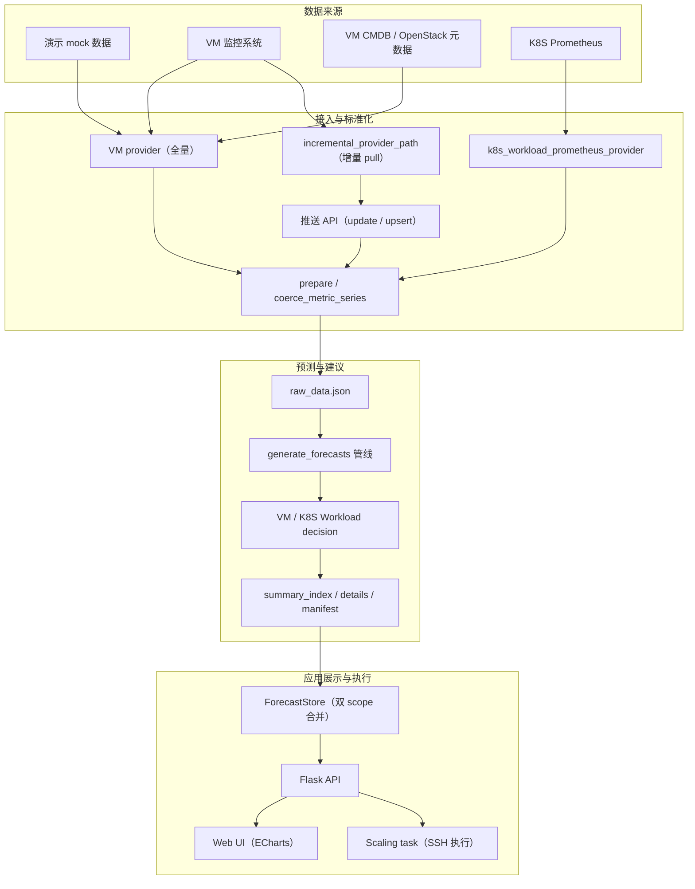
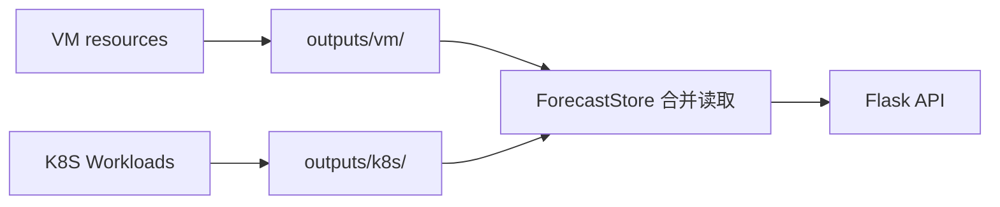
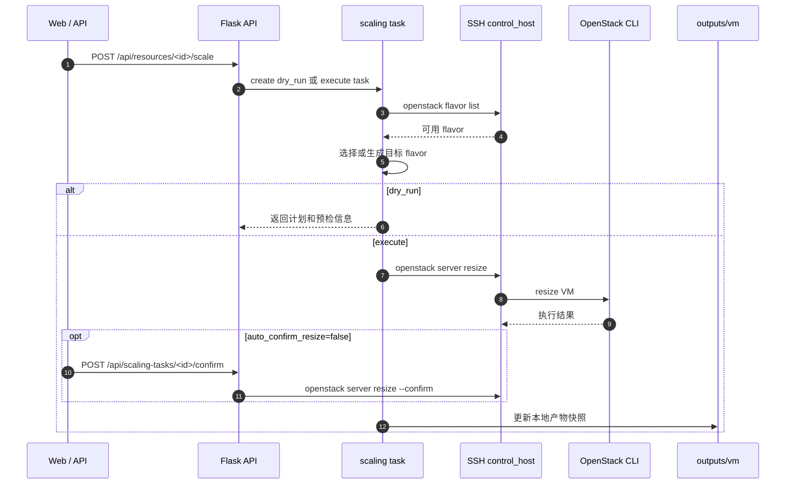

# 架构与数据流

本文档详细描述系统的目录结构、总体架构、预测管线流程、数据更新机制和核心功能模块。

## 目录结构

```text
.
├── app.py                           # Flask Web 入口
├── generate_forecasts.py            # 预测生成 CLI（全量 / 仅预测）
├── ingest_k8s_workloads.py          # K8S Workload Prometheus 接入 CLI
├── check_outputs.py                 # 预测产物健康检查 CLI
├── requirements.txt                 # 运行依赖
├── requirements-dev.txt             # 开发测试依赖
├── AGENTS.md                        # 项目协作约定（AI Agent 踩坑笔记）
│
├── docs/                            # 详细文档
│   ├── architecture.md              #   架构与数据流（本文件）
│   ├── configuration.md             #   部署配置与输出结构
│   ├── api-reference.md             #   API 接口文档与使用示例
│   └── development.md               #   开发指南与 FAQ
│
├── deploy/                          # 运行时敏感配置（.gitignore 忽略）
│   ├── clusters.example.json        # 集群配置示例
│   ├── clusters.json                # VM / K8S 调配集群配置
│   ├── k8s_prometheus_clusters.json # K8S Prometheus 集群配置
│   └── forecast_config.json         # 预测模型开关配置
│
├── resource_predict/                # 核心业务包
│   ├── __init__.py
│   ├── settings.py                  # 全局配置（frozen dataclass 单例）
│   ├── resource_types.py            # 资源类型归一化与指标集定义
│   ├── utils.py                     # 公共工具（数值解析、统计、策略分级）
│   ├── logging_setup.py             # 应用日志初始化
│   │
│   ├── api/                         # Flask API 路由层
│   │   ├── resources.py             #   资源列表 / 详情 / 批量查询
│   │   ├── updates.py               #   数据更新（pull / push / upsert）
│   │   ├── scaling.py               #   调配任务创建 / 查询 / 确认
│   │   ├── cluster_configs.py       #   集群配置读写与 K8S 诊断/拉取
│   │   ├── forecast_config.py       #   预测模型开关读写
│   │   └── pages.py                 #   HTML 页面路由
│   │
│   ├── core/                        # 核心业务逻辑
│   │   ├── forecasting.py           #   ARIMA / SARIMA / Prophet / Naive / Rolling 实现
│   │   ├── decision.py              #   VM 决策引擎（扩缩容判断 + 目标规格计算）
│   │   └── k8s_workload_decision.py #   K8S Workload 决策引擎
│   │
│   ├── data/                        # 数据层
│   │   ├── io.py                    #   raw_data.json 读写 + 时间戳解析
│   │   └── updater.py               #   增量合并 + 滑动窗口 + 原始数据备份 + 后台调度
│   │
│   ├── pipeline/                    # 预测管线
│   │   ├── run.py                   #   管线入口（generate_forecasts）
│   │   ├── prepare.py               #   数据准备与 mock 数据生成
│   │   ├── worker.py                #   单资源 worker
│   │   ├── fit.py                   #   单指标拟合（回测 + 未来预测 + 集成）
│   │   ├── forecasting.py           #   方法调度与集成融合
│   │   ├── model_selection.py       #   最优方法选择（异常路由）
│   │   ├── plan.py                  #   并行策略规划
│   │   ├── windowing.py             #   预测窗口解析
│   │   ├── metrics.py               #   回测指标计算
│   │   ├── anomaly.py               #   异常检测（MAD z-score）
│   │   ├── resource_profile.py      #   资源画像构建
│   │   ├── partial.py               #   增量预测合并
│   │   ├── write_outputs.py         #   产物写入（summary / details / manifest）
│   │   ├── series_utils.py          #   序列转换工具
│   │   ├── output_paths.py          #   scope 输出路径管理
│   │   ├── constants.py             #   常量定义
│   │   └── _types.py                #   WorkerContext 类型定义
│   │
│   ├── providers/                   # 数据源
│   │   ├── mock.py                  #   Mock 数据生成器
│   │   └── k8s_prometheus.py        #   K8S Prometheus 数据拉取与聚合
│   │
│   └── services/                    # 应用服务层
│       ├── store/                   #   产物读取与缓存
│       │   ├── forecast_store.py    #     ForecastStore（双 scope 合并读取）
│       │   ├── resource_detail.py   #     详情展示窗口裁切
│       │   └── query.py             #     搜索与筛选辅助
│       ├── scaling/                 #   调配执行
│       │   ├── executor.py          #     调配计划构建（VM / K8S 命令生成）
│       │   ├── tasks.py             #     任务生命周期管理
│       │   ├── command_runner.py    #     SSH 命令执行
│       │   ├── openstack_flavors.py #     OpenStack flavor 发现与选择
│       │   ├── cluster_config.py    #     集群配置加载
│       │   └── snapshot.py          #     调配成功后更新本地产物快照
│       ├── urgency.py               #   紧急度评分（资源排序优先级）
│       ├── output_health.py         #   产物健康检查逻辑
│       ├── forecast_config.py       #   预测配置管理
│       ├── cluster_configs.py       #   集群配置服务
│       ├── k8s_ingest.py            #   K8S 后台定时拉取
│       └── update_tasks.py          #   更新任务同步/异步执行
│
├── templates/                       # Flask HTML 模板
│   └── index.html                   #   单页应用主页面
│
├── static/                          # 前端静态资源
│   ├── css/index.css                #   样式
│   ├── js/                          #   JavaScript 模块
│   │   ├── index.js                 #     入口与初始化
│   │   ├── app-state.js             #     全局状态管理
│   │   ├── api.js                   #     API 调用封装
│   │   ├── resource-list.js         #     资源列表渲染
│   │   ├── charts.js                #     ECharts 图表
│   │   └── scaling.js               #     调配交互
│   └── vendor/echarts/              #   ECharts 库
│
├── tests/                           # 自动化测试
│   ├── test_forecasting.py          #   预测方法测试
│   ├── test_forecast_windowing.py   #   窗口解析测试
│   ├── test_decision.py             #   VM 决策测试
│   ├── test_k8s_workload_decision.py #  K8S 决策测试
│   ├── test_io.py                   #   数据 IO 测试
│   ├── test_scaling_executor.py     #   调配计划测试
│   ├── test_scaling_api.py          #   调配 API 测试
│   ├── test_scaling_tasks.py        #   任务生命周期测试
│   ├── test_scaling_security.py     #   安全相关测试
│   ├── test_output_health.py        #   健康检查测试
│   ├── test_output_isolation.py     #   产物隔离测试
│   ├── test_cluster_configs.py      #   集群配置测试
│   ├── test_forecast_config.py      #   预测配置测试
│   ├── test_k8s_workload_provider.py #  K8S provider 测试
│   └── test_utils.py                #   工具函数测试
│
└── outputs/                         # 运行产物（.gitignore 忽略）
    ├── vm/                          #   VM scope 产物
    ├── k8s/                         #   K8S scope 产物
    └── scaling_tasks.json           #   调配任务记录
```

## 总体架构



## 预测管线流程

```text
Provider（mock / real / Prometheus）
  -> build_prepared_data()          [pipeline/prepare.py]
  -> write_raw_dataset()            [data/io.py -> outputs/<scope>/raw_data.json]
  -> resolve_parallel_plan()        [pipeline/plan.py - ThreadPoolExecutor 调度]
  -> worker() per resource          [pipeline/worker.py]
      -> fit_one_metric()           [pipeline/fit.py - 全部活跃模型]
      -> model_selection            [pipeline/model_selection.py - 最优选择]
      -> build_scaling_advice()     [core/decision.py]
      -> build_k8s_workload_advice()[core/k8s_workload_decision.py]
  -> write_prediction_outputs()     [pipeline/write_outputs.py]
```

`WorkerContext`（`pipeline/_types.py`）是传递给每个 worker 的只读上下文。`FitResult` 是每个指标的返回结构。管线使用 `concurrent.futures.ThreadPoolExecutor` 进行资源级并行，可选的指标级内部并行由 `resolve_parallel_plan()` 控制。

## 产物隔离



VM 数据写入 `outputs/vm/`，K8S 数据写入 `outputs/k8s/`。两个目录完全物理隔离，互不覆盖。`ForecastStore` 在 API 层透明合并两个 scope 的数据。`scoped_out_dir()` / `split_items_by_scope()`（`pipeline/output_paths.py`）强制此分离，切勿在单个 `raw_data.json` 中混合 scope。

## 数据更新机制

系统支持多种数据更新模式：

- **Pull 模式（增量）**：后台调度线程定时调用 `IncrementalProvider` 拉取增量数据
- **Push 模式（增量）**：通过 HTTP `POST /api/update-data` 或 `/api/upsert-data` 推送增量数据
- **K8S Prometheus Pull**：后台定时从 Prometheus 拉取 K8S Workload 指标并合并到 K8S scope
- **K8S CLI / API 触发**：手动通过 CLI 或 `POST /api/cluster-configs/k8s-fetch` 触发一次性拉取

所有模式共享同一个排他锁 `_update_exclusive`，保证"读 raw -> 合并 -> 写 raw -> 重预测"序列的原子性。合并前自动备份 `raw_data.json` 到 `backups/` 子目录。

```text
Pull:       _scheduler_loop -> run_update -> IncrementalProvider -> _do_update
Push:       POST /api/update-data -> run_scoped_update_with_data -> _do_update
K8S Pull:   _k8s_scheduler_loop -> run_k8s_prometheus_upsert -> run_upsert_with_data
K8S Fetch:  POST /api/cluster-configs/k8s-fetch -> run_k8s_prometheus_upsert（异步）
```

K8S Prometheus 拉取窗口由 `run_k8s_prometheus_upsert()` 决定：如果 `outputs/k8s/raw_data.json` 缺失、指定集群没有本地基线，或请求传入 `full_refresh=true`，则按 `history_days` 拉取全量历史窗口（默认 7 天）；否则按 `scheduled_update_interval_minutes + incremental_overlap_minutes` 拉取增量窗口（默认 6 小时周期 + 1 小时 overlap = 最近 7 小时）。

关键线程原语（`data/updater.py`）：

- `_update_exclusive`（Lock）：序列化 HTTP 和调度线程之间的完整更新序列
- `_lock`（Lock）：保护 `_update_status` 字典的线程安全读取
- `_stop_event`（Event）：通知后台调度线程退出

`fail_if_busy=True` 引发 `UpdateBusyError`（映射到 HTTP 409）而非阻塞。合并后，updater 调用 `generate_predictions_only()` 传入 `resource_ids` 进行部分重预测而非全量管线运行。

## VM 调配执行流程



## 核心功能模块

### 预测引擎（`core/forecasting.py`）

| 方法 | 说明 |
| --- | --- |
| ARIMA | 自动阶数选择（AIC 最小），线性趋势，收敛重试 |
| SARIMA | 季节差分，自动推断日周期 s，SARIMAX 框架 |
| Prophet | 日/周季节性，可配置 changepoint 灵活度 |
| Seasonal Naive | 回放最近一个季节窗口，鲁棒候选 |
| Rolling Mean | 近期滚动均值作为稳定基线 |
| Ensemble | RMSE 倒数加权融合（可选启用） |

**模型选择**：正常情况按 `selection_rmse`（0.65 * 回测 RMSE + 0.35 * 滚动回测 RMSE）最小选择；存在异常时优先鲁棒候选（ensemble / seasonal_naive / rolling_mean）。滚动回测折数由 `rolling_backtest_folds`（默认 3）控制。

### VM 决策引擎（`core/decision.py`）

- **扩容判断**：P95 / 峰值超过阈值 + 峰谷差 + 上升趋势斜率 + 窗口均值变化
- **缩容判断**：均值 + P95 低于阈值，含 `max_reduction_ratio` 保护（防止 32 核 -> 1 核）
- **Rightsize 检测**：均值 < 0.35 且 P95 < 0.55 的资源标记为过度配置候选（可优化规格但非极端空闲）
- **磁盘专用阈值**：磁盘扩容阈值比通用阈值低 0.05（磁盘使用具有单调性且不可弹性回收）
- **目标规格**：按维度独立计算，超出 100% 时线性推算容量，CPU 核数对齐偶数，硬盘缩容最小 50GB
- **策略分级**：conservative / balanced / aggressive，阈值和确认轮次差异化
- **风险画像**：每个资源生成 `risk_profile`，包含 `saturation_risk`（饱和风险分）、`idle_opportunity`（空闲机会分）、`risk_score`（综合风险分）、当前生效阈值和冷却时间
- **置信度评分**：多指标加权（P95 强度 42 + 峰值强度 20 + 均值强度 14 + 持续性 16 + 趋势 8）
- **执行门控**：`action_gate` 输出 `ready` / `observe`，含所需确认轮次。扩容默认需要 `scale_out_confirmations=2` 轮，缩容默认需要 `scale_in_confirmations=3` 轮；conservative 缩容 +1 轮、aggressive 缩容 -1 轮，conservative 扩容可少 1 轮。当前实现未持久化跨预测轮次计数，因此需要多轮确认的建议会保持 `observe`，除非通过人工复核路径执行；进入 `execute` 前还会强制校验 `confidence`、`data_quality`、`cooldown` 和 `policy_tier`

### K8S Workload 决策引擎（`core/k8s_workload_decision.py`）

- **当前资源规格**：K8S 当前 request/limit 只保存在 `spec.containers.<container>`，不保留 Workload 级累加 request/limit 字段；前端也按 container 粒度展示。
- **扩容判断**：基于 `cpu_limit` / `memory_limit`，P95 >= 0.8 或峰值 >= 0.9；没有 limit 时不提出扩容建议
- **缩容判断**：基于 `cpu_request` / `memory_request`，均值 < 0.2 且 P95 < 0.35
- **数据质量**：`_quality_level()` 评估每个指标的数据质量，poor 质量自动跳过执行建议
- **Baseline 缺失处理**：缺少 request/limit 时降级为 trend-only 分析
- **目标利用率分级**：`_target_utilization()` 按策略层级返回差异化利用率目标（0.55~0.78）
- **requests/limits 建议**：按容器粒度，per-replica target 与副本数独立计算避免双重缩放；小于 `2C/2Gi` 的 Workload 保留小数粒度，避免 `0.5C` 级别 request/limit 被放大到 `2C`
- **副本数建议**：Deployment / StatefulSet / ReplicaSet 支持；DaemonSet 跳过副本缩放并给出警告
- **Namespace 策略**：自动从 spec 中识别 namespace 并匹配 conservative / aggressive 分组
- **Workload 类型归一化**：`_workload_kind()` 标准化控制器类型字符串

### 增量数据合并（`data/updater.py`）

- 支持混合时间戳格式（秒/毫秒/ISO 字符串）
- 去重保留最新值（`duplicated(keep="last")`）
- 可选滑动窗口：合并后裁切到原始长度
- 并发安全：`_update_exclusive`（排他锁）+ `_lock`（状态锁）
- 变更检测：仅在 spec 或指标值真正变化时触发重预测
- 原始数据备份：合并前自动调用 `backup_raw_dataset()` 将 `raw_data.json` 复制到 `backups/` 子目录（带时间戳命名）
- 可插拔数据源：通过 `incremental_provider_path`（`module:function` 格式）指定自定义增量 provider，未配置时使用默认 mock provider

### 调配执行（`services/scaling/`）

- **OpenStack VM**：自动发现可用 flavor -> 选择/生成目标 flavor -> `openstack server resize` -> 可选自动/手动 confirm
- **K8S Workload**：`kubectl set resources` 按容器粒度 -> `kubectl scale` 调整副本数
- **执行前置校验**：`execute` 模式在任务入队前调用 `_execution_gate_failures()`。默认建议执行必须满足 `action_gate=ready`、`confidence=high` 且分数达标、数据质量良好、未处于冷却期、策略层级有效；人工复核建议（`target_source=confirmed`）只跳过 `action_gate`，仍保留其他门控；手动 `target_spec` 不要求建议 `action_gate` / `confidence`，但仍需通过策略层级、数据质量、冷却期和 K8S 目标策略校验
- **安全**：所有用户可控值使用 `shlex.quote()` 转义
- **快照**：调配成功后自动更新 `summary_index.json` / `details/*.json` / `raw_data.json` / `manifest.json` 中的 spec

`build_scaling_plan()`（`executor.py`）生成包含 shell 命令的 `ScalingPlan` dataclass。`command_runner.py` 通过 SSH 执行命令。`openstack_flavors.py` 从控制节点查询可用 flavor 以选择调整目标；如无合适 flavor，`allow_create_flavor=True` 启用自动创建。

### 紧急度评分（`services/urgency.py`）

`compute_urgency_score()` 为每个资源计算一个综合紧急度分数，用于资源列表的默认排序。评分维度包括：

- **动作类型**：`scale_out` 基础分 35，`scale_in` 基础分 18，`hold` 为 0
- **置信度加成**：high +6、medium +3、low +1
- **指标压力**：逐指标计算 P95/峰值/均值/趋势/峰谷差的超标程度，取最高值
- **风险评分加成**：从 `risk_profile.risk_score` 读取，最高 +20
- **多指标叠加**：多指标同时告警时额外加分
- **混合信号**：`has_mixed_signals` 为 true 时 +4
- **目标规格变化幅度**：当前规格与建议规格的差异比例，最高 +18
- **副本数变化**：K8S 副本数变化也纳入评分
