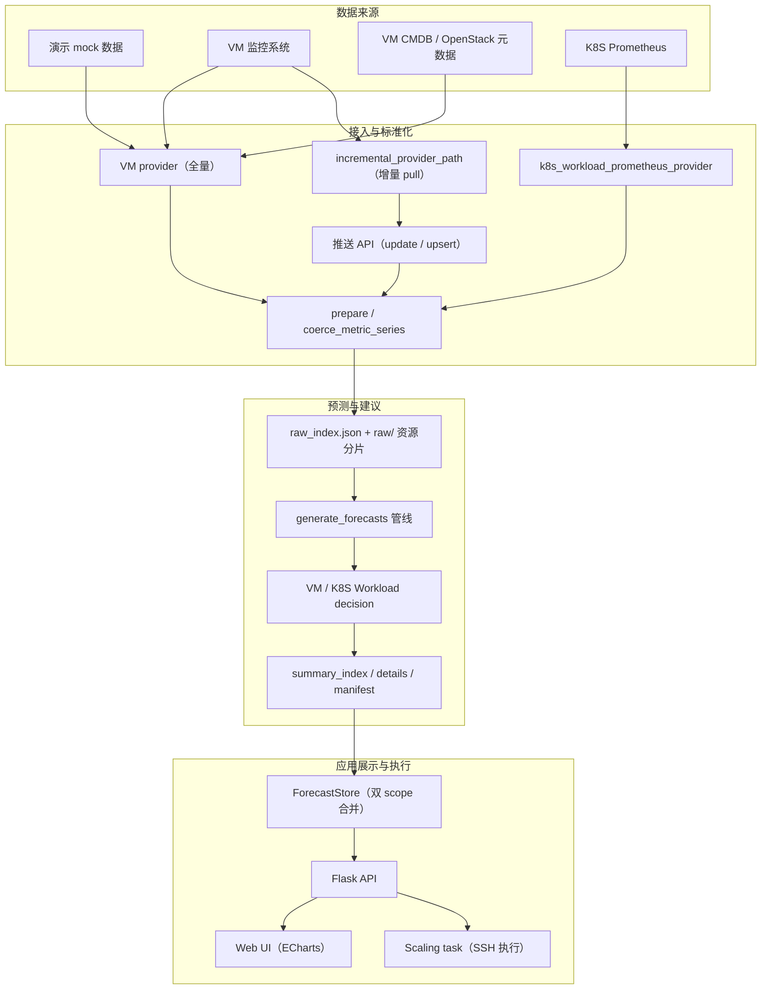
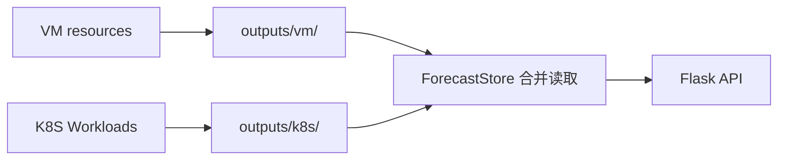
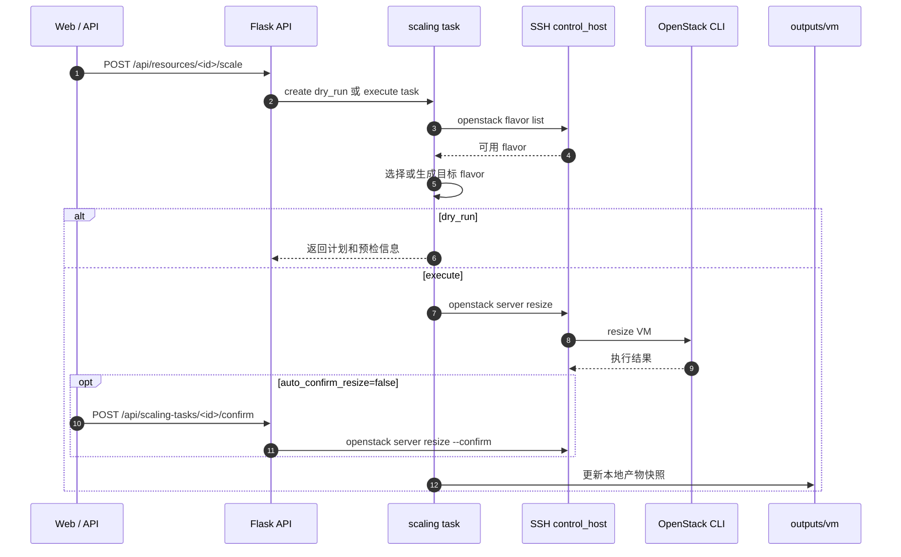

# 架构与数据流

本文档详细描述系统的目录结构、总体架构、预测管线流程、数据更新机制和核心功能模块。

## 目录结构

```text
.
├── app.py                           # Flask Web 入口
├── generate_forecasts.py            # 预测生成 CLI（全量 / 仅预测）
├── ingest_k8s_workloads.py          # K8S Workload Prometheus 接入 CLI
├── check_outputs.py                 # 预测产物健康检查 CLI
├── requirements.txt                 # 运行依赖
├── requirements-dev.txt             # 开发测试依赖
├── AGENTS.md                        # 项目协作约定（AI Agent 踩坑笔记）
│
├── docs/                            # 详细文档
│   ├── architecture.md              #   架构与数据流（本文件）
│   ├── configuration.md             #   部署配置与输出结构
│   ├── api-reference.md             #   API 接口文档与使用示例
│   └── development.md               #   开发指南与 FAQ
│
├── deploy/                          # 部署配置（凭据类文件由 .gitignore 忽略）
│   ├── clusters.example.json        # 集群配置示例
│   ├── clusters.json                # VM / K8S 调配集群配置（忽略）
│   ├── k8s_prometheus_clusters.json # K8S Prometheus 集群配置（忽略）
│   └── runtime_config.json          # 页面统一管理的运行配置（含预测模型开关）
│
├── resource_predict/                # 核心业务包
│   ├── __init__.py
│   ├── settings.py                  # 全局配置（frozen dataclass 单例）
│   ├── resource_types.py            # 资源类型归一化与指标集定义
│   ├── utils.py                     # 公共工具（数值解析、统计、策略分级）
│   ├── logging_setup.py             # 应用日志初始化
│   │
│   ├── api/                         # Flask API 路由层
│   │   ├── resources.py             #   资源列表 / 详情 / 批量查询
│   │   ├── updates.py               #   数据更新（pull / push / upsert）
│   │   ├── scaling.py               #   调配任务创建 / 查询 / 确认
│   │   ├── cluster_configs.py       #   集群配置读写与 K8S 诊断/拉取
│   │   ├── system_config.py         #   统一运行配置读写（含预测模型开关）
│   │   └── pages.py                 #   HTML 页面路由
│   │
│   ├── core/                        # 核心业务逻辑
│   │   ├── forecasting.py           #   ARIMA / SARIMA / Prophet / Naive / Rolling 实现
│   │   ├── decision.py              #   VM 决策引擎（扩缩容判断 + 目标规格计算）
│   │   └── k8s_workload_decision.py #   K8S Workload 决策引擎
│   │
│   ├── data/                        # 数据层
│   │   ├── io.py                    #   raw 记录转换 + 时间戳解析
│   │   ├── raw_store.py             #   资源级 raw 分片 + O(1) 索引 + LRU 缓存
│   │   └── updater.py               #   增量合并 + 滑动窗口 + 原子索引替换
│   │
│   ├── pipeline/                    # 预测管线
│   │   ├── run.py                   #   管线入口（generate_forecasts）
│   │   ├── prepare.py               #   数据准备与 mock 数据生成
│   │   ├── worker.py                #   单资源 worker
│   │   ├── fit.py                   #   单指标拟合（回测 + 未来预测 + 集成）
│   │   ├── forecasting.py           #   方法调度与集成融合
│   │   ├── model_selection.py       #   最优方法选择（异常路由）
│   │   ├── plan.py                  #   并行策略规划
│   │   ├── windowing.py             #   预测窗口解析
│   │   ├── metrics.py               #   回测指标计算
│   │   ├── anomaly.py               #   异常检测（MAD z-score）
│   │   ├── resource_profile.py      #   资源画像构建
│   │   ├── partial.py               #   增量预测合并
│   │   ├── write_outputs.py         #   产物写入（summary / details / manifest）
│   │   ├── series_utils.py          #   序列转换工具
│   │   ├── output_paths.py          #   scope 输出路径管理
│   │   ├── constants.py             #   常量定义
│   │   └── _types.py                #   WorkerContext 类型定义
│   │
│   ├── providers/                   # 数据源
│   │   ├── mock.py                  #   Mock 数据生成器
│   │   └── k8s_prometheus.py        #   K8S Prometheus 数据拉取与聚合
│   │
│   └── services/                    # 应用服务层
│       ├── store/                   #   产物读取与缓存
│       │   ├── forecast_store.py    #     ForecastStore（双 scope 合并读取）
│       │   └── query.py             #     搜索与筛选辅助
│       ├── scaling/                 #   调配执行
│       │   ├── executor.py          #     调配计划构建（VM / K8S 命令生成）
│       │   ├── tasks.py             #     任务生命周期管理
│       │   ├── command_runner.py    #     SSH 命令执行
│       │   ├── openstack_flavors.py #     OpenStack flavor 发现与选择
│       │   ├── cluster_config.py    #     集群配置加载
│       │   └── snapshot.py          #     调配成功后更新本地产物快照
│       ├── urgency.py               #   紧急度评分（资源排序优先级）
│       ├── output_health.py         #   产物健康检查逻辑
│       ├── runtime_config.py        #   统一运行配置模型、校验与持久化
│       ├── system_config.py         #   系统配置聚合读写与失败回滚
│       ├── forecast_config.py       #   由 settings 派生本轮预测模型开关
│       ├── cluster_configs.py       #   集群配置服务
│       ├── k8s_ingest.py            #   K8S Prometheus 拉取与后台定时调度
│       ├── update_tasks.py          #   更新任务同步/异步执行
│       └── update_history.py        #   最近更新历史持久化
│
├── templates/                       # Flask HTML 模板
│   └── index.html                   #   单页应用主页面
│
├── static/                          # 前端静态资源
│   ├── css/index.css                #   样式
│   ├── js/                          #   JavaScript 模块
│   │   ├── index.js                 #     入口与初始化
│   │   ├── app-state.js             #     全局状态管理
│   │   ├── api.js                   #     API 调用封装
│   │   ├── resource-list.js         #     资源列表渲染
│   │   ├── charts.js                #     ECharts 图表
│   │   └── scaling.js               #     调配交互
│   └── vendor/echarts/              #   ECharts 库
│
├── tests/                           # 自动化测试
│   ├── test_forecasting.py          #   预测方法测试
│   ├── test_forecast_windowing.py   #   窗口解析测试
│   ├── test_decision.py             #   VM 决策测试
│   ├── test_k8s_workload_decision.py #  K8S 决策测试
│   ├── test_io.py                   #   数据 IO 测试
│   ├── test_scaling_executor.py     #   调配计划测试
│   ├── test_scaling_api.py          #   调配 API 测试
│   ├── test_scaling_tasks.py        #   任务生命周期测试
│   ├── test_scaling_security.py     #   安全相关测试
│   ├── test_output_health.py        #   健康检查测试
│   ├── test_output_isolation.py     #   产物隔离测试
│   ├── test_cluster_configs.py      #   集群配置测试
│   ├── test_forecast_config.py      #   预测配置测试
│   ├── test_k8s_workload_provider.py #  K8S provider 测试
│   └── test_utils.py                #   工具函数测试
│
└── outputs/                         # 运行产物（.gitignore 忽略）
    ├── vm/                          #   VM scope 产物
    ├── k8s/                         #   K8S scope 产物
    └── scaling_tasks.json           #   调配任务记录
```

## 总体架构


```mermaid
flowchart TB
    subgraph Sources["数据来源"]
        Demo["演示 mock 数据"]
        VMMonitor["VM 监控系统"]
        VMCMDB["VM CMDB / OpenStack 元数据"]
        K8SProm["K8S Prometheus"]
    end

    subgraph Ingest["接入与标准化"]
        VMProvider["VM provider（全量）"]
        IncrementalProvider["incremental_provider_path（增量 pull）"]
        PushAPI["推送 API（update / upsert）"]
        K8SProvider["k8s_workload_prometheus_provider"]
        Normalize["prepare / coerce_metric_series"]
    end

    subgraph Forecast["预测与建议"]
        Raw["raw_index.json + raw/ 资源分片"]
        Pipeline["generate_forecasts 管线"]
        Decision["VM / K8S Workload decision"]
        Artifacts["summary_index / details / manifest"]
    end

    subgraph App["应用展示与执行"]
        Store["ForecastStore（双 scope 合并）"]
        API["Flask API"]
        UI["Web UI（ECharts）"]
        Scale["Scaling task（SSH 执行）"]
    end

    Demo --> VMProvider
    VMMonitor --> VMProvider
    VMCMDB --> VMProvider
    VMMonitor --> IncrementalProvider
    K8SProm --> K8SProvider
    VMProvider --> Normalize
    IncrementalProvider --> PushAPI
    K8SProvider --> Normalize
    PushAPI --> Normalize
    Normalize --> Raw
    Raw --> Pipeline
    Pipeline --> Decision
    Decision --> Artifacts
    Artifacts --> Store
    Store --> API
    API --> UI
    API --> Scale
```

## 预测管线流程

```text
Provider（mock / real / Prometheus）
  -> build_prepared_data()          [pipeline/prepare.py]
  -> write_raw_resource_dataset()   [data/raw_store.py -> raw_index.json + raw/]
  -> resolve_parallel_plan()        [pipeline/plan.py - ThreadPoolExecutor 调度]
  -> worker() per resource          [pipeline/worker.py]
      -> fit_one_metric()           [pipeline/fit.py - 全部活跃模型]
      -> model_selection            [pipeline/model_selection.py - 最优选择]
      -> build_scaling_advice()     [core/decision.py]
      -> build_k8s_workload_advice()[core/k8s_workload_decision.py]
  -> write_prediction_outputs()     [pipeline/write_outputs.py]
```

K8S Prometheus 的缺口安全链路进一步细化为：

```text
Prometheus range window
  -> 24h chunks
  -> per-request retry
  -> label/timestamp merge
  -> per-cluster atomic aggregation
  -> resource-ID scoped upsert
  -> recent contiguous forecast segment
  -> canonical future index after test_end_ms
  -> frontend test-boundary guard
```

每个 range 分片独立对连接失败、超时、HTTP 429 和 5xx 执行有限次数指数退避重试，分片按完整标签集合和时间戳合并。任一必需查询或分片最终失败时，该集群本轮不会提交部分时间范围；其他成功集群仍继续更新。upsert 只触及本轮成功返回的 `resource_id`，因此失败集群或本轮未出现的 Workload 会保留既有 raw 历史和预测产物。

容器指标聚合到控制器粒度依赖 `kube_pod_owner` 瞬时查询（只回看约 5 分钟），其可用性与数小时的 range 查询并不同步。查询成功却聚合不出任何 Workload 时，provider 会按 15 秒、30 秒退避整轮重拉该集群，最多 3 次尝试；错误消息与日志会指出具体断点（容器使用率序列为空 / `kube_pod_owner` 无结果或查询异常 / owner 标签不匹配 / CPU 与内存序列无法配对）以及各序列计数，避免把 kube-state-metrics 重启或查询限流这类临时故障误记为集群配置问题。

采集正则化只对不超过 `max_interpolation_gap_steps` 的完整短缺口用此前观测向前填补，不使用缺口之后的数值，避免在训练/测试切分前引入未来数值。大缺口保持稀疏。预测使用 K8S 配置的 `step_seconds` 作为权威采样间隔，并从每个指标最近的连续数据段评估可用性；连续段不足测试窗口时跳过重算、记录 `prediction_skips` 并保留旧产物。模型未来值统一重建为从真实测试终点 `test_end_ms + sample_interval_seconds` 开始的规范时间轴。

前端仍执行防御性边界检查：只绘制严格晚于 `test_end_ms` 的未来点，黄色预测区域从最后测试点开始，到最后一个有效未来点结束，与当前时间无关。历史线和测试线在大缺口处插入空点并保持 `connectNulls=false`，避免跨越采集中断直接连线。

`WorkerContext`（`pipeline/_types.py`）是传递给每个 worker 的只读上下文。`FitResult` 是每个指标的返回结构。管线使用 `concurrent.futures.ThreadPoolExecutor` 进行资源级并行，可选的指标级内部并行由 `resolve_parallel_plan()` 控制。

## 产物隔离


```mermaid
flowchart LR
    VM["VM resources"] --> VMO["outputs/vm/"]
    K8S["K8S Workloads"] --> K8SO["outputs/k8s/"]
    VMO --> Store["ForecastStore 合并读取"]
    K8SO --> Store
    Store --> API["Flask API"]
```

VM 数据写入 `outputs/vm/`，K8S 数据写入 `outputs/k8s/`。两个目录完全物理隔离，互不覆盖。每个 scope 都有独立的 `raw_index.json` 和 `raw/` 资源分片；`ForecastStore` 在 API 层透明合并两个 scope 的数据。`scoped_out_dir()` / `split_items_by_scope()`（`pipeline/output_paths.py`）强制此分离。

## 数据更新机制

系统支持多种数据更新模式：

- **Pull 模式（增量）**：通过更新 API 调用 `IncrementalProvider` 拉取增量数据
- **Push 模式（增量）**：通过 HTTP `POST /api/update-data` 或 `/api/upsert-data` 推送增量数据
- **K8S Prometheus Pull**：通过页面按钮、API 或 CLI 从 Prometheus 拉取 K8S Workload 指标并合并到 K8S scope
- **K8S CLI / API 触发**：手动通过 CLI 或 `POST /api/cluster-configs/k8s-fetch` 触发一次性拉取

所有模式共享同一个排他锁 `_update_exclusive`，保证“按 ID 读取目标 raw -> 合并 -> 写入变化分片 -> 原子替换索引 -> 重预测”序列的完整性。资源分片不可变并采用内容寻址，不再复制整份 raw 备份。

每个更新任务进入成功、部分成功或失败终态时，`services/update_history.py` 会将摘要原子写入 `outputs/update_history.json`。该文件按完成时间倒序保留最近 100 条，供 `GET /api/update-history` 和“数据更新”页面读取。历史存储与更新结果隔离：文件缺失或损坏时返回空历史，写入失败只记录日志，不改变采集、合并或预测结果。

K8S Prometheus 更新还保存 `cluster_results`：每个目标集群分别记录成功/失败、Workload 数、耗时和错误。只要成功集群的数据完成 upsert 与预测，多集群混合结果记为 `partial_success`；全部集群失败或后续写入/预测失败时记为 `failed`。部分失败不会丢弃成功集群的数据，本轮未返回的 Workload 也不作为删除信号。

```text
Pull:       POST /api/update-trigger -> run_update -> IncrementalProvider -> _do_update
Push:       POST /api/update-data -> run_scoped_update_with_data -> _do_update
K8S Fetch:  POST /api/cluster-configs/k8s-fetch -> run_k8s_prometheus_upsert（异步）
```

K8S Prometheus 拉取窗口由 `run_k8s_prometheus_upsert()` 决定：如果 `outputs/k8s/raw_index.json` 缺失、指定集群没有本地基线，或请求传入 `full_refresh=true`，则按 `history_days` 拉取全量历史窗口（默认 7 天）；否则按 `scheduled_update_interval_minutes + incremental_overlap_minutes` 拉取增量窗口（默认 6 小时周期 + 1 小时 overlap = 最近 7 小时）。通过 `python app.py` 启动且 `scheduled_update_enabled=true` 时，应用会在 `scheduled_update_startup_delay_seconds` 后启动首次 K8S 拉取，此后按配置间隔执行；也可通过页面按钮、API 或 CLI 手动触发。

调度线程的等待挂在 `_k8s_reload_event` 上，因此保存系统配置（`PUT /api/system-config`）会立刻唤醒它重读开关和周期，无需重启应用。唤醒本身不触发拉取：循环每轮按 `last_start + max(60 秒, scheduled_update_interval_minutes)` 重新推导到期时刻并继续等待剩余部分，所以周期既不会被重置也不会被提前。其中 `last_start` 是上一次拉取**开始**时的 monotonic 时刻，拉取异常同样占用本轮，因此失败后不会快速重试而是等满一个周期；`last_start` 为 `None`（从未拉取过）时视为已到期。只有重算后已逾期的配置变更才会立即取数：把周期改短到已过期、关闭超过一个周期后重新打开，或线程启动后还没拉取过。首次成功拉取之前 `trigger_source` 都是 `scheduled_startup`，之后为 `scheduled`。VM 侧的 `_scheduler_loop` 没有接入该事件，且 `start_background_updater()` 当前无调用方，因此 VM 数据不会被自动拉取。

锚定开始时刻而非完成时刻是数据完整性的要求。增量回看窗口固定为 `scheduled_update_interval_minutes + incremental_overlap_minutes`，而窗口末端取的是 `_fetch_target()` 里构建查询时的 `time.time()`，也就是本轮拉取的起点。若按完成时刻计时，两轮起点的实际间隔会变成 `周期 + 拉取耗时`，一旦耗时超过 `incremental_overlap_minutes`（默认 60 分钟），窗口就盖不住上一轮的末端，中间那段数据永远不会被任何一轮取到，漏掉的时长等于 `拉取耗时 - incremental_overlap_minutes`。按开始时刻计时后实际间隔是 `max(周期, 拉取耗时)`，默认配置下拉取耗时不超过 420 分钟都不会漏；耗时超过周期时循环会记录 warning 并立即开始下一轮。漏掉的时间段若超过 `step_seconds × (max_interpolation_gap_steps + 1)`（默认 40 分钟），`recent_contiguous_segment()` 会判定断档并把可用历史截断到最近一段，该段点数不足 `test_size` 时 `prepare_recent_contiguous_forecast_data()` 记入 `prediction_skips` 并沿用旧预测。

关键线程原语（`data/updater.py`）：

- `_update_exclusive`（Lock）：序列化 HTTP 更新任务之间的完整更新序列
- `_lock`（Lock）：保护 `_update_status` 字典的线程安全读取
- `_history_lock`（Lock）：串行化更新历史文件的读取和原子替换

`fail_if_busy=True` 引发 `UpdateBusyError`（映射到 HTTP 409）而非阻塞。合并后，updater 调用 `generate_predictions_only()` 传入 `resource_ids` 进行部分重预测而非全量管线运行。

## VM 调配执行流程


```mermaid
sequenceDiagram
    autonumber
    participant User as Web / API
    participant API as Flask API
    participant Task as scaling task
    participant SSH as SSH control_host
    participant OS as OpenStack CLI
    participant Outputs as outputs/vm

    User->>API: POST /api/resources/<id>/scale
    API->>Task: create dry_run 或 execute task
    Task->>SSH: openstack flavor list
    SSH-->>Task: 可用 flavor
    Task->>Task: 选择或生成目标 flavor
    alt dry_run
        Task-->>API: 返回计划和预检信息
    else execute
        Task->>SSH: openstack server resize
        SSH->>OS: resize VM
        OS-->>SSH: 执行结果
        opt auto_confirm_resize=false
            User->>API: POST /api/scaling-tasks/<id>/confirm
            API->>SSH: openstack server resize --confirm
        end
        Task->>Outputs: 更新本地产物快照
    end
```

## 核心功能模块

### 预测引擎（`core/forecasting.py`）

| 方法 | 说明 |
| --- | --- |
| ARIMA | 自动阶数选择（AIC 最小），线性趋势，收敛重试 |
| SARIMA | 每天 2–24 点使用日季节滞后；高频采样使用三阶日周期 Fourier 外生项＋ARIMA 残差；每天不超过一点时禁用日季节项 |
| Prophet | 日/周季节性，可配置 changepoint 灵活度 |
| Seasonal Naive | 回放最近一个季节窗口，鲁棒候选 |
| Rolling Mean | 近期滚动均值作为稳定基线 |
| Ensemble | RMSE 倒数加权融合（可选启用） |

**模型选择与独立测试**：从外层训练段尾部划出 `rolling_backtest_folds` 个时间验证折（默认 1）；每折长 `test_size`，最初训练段至少 `max(test_size, 24)` 点。路由仅读取最早验证折之前的数据。单折按验证 RMSE 选型；多折按 `0.65 × 最近验证折RMSE + 0.35 × 全部验证残差RMSE` 选型，异常时优先鲁棒候选。外层测试只评分，不参与选型或集成权重。历史不足时按预定义模型优先级降级并记录原因。

**集成与在线更新**：首个验证折等权，后续折只用之前验证折学习权重；误差来自真实集成预测残差。独立测试和未来预测使用全部内部验证确定的固定权重，缺失成员时不静默重分配权重。所有候选未来曲线使用最新完整观测重新拟合，以保留模型对照图。入选模型未来失败时以 Rolling Mean 的真实名称降级。相比原先一次延伸预测，单验证折通常需要验证、测试和未来三次拟合，应在生产规模下度量耗时。

**预测留档**：`pipeline/forecast_archive.py` 在增量合并前流式写入本轮新预测的入选曲线，按 scope 保存 gzip JSONL，临时文件成功完成后原子发布；默认保留 7 天。来源记录数据和训练截止时间、配置摘要、模型版本与实际模型。不会将复用的旧预测重新标记为新预测。原始建议快照位于跨轮次门控之前，不是执行授权。

**真实误差回填**：`pipeline/realized_error.py` 在 raw 提交后及新预测留档后导入尚未登记的批次，用显式未填补采样证据精确匹配目标时间。SQLite 按 scope、批次、资源、容器、指标保存原始曲线与首次真实评分，迟到数据补评；按规格、口径及观测成员检查可比性。报告按入选模型和提前量聚合，和独立测试误差分开。默认保留 7 天；不改变选型或执行门控。详细契约与重试命令见 [configuration.md](configuration.md)。

### VM 决策引擎（`core/decision.py`）

`pipeline/activation_assessment.py` 在报告事务的同一 SQLite 快照内逐资源判定影子策略的评审条件：识别最新连续可比轮次，按指标去重目标，再对同一观测集合检查样本、新鲜度、风险、资源量与建议稳定性。判定随真实误差报告输出，不自行启用策略。默认关闭的 `controlled_activation.py` 只对显式允许资源核对本轮判定并重建完整校准建议，在跨轮次确认前切换；切换后确认计数重新积累。execute 路径额外核验校准授权及该资源当前账本，保留原有其他门控。

`pipeline/shadow.py` 在校准后、留档前为完整新预测生成非执行对照：同一建议算法分别使用原入选曲线与校准上界。两套 action/target_spec/policy_tier 和基准规格随预测冻结，`shadow_evaluation.py` 在 SQLite 中关联对应曲线，使用后来到达的同批真实评分计算配对超出率、建议资源量差异和相邻建议变更率。K8S request/limit 分开、仅固定副本数的可比指标参与真实值评分；影子数据不流入正式执行门控。

预测留档前，`pipeline/calibration.py` 从真实误差账本的只读快照中读取生成时已知的可比残差，为入选曲线附加经验上界。不同资源、容器、模型、口径和提前量不混用样本；上界随原预测留档，后续单独核验覆盖率。默认只输出观察信息；显式开启受控采用后，只有通过本轮判定的资源才由 controlled_activation 切换正式建议，仍受执行门控约束。

- **扩容判断**：P95 / 峰值超过阈值 + 峰谷差 + 上升趋势斜率 + 窗口均值变化
- **缩容判断**：均值 + P95 低于阈值，含 `max_reduction_ratio` 保护（防止 32 核 -> 1 核）
- **Rightsize 检测**：均值 < 0.35 且 P95 < 0.55 的资源标记为过度配置候选（可优化规格但非极端空闲）
- **磁盘专用阈值**：磁盘扩容阈值比通用阈值低 0.05（磁盘使用具有单调性且不可弹性回收）
- **目标规格**：按维度独立计算，超出 100% 时线性推算容量，CPU 核数对齐偶数，硬盘缩容最小 50GB
- **策略分级**：conservative / balanced / aggressive，阈值和确认轮次差异化
- **风险画像**：每个资源生成 `risk_profile`，包含 `saturation_risk`（饱和风险分）、`idle_opportunity`（空闲机会分）、`risk_score`（综合风险分）、当前生效阈值和冷却时间
- **置信度评分**：每个触发扩缩容的指标先计算单项置信度，再汇总为资源级置信度；前端详情抽屉的“置信度 i”会按公式展示当前资源的分数组成
- **执行门控**：`action_gate` 输出 `ready` / `observe`，含所需及已确认轮次。扩容默认需要 `scale_out_confirmations=2` 轮，缩容默认需要 `scale_in_confirmations=3` 轮；conservative 缩容 +1 轮、aggressive 缩容 -1 轮，conservative 扩容可少 1 轮。系统通过各输出目录下的 `action_gate_state.json` 按资源持久化同方向建议的连续轮次，目标规格变化不会重置计数，动作反向或变为保持/混合/数据不足时重新计数或清零；进入 `execute` 前还会强制校验 `confidence`、`data_quality`、`cooldown` 和 `policy_tier`。资源历史覆盖不足 5 天时，非 `hold` 建议会记录 `history_warning` 并将置信度降到执行阈值以下。

### K8S Workload 决策引擎（`core/k8s_workload_decision.py`）

- **当前资源规格**：K8S 当前 request/limit 只保存在 `spec.containers.<container>`，不保留 Workload 级累加 request/limit 字段；前端也按 container 粒度展示。
- **Container 级预测**：K8S Workload 仍是资源主体；provider 同时输出 Workload 聚合 `metrics` 和 `container_metrics.<container>.<metric>`。预测产物保留 Workload 聚合 `charts`，并新增 `container_charts.<container>.<metric>` 供详情页在同一 ECharts 图中绘制多条 container 曲线。
- **风险队列统计范围**：K8S 指标胶囊展示完整历史观测窗口的 Workload 聚合 P95。百分比按参与容器使用量总和除以对应 Request/Limit 总和计算，并显示参与容器数；这不是容器使用率的算术平均。详情抽屉的统计在容器图表加载后展示当前选中 Container 的范围，两者通过标签和提示明确区分。
- **未来预测辅助区**：详情图橙色区域只覆盖 `x_pred_ms + preds_future` 中全部可见模型的有效未来预测时间并集，不覆盖 `x_test_ms + preds` 测试/回测阶段。预测线与色带共用有效点规则：`null`、空字符串和非有限数均视为缺失，真实数值 `0` 保留；首尾缺失会收缩色带边界，中间缺失不会把未来区域拆段，有效未来时间不足两个时不显示色带。
- **扩容判断**：基于 `cpu_limit` / `memory_limit`，P95 >= 0.8 或峰值 >= 0.9；没有 limit 时不提出扩容建议
- **缩容判断**：基于 `cpu_request` / `memory_request`，均值 < 0.2 且 P95 < 0.35
- **数据质量**：`_quality_level()` 评估每个指标的数据质量，poor 质量自动跳过执行建议
- **Baseline 缺失处理**：缺少 request/limit 时降级为 trend-only 分析
- **目标利用率分级**：`_target_utilization()` 按策略层级返回差异化利用率目标（0.55~0.78）
- **requests/limits 建议**：按容器粒度，per-replica target 与副本数独立计算避免双重缩放；小于 `2C/2Gi` 的 Workload 保留小数粒度，避免 `0.5C` 级别 request/limit 被放大到 `2C`
- **多容器执行目标**：多 container Workload 的 request/limit 建议写入 `target_spec.containers.<container>`；`replicas` 仍保留在 Workload 级 `target_spec.replicas`。
- **副本数建议**：Deployment / StatefulSet / ReplicaSet 支持；DaemonSet 跳过副本缩放并给出警告
- **Namespace 策略**：自动从 spec 中识别 namespace 并匹配 conservative / aggressive 分组
- **Workload 类型归一化**：`_workload_kind()` 标准化控制器类型字符串

### 增量数据合并（`data/updater.py`）

- 支持混合时间戳格式（秒/毫秒/ISO 字符串）
- 去重保留最新值（`duplicated(keep="last")`）
- 可选滑动窗口：合并后裁切到原始长度
- **30 天 raw 保留**：增量合并和新资源规范化后，VM、Workload 汇总及 `container_metrics` 的每条序列都独立保留从自身最新样本向前 `retention_days` 的时间窗口（默认 30 天，截止点包含）；离线资源保留最后已知的有界窗口
- 并发安全：`_update_exclusive`（排他锁）+ `_lock`（状态锁）
- 变更检测：仅在 spec 或指标值真正变化时触发重预测
- 原始数据提交：裁剪视为资源变更，只为变化资源写入新的内容寻址分片，最后原子替换 `raw_index.json`；旧快照分片保留短暂宽限期后清理
- 可插拔数据源：通过 `incremental_provider_path`（`module:function` 格式）指定自定义增量 provider，未配置时使用默认 mock provider

### 调配执行（`services/scaling/`）

- **OpenStack VM**：自动发现可用 flavor -> 选择/生成目标 flavor -> `openstack server resize` -> 可选自动/手动 confirm
- **K8S Workload**：`kubectl set resources` 按容器粒度 -> `kubectl scale` 调整副本数
- **执行前置校验**：`execute` 模式在任务入队前调用 `_execution_gate_failures()`。默认建议执行必须满足 `action_gate=ready`、`confidence=high` 且分数达标、数据质量良好、未处于冷却期、策略层级有效；人工复核建议（`target_source=confirmed`）只跳过 `action_gate`，仍保留其他门控；手动 `target_spec` 不要求建议 `action_gate` / `confidence`，但仍需通过策略层级、数据质量、冷却期和 K8S 目标策略校验
- **安全**：所有用户可控值使用 `shlex.quote()` 转义
- **快照**：调配成功后自动更新 `summary_index.json` / `details/*.json` / 目标资源 raw 分片 / `raw_index.json` / `manifest.json` 中的 spec

`build_scaling_plan()`（`executor.py`）生成包含 shell 命令的 `ScalingPlan` dataclass。`command_runner.py` 通过 SSH 执行命令。`openstack_flavors.py` 从控制节点查询可用 flavor 以选择调整目标；如无合适 flavor，`allow_create_flavor=True` 启用自动创建。

### 紧急度评分（`services/urgency.py`）

`compute_urgency_score()` 为每个资源计算一个综合紧急度分数，用于资源列表的默认排序。`compute_urgency_breakdown()` 返回同一套计算的分项，API 会把它作为 `urgency_breakdown` 返回给前端，风险列表的“紧急度 i”使用中文公式串展示，例如：

```text
紧急度150 = 基础动作分35 + 置信度加成6 + 风险分贡献12.4 + 最强指标贡献72.1 + 其他指标贡献8.5 + 多指标加成4 + 目标变化分12
```

总分公式：

```text
紧急度 = 基础动作分
       + 置信度加成
       + 风险分贡献
       + 最强指标贡献
       + 其他指标贡献
       + 多指标加成
       + 混合信号加成
       + 目标变化分
       + 仅分析折扣/封顶
```

分项含义：

- **基础动作分**：扩容类动作（`scale_out` / `scale_out_candidate`）为 35，缩容类动作（`scale_in` / `scale_in_candidate`）为 18，`hold` 为 0，`insufficient_data` 固定为 1。
- **置信度加成**：high +6、medium +3、low +1。
- **风险分贡献**：读取 `risk_profile.risk_score`，按 `risk_score * 0.2` 计分，最高 +20。
- **最强指标贡献**：逐指标计算压力/空闲信号分，取最大值。扩容指标综合 P95 超阈值、峰值超阈值、均值超阈值、上升趋势和峰谷差；缩容指标综合均值低于阈值、P95 低于缩容保护阈值、下降趋势和稳定性。
- **其他指标贡献**：除最强指标外，其余指标贡献之和乘以 0.25，避免多个弱信号把排序过度抬高。
- **多指标加成**：触发扩缩容信号的指标数超过 1 个时，每多一个指标 +4。
- **混合信号加成**：`has_mixed_signals=true` 时 +4，用于提示同一资源存在扩缩方向冲突。
- **目标变化分**：当前规格与 `target_spec` 的变化幅度，最高 +18；K8S 的 `replicas` 变化也纳入该项。
- **仅分析折扣/封顶**：K8S 建议若是 `analysis_only` 且目标策略未 ready，会先乘以 0.35，再按动作封顶；扩容类最高 35，缩容类最高 25。

`urgency_breakdown.metric_scores` 会保留每个指标的原始贡献值。前端 tooltip 中的“指标贡献”展示的是这些原始单项分；总分只直接使用其中最高的一项，其他项进入“其他指标贡献（0.25 倍）”。

#### 紧急度指标贡献

紧急度里的“指标贡献”用于排序优先级，和置信度章节中的“指标得分”不是同一套权重。它只对触发扩缩容动作的指标计算；`hold` 指标不会进入 `urgency_breakdown.metric_scores`。

参与紧急度计算的指标按资源类型过滤：OpenStack VM 使用 CPU、内存和磁盘；K8S Workload 仅使用 CPU 和内存。K8S 旧产物或异常输入中即使残留 `disk` 统计、动作或目标规格，磁盘也不会进入指标贡献、多指标加成或目标变化分。

扩容类指标贡献：

```text
指标贡献 = 32 * P95超阈值强度
        + 22 * 峰值超阈值强度
        + 12 * 均值超阈值强度
        + 6  * 上升趋势压力
        + 4  * 峰谷差压力
```

- `P95超阈值强度 = above(p95, scale_out_threshold)`。
- `峰值超阈值强度 = above(peak, peak_guard_threshold)`。
- `均值超阈值强度 = above(avg, scale_out_threshold)`。
- `上升趋势压力` 最多 2 分量：`slope` 大于 0 时按 `uptrend_slope_threshold` 归一化，`window_mean_delta` 大于 0 时按 `window_mean_delta_threshold` 归一化，两项相加后最高为 2。
- `峰谷差压力 = min(1, gap / peak_valley_gap_threshold)`。

缩容类指标贡献：

```text
指标贡献 = 20 * 均值空闲强度
        + 16 * P95空闲强度
        + 5  * 下降趋势压力
        + 4  * 稳定性
```

- `均值空闲强度 = below(avg, scale_in_threshold)`。
- `P95空闲强度 = below(p95, scale_in_p95_guard)`。
- `下降趋势压力` 最多 2 分量：`slope` 小于 0 时按 `downtrend_slope_threshold` 归一化，`window_mean_delta` 小于 0 时按 `window_mean_delta_threshold` 归一化，两项相加后最高为 2。
- `稳定性 = 1 - min(1, gap / 0.5)`，峰谷差越小，缩容信号越稳定。

总分中指标贡献的使用方式：

```text
最强指标贡献 = max(所有指标贡献)
其他指标贡献 = 0.25 * sum(除最强指标外的指标贡献)
多指标加成 = 4 * max(0, 触发动作指标数 - 1)
```

因此 tooltip 中的原始指标贡献可能不会原样相加到紧急度总分。例如 CPU 扩容贡献 28.1、内存扩容贡献 10.4，则总分里会计入 `最强指标贡献28.1 + 其他指标贡献2.6`。

### 置信度评分

置信度用于判断建议可靠程度，也参与执行门控。详情抽屉的“置信度 i”使用中文公式串展示当前资源的资源级置信度，例如：

```text
置信度76.4 = 最高指标贡献48.1 + 平均指标贡献24.3 + 多指标加成4
```

#### VM 置信度

VM 先为每个触发动作的指标计算单项置信度：

- 扩容指标：综合 P95 超阈值、峰值超阈值、均值超阈值、持续高负载、上升趋势，并对“只有尖峰但 P95 不强”的情况扣分。
- 缩容指标：综合均值低于缩容阈值、P95 低于缩容保护阈值、持续低负载、下降趋势、稳定性，并对上升趋势扣分。

VM 单项指标得分会先把各类信号归一化：

```text
above(x, threshold) = 0                              , x <= threshold
                    = (x - threshold) / (1-threshold), threshold < x <= 1
                    = 1 + log1p(x - 1) capped        , x > 1

below(x, threshold) = clamp((threshold - x) / threshold, 0, 1)

trend_up   = 0.5 * slope_up_ratio   + 0.5 * window_delta_up_ratio
trend_down = 0.5 * slope_down_ratio + 0.5 * window_delta_down_ratio
```

VM 扩容指标得分：

```text
指标得分 = 42 * min(1, P95超阈值强度)
        + 20 * min(1, 峰值超阈值强度)
        + 14 * min(1, 均值超阈值强度)
        + 16 * 持续高负载强度
        + 8  * 上升趋势强度
        + 8  * max(0, P95超阈值强度 - 1)
        - 尖峰惩罚
```

- `P95超阈值强度 = above(p95, scale_out_threshold)`。
- `峰值超阈值强度 = above(peak, peak_guard_threshold)`。
- `均值超阈值强度 = above(avg, scale_out_threshold)`。
- `持续高负载强度 = max(high_ratio, min(1, P95超阈值强度))`。
- `尖峰惩罚` 仅在峰值超阈值但 P95 强度很弱时触发，最高扣 18 分，用于降低瞬时尖峰导致的误判。

VM 缩容指标得分：

```text
指标得分 = 28 * 均值空闲强度
        + 26 * P95空闲强度
        + 24 * 持续低负载比例
        + 10 * 下降趋势强度
        + 12 * 稳定性
        + 持续低负载奖励
        - 上升趋势惩罚
```

- `均值空闲强度 = below(avg, scale_in_threshold)`。
- `P95空闲强度 = below(p95, scale_in_p95_guard)`。
- `稳定性 = 1 - min(1, gap / scale_in_p95_guard)`。
- `持续低负载奖励 = min(8, 8 * low_streak / 12)`，仅在连续低负载点存在时生效。
- `上升趋势惩罚 = 12 * trend_up`。

单项指标得分最后会被限制在 `0..100`。

资源级公式：

```text
置信度 = 最高指标得分 * 0.65
       + 平均指标得分 * 0.35
       + 多指标加成
       - 混合信号扣分
       + 历史覆盖封顶/其他调整
```

- **多指标加成**：至少 2 个指标触发动作时 +4。
- **混合信号扣分**：`has_mixed_signals=true` 时 -8。
- **历史覆盖封顶**：非 `hold` 建议若历史覆盖不足 5 天，置信度会被封顶到执行阈值以下。
- 分级：`score >= 72` 为 high，`45 <= score < 72` 为 medium，否则为 low。

#### K8S Workload 置信度

K8S 的单项置信度与 VM 类似，但仅对有 request/limit baseline 且数据质量不是 poor 的指标触发；缺 baseline 的指标会降级为 trend-only 分析，不直接产生可执行扩缩容目标。

K8S 单项指标得分使用 K8S 当前策略阈值（`policy_thresholds(policy_tier)`）计算。扩容基于 limit 使用率，缩容基于 request 使用率。

K8S 扩容指标得分：

```text
指标得分 = 42 * min(1, P95超阈值强度)
        + 20 * min(1, 峰值超阈值强度)
        + 14 * min(1, 均值超阈值强度)
        + 16 * 持续高负载强度
        + 8  * 上升趋势强度
        - 尖峰惩罚
```

- `P95超阈值强度 = above(p95, scale_out_threshold)`。
- `峰值超阈值强度 = above(peak, peak_guard_threshold)`。
- `均值超阈值强度 = above(avg, scale_out_threshold)`。
- `持续高负载强度 = max(high_ratio, min(1, P95超阈值强度))`。
- `尖峰惩罚` 最高扣 18 分；K8S 当前实现用固定 `gap / 0.3` 判定尖峰幅度。

K8S 缩容指标得分：

```text
指标得分 = 34 * 均值空闲强度
        + 30 * P95空闲强度
        + 18 * 持续低负载比例
        + 10 * 下降趋势强度
        + 8  * 稳定性
        - 上升趋势惩罚
```

- `均值空闲强度 = below(avg, scale_in_threshold)`。
- `P95空闲强度 = below(p95, scale_in_p95_guard)`。
- `稳定性 = 1 - min(1, gap / scale_in_p95_guard)`。
- `上升趋势惩罚 = 12 * trend_up`。

K8S 单项指标得分同样限制在 `0..100`。多容器 Workload 会先按 container 计算单项得分，再把相关 container 的最大得分合并到 Workload 级 `confidence_metric_scores`。

资源级公式：

```text
置信度 = 最高指标得分 * 0.65
       + 平均指标得分 * 0.35
       + 多指标加成
       - 数据质量扣分
       - 缺 baseline/阻断项扣分
       + 执行就绪加成
       + 历史覆盖封顶/其他调整
```

- **数据质量扣分**：任一相关指标 `poor` 时 -18，任一相关指标 `fair` 时 -8。
- **阻断项扣分**：存在无法执行的 blocker 时 -12；缺 baseline 且策略未 ready 时还会降低置信度。
- **container 级合并**：多容器 Workload 会先按 container 生成建议；同一指标有多个 container 信号时，资源级动作优先保留扩容信号，置信度取相关 container 单项分的最大值。
- **执行就绪加成**：`target_k8s_policy.ready_for_execution=true` 时 +4。
- **历史覆盖封顶**：非 `hold` 建议若历史覆盖不足 5 天，置信度会被封顶到执行阈值以下。
- 分级同 VM：`score >= 72` 为 high，`45 <= score < 72` 为 medium，否则为 low。
